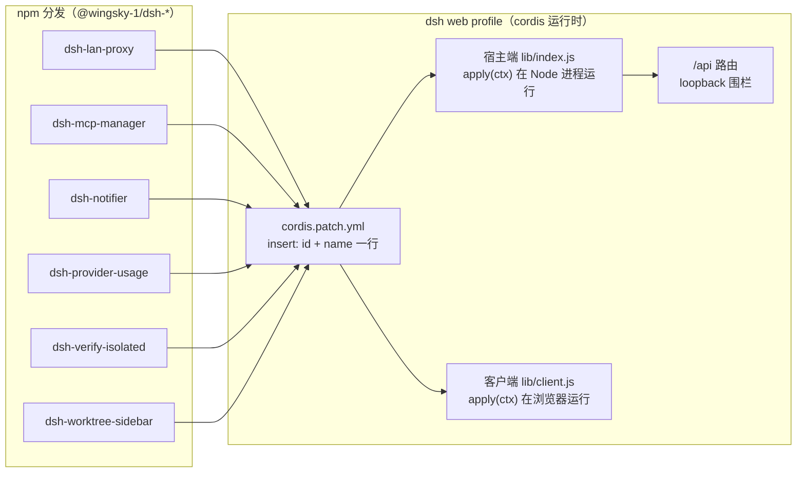

# dsh-plugin-hub 插件架构文档

> 本目录用**图解为主**的方式，讲清每个插件的**功能、原理、使用方式**。
> lan-proxy、notifier、worktree-sidebar、mcp-manager 与 jev-decide 按 BA 业务 / AA 应用 / DA 数据 / TA 技术四视图组织（mcp-manager 与 lan-proxy、notifier 的 TOGAF 四视图同模板，基线 d5cfdf08）；
> 其余文档按功能概览 → 总体架构图 → 核心机制 / 时序 → 使用方式 → 安全模型与边界组织，
> 与各插件包 README（安装 / 配置 / 验证的快速上手）互补。
>
> 图使用两种载体（源数据均归档、可复现）：
> - **SVG 架构图**：按 diagram-design 编辑风手写 SVG，源文件
>   归档在 [diagrams/](diagrams/)，可直接用浏览器打开源 HTML 调整后重新导出
>   （`python3 scripts/lib/export-diagram-svg.py <源.html>`）；
> - **Mermaid 图**：内嵌在 md 中，GitHub 原生渲染，源码即文档（天然可维护）。
>
> 仓库级共享机制（loopback 围栏、官方 settings 存储、client 干净模块等）见
> [「通用机制」](#通用机制)。

## 插件索引

| 插件 | 一句话定位 | 架构文档 |
|---|---|---|
| `@wingsky-1/dsh-lan-proxy` | 局域网访问 dsh web：HTTP/HTTPS/WS 转发 + TLS + 响应压缩 | [dsh-lan-proxy.md](dsh-lan-proxy.md) |
| `@wingsky-1/dsh-mcp-manager` | MCP 服务器管理：配置面与模型可见面管理（单池 + `ws_mcp_call` 统一寻址） | [dsh-mcp-manager.md](dsh-mcp-manager.md) |
| `@wingsky-1/dsh-notifier` | 审批/完成/错误事件通知：浏览器 Notification + 系统 toast + Bark | [dsh-notifier.md](dsh-notifier.md) |
| `@wingsky-1/dsh-jev-decide` | JEV 决策网关：frozen 预设裁决 + 本地密形预检 + 双轨密钥 | [dsh-jev-decide.md](dsh-jev-decide.md) |
| `@wingsky-1/dsh-provider-usage` | 多 provider 用量统计：v2 适配器契约 + 宿主端渲染 + 历史落盘 | [dsh-provider-usage.md](dsh-provider-usage.md) |
| `@wingsky-1/dsh-verify-isolated` | 插件开发隔离浏览器验证 skill（临时 DSH_HOME + 独立 profile） | [dsh-verify-isolated.md](dsh-verify-isolated.md) |
| `@wingsky-1/dsh-worktree-sidebar` | 把某个 git worktree 登记给当前会话：官方右侧栏文件树换根、会话 cwd 不变 | [dsh-worktree-sidebar.md](dsh-worktree-sidebar.md) |
| `@wingsky-1/dsh-plugins-all` | 全家桶聚合包（一键装齐 + 聚合 cordis patch） | [dsh-plugins-all.md](dsh-plugins-all.md) |

## 全景：插件如何挂载进 dsh web

所有插件都不修改 DSH 源码——统一经 **`cordis.patch.yml` + profile 机制**挂载：

要点：

- **安装**：`dsh plugin --profile web add <包名>` → 包内 `cordis.patch.yml` 的 insert 行
  被写进 profile 插件名册；`dsh web` 重启时组合 bundle，宿主端与客户端各跑一半；
- **宿主端**（`exports "."` → `lib/index.js`）：在 Node 进程中 `apply(ctx)`，注入
  `webServer` / `tools` / `settings` / `connection` 等官方服务，注册路由与事件监听；
- **客户端**（`exports "./client"` → `lib/client.js`）：干净模块（`apply(ctx)` +
  `inject`），构建期内联样式与依赖，通过 `__DSH_ROUTES__` 拿到真实路由表；
- **依赖关系**：各插件彼此独立（`dsh-mcp-manager` 提供的 `ctx.mcpManager` 为可选消费面，
  无插件对其强依赖）；
- `dsh-plugins-all` 是聚合包：dependencies 拉齐全部子包 + 聚合 cordis patch
  （`scripts/gate/aggregate.ts` 自动生成，禁止手改）。

## 通用机制

所有插件遵循仓库级共享约定（单一事实源在 `shared/` 与 [docs/DEVELOPMENT.md](../DEVELOPMENT.md)）：

| 机制 | 说明 | 实现位置 |
|---|---|---|
| **loopback 围栏** | 所有 `/api` 路由强制回环来源（remoteAddress + Host + 非跨站 + Origin 同源），非法 403 / 方法错 405——DNS 重绑定与跨站防御 | `shared/loopback.js`（`isLoopbackRequest`） |
| **官方 settings 存储** | 使用此机制的插件（如 lan-proxy）将配置存官方 `settings.register` 命名空间，cordis config 作 base 层，热更新由 `scope.watch` 驱动；notifier 当前自持 `config.json`，官方 settings 仅作迁移来源，见其 DA 视图 | `shared/settings-namespace.js`（`installSettingsNamespace`） |
| **客户端干净模块** | 只 `export function apply(ctx)` + `export const inject`；样式独立 `src/client/style.css`；构建期内联（`scripts/build/build-client.ts`） | 各包 `src/client/index.ts` |
| **发布物自包含** | 第三方依赖构建期内联进 `lib/`，运行时零 npm 依赖；license 自动归集 `lib/THIRD-PARTY-LICENSES` | `scripts/build/` |
| **loopback 服务端/客户端契约** | 宿主端在 index.ts 透出纯函数/常量，smoke 从 `lib/index.js` 导入断言（路由围栏 + 客户端契约） | `test/*.test.ts` |

## 图源归档

`diagrams/` 目录存放每张 SVG 架构图的**源文件**（diagram-design HTML），命名与文档一一对应：

| 文档 | 图 | 源文件 |
|---|---|---|
| 本页（全景） | 挂载流程图 | mermaid 内嵌（无独立源） |
| [dsh-lan-proxy.md](dsh-lan-proxy.md) | BA 业务架构 | [图源 HTML](diagrams/lan-proxy-ba.html) |
| [dsh-lan-proxy.md](dsh-lan-proxy.md) | AA 应用架构 | [图源 HTML](diagrams/lan-proxy-aa.html) |
| [dsh-lan-proxy.md](dsh-lan-proxy.md) | DA 数据架构 | [图源 HTML](diagrams/lan-proxy-da.html) |
| [dsh-lan-proxy.md](dsh-lan-proxy.md) | TA 技术架构 | [图源 HTML](diagrams/lan-proxy-ta.html) |
| [dsh-lan-proxy.md](dsh-lan-proxy.md) | 转发架构图（历史图源） | `diagrams/lan-proxy-architecture.html` |
| [dsh-mcp-manager.md](dsh-mcp-manager.md) | BA / AA / DA / TA 四视图 | `diagrams/mcp-manager-{ba,aa,da,ta}.html` |
| [dsh-mcp-manager.md](dsh-mcp-manager.md) | 双轨架构图（历史单图，非事实源） | `diagrams/mcp-manager-architecture.html` |
| [dsh-notifier.md](dsh-notifier.md) | BA 业务架构 | [图源 HTML](diagrams/notifier-ba.html) |
| [dsh-notifier.md](dsh-notifier.md) | AA 应用架构 | [图源 HTML](diagrams/notifier-aa.html) |
| [dsh-notifier.md](dsh-notifier.md) | DA 数据架构 | [图源 HTML](diagrams/notifier-da.html) |
| [dsh-notifier.md](dsh-notifier.md) | TA 技术架构 | [图源 HTML](diagrams/notifier-ta.html) |
| [dsh-notifier.md](dsh-notifier.md) | 按域架构与通知管线图（历史图源） | `diagrams/notifier-architecture.html` |
| [dsh-jev-decide.md](dsh-jev-decide.md) | BA 业务架构 | [图源 HTML](diagrams/jev-ba.html) |
| [dsh-jev-decide.md](dsh-jev-decide.md) | AA 应用架构 | [图源 HTML](diagrams/jev-aa.html) |
| [dsh-jev-decide.md](dsh-jev-decide.md) | DA 数据架构 | [图源 HTML](diagrams/jev-da.html) |
| [dsh-jev-decide.md](dsh-jev-decide.md) | TA 技术架构 | [图源 HTML](diagrams/jev-ta.html) |
| [dsh-provider-usage.md](dsh-provider-usage.md) | 宿主端渲染架构图 | `diagrams/provider-usage-architecture.html` |
| [dsh-worktree-sidebar.md](dsh-worktree-sidebar.md) | BA 业务架构（能力面 → 工具 → 可见产物） | `diagrams/worktree-sidebar-ba.html` |
| [dsh-worktree-sidebar.md](dsh-worktree-sidebar.md) | AA 应用架构（组合根 + 五域 + 适配层 + 浏览器端接管） | `diagrams/worktree-sidebar-aa.html` |
| [dsh-worktree-sidebar.md](dsh-worktree-sidebar.md) | DA 数据架构（写入链 / 字段与版本 / 身份凭据 / 三态与缓存 / 自愈） | `diagrams/worktree-sidebar-da.html` |
| [dsh-worktree-sidebar.md](dsh-worktree-sidebar.md) | TA 技术架构（挂载 / 依赖 / 构建链 / 门禁 / 耦合点 / 命门） | `diagrams/worktree-sidebar-ta.html` |

> 调整方法：用浏览器打开源 HTML → 修改 SVG 内容 → 重新导出 SVG
> （`python3 scripts/lib/export-diagram-svg.py <源.html>`）替换文档中的引用。
> Mermaid 图直接改 md 源码块即可（GitHub 原生渲染）。
>
> 包内 archify 旧物归档（#767 DIAGRAM-A）：`packages/dsh-mcp-manager/docs/diagrams/` 的 `mcp-manager-archify-overview.html` 与 `mcp-manager-overview.architecture.json` 已移入同包 `docs/archive/`（历史留档，非事实源）；6 个 `visual-check` 生成物已删除。
