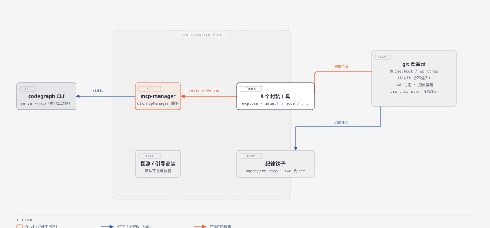
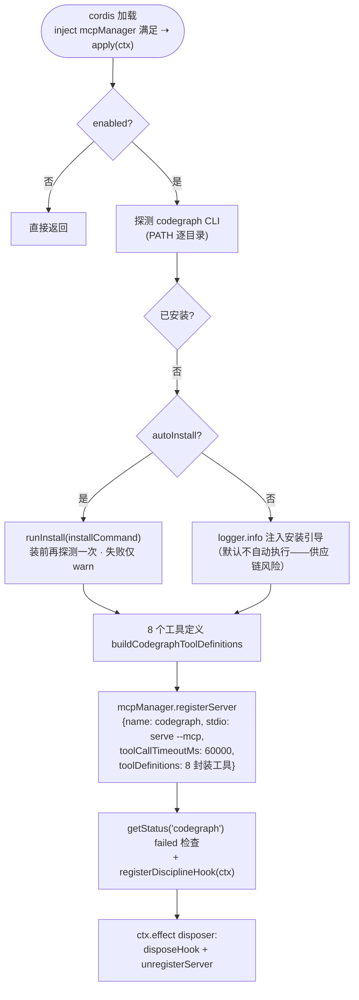
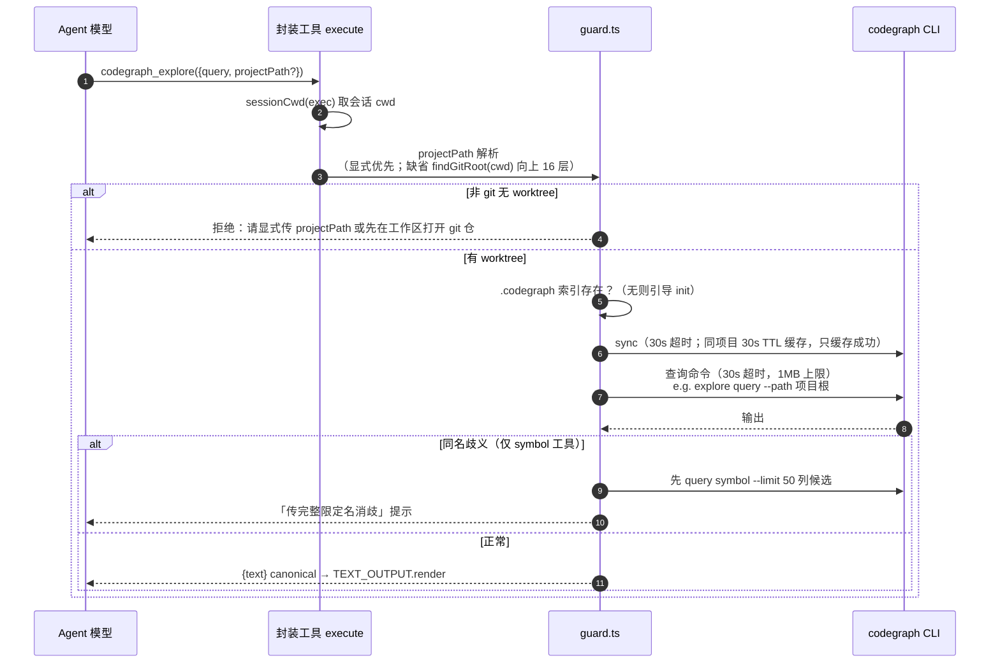
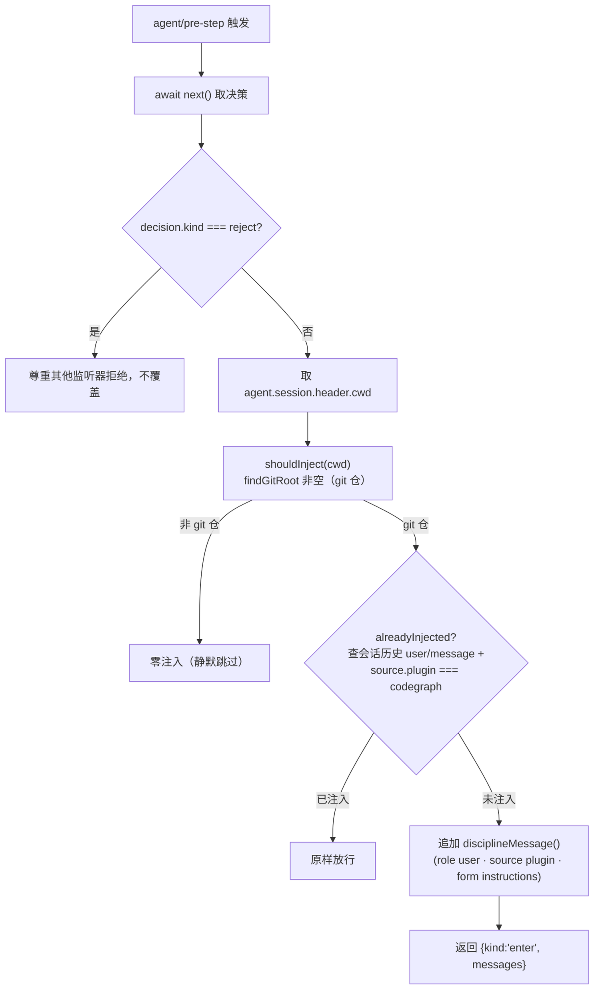

# dsh-codegraph 架构与运行机制（图解）

> 包：`@wingsky-1/dsh-codegraph` · 源码：`packages/dsh-codegraph/` · 版本：0.2.0
> 功能一句话：**codegraph MCP + worktree 开发纪律**——把
> [codegraph](https://github.com/colbymchenry/codegraph)（本地代码图谱 MCP）与配套
> worktree 开发纪律打包成 dsh 插件一键交付：探测/引导安装 CLI、经 dsh-mcp-manager
> 运行时注册 MCP 服务器，并在 git 仓会话注入「结构类查询优先用 codegraph」的纪律。
>
> 快速上手（安装 / 配置 / 工具表）见 [包 README](../../packages/dsh-codegraph/README.md)；
> 本文讲**原理与运行机制**。

---

## 1. 总体架构：零自注册，一切经 mcp-manager



> 图源：`docs/architecture/diagrams/codegraph-architecture.html`（diagram-design）。

核心设计（架构收敛，#363）：

- **不再自注册任何裸名工具**——8 个封装工具（`codegraph_explore` / `impact` / `node` /
  `callers` / `callees` / `search` / `files` / `status`）经 `registerServer.toolDefinitions`
  通道交给 mcp-manager 统一注册管理，模型只见统一命名的工具，底层 CLI 实现完全内部化；
- **强依赖 mcp-manager**（`inject: ["mcpManager"]`）：未启用时 cordis 内核自动停用本
  插件，启用后自动激活——MCP 的注册/管理/使用本就走 mcp-manager 的能力；
- **工具层纪律默认固化为行为**：查询前强制 sync（新鲜度硬保证）+ projectPath 校验/
  补全——不提供关闭开关，保证「worktree 索引不过期」「不漏传 projectPath」不被配置绕过。

---

## 2. 插件装配流程



关键点：

- **注册即连接**：`registerServer` 后 mcp-manager 立即建连（stdio: `codegraph serve
  --mcp`），失败经 `getStatus` 感知并 warn；配置为内存态不落盘，不影响 store 持久化；
- **探测不擅自安装**：默认 `autoInstall: false`——安装命令来自第三方
  `@colbymchenry/codegraph`，供应链风险由用户显式执行时自担；`provider 描述` 携带
  服务器级 description（#417 A2：能力目录如实展示结构类查询能力，fallback 只会埋没
  explore/impact/callers 核心能力）；
- **无客户端半**：纯宿主基础设施插件，无 UI，不注入任何 UI 组件。

---

## 3. 工具执行链路：sync → 校验 → 转发

每个封装工具共用统一 execute 骨架（`buildCliTool` + `guardedCodegraph`）：



守护细则：

- **强制 sync（TTL 缓存）**：`SYNC_TTL_MS=30000` 进程内 Map 只缓存成功，`codegraph sync
  <path>` 30s 超时——查询结果不缓存，索引不过期；失败且 CLI 缺失 → 提示安装；
- **stderr 非空即失败**：CLI 1.6.0 实测未知子命令 stderr 报错但退出码 0 的边角——
  以 stderr 为准兜底；`isNoResultOutput` 识别 `ℹ not found / No results found / No
  callers/callees/files found 等` → 返回中文空结果提示（非错误）；
- **CLI 映射与参数 schema 实测对齐**：impact/callers/callees 无 `file`、node 无 `line`、
  files 用 `filter`（CLI `--filter`）而非 `path`、status 的 path 为位置参数、
  search 映射 CLI `query` 子命令（CLI 无 search）；
- **契约要点**：schema 字段名必须 `parameters`（MCP 的 `inputSchema` 是可选别名）；
  全部工具 `isConcurrencySafe: () => true`（只读）。

---

## 4. 纪律注入机制

`registerDisciplineHook(ctx)` 监听根上下文 `agent/pre-step`（**注意**：cordis.patch.yml
注释写的是 agent/created，实际代码用 `agent/pre-step`，以代码为准）：



- **载体与幂等**：pre-step user 消息注入（官方 dsh-tool-skill 同款载体，出现在 GUI
  「上下文注入」面板）；compaction/resume 后历史压缩 → `alreadyInjected` false →
  重新注入（自愈）；
- **内容为场景决策表**（#417 A 项）：结构类查询（谁调用 X / 改 X 影响谁 / 符号定义与
  调用链）优先用 codegraph，按场景选 impact/explore/node/callers/callees/search/
  files/status，全文搜词才用 grep、正在编辑的文件 Read 原文；约 200 tokens/次，
  每会话一次非每 step；
- **与能力目录正交**：纪律讲工具用法、mcp-manager 能力目录讲服务器清单，无先后依赖
  （#360 曾排先后实测脆耦合，已去依赖）。

---

## 5. Worktree 开发流程（使用方式）

```
git worktree add ../dsh-hub-task-<n> -b task/<n>   # 建 worktree
codegraph init ../dsh-hub-task-<n>                 # 建该 worktree 索引（每 worktree 独立）
# 开发中改文件 → 查询时工具自动先 sync（无需手动）
# 任务结束清理 worktree 时 .codegraph/ 随目录删除
```

- **每 worktree 独立索引**：查询由工具自动 sync 保证新鲜度；未 init 的目录查询返回
  引导而非报错；索引只覆盖 init/sync 时的文件；`.codegraph/` 是本地运行时产物
  （已建议 gitignore），不入库。

---

## 6. 安全模型与依赖

| 项 | 说明 |
|---|---|
| 不自动执行第三方安装命令 | 默认 `autoInstall: false`；开启需知悉插件会执行安装命令（供应链风险） |
| stdio 子进程继承宿主权限 | codegraph MCP 服务器以宿主进程权限运行（同其他 stdio MCP） |
| 索引为本地 SQLite 无加密 | `.codegraph/` 含全部源码结构，多用户机器上注意目录权限 |
| 外部二进制非自包含 | codegraph 独立安装的二进制，不随本插件发布；本插件只探测 + 引导（发布物自包含、无运行时 npm 依赖） |
| 工具在真实服务器上执行 | 封装工具真实查询本地索引，先确认再操作 |

**依赖**：`dsh-mcp-manager`（提供 `ctx.mcpManager` service，**强依赖** inject 声明；
mcp-manager 未启用时 cordis 内核自动停用本插件）+ codegraph CLI
（`@colbymchenry/codegraph`，探测 + 引导安装）。