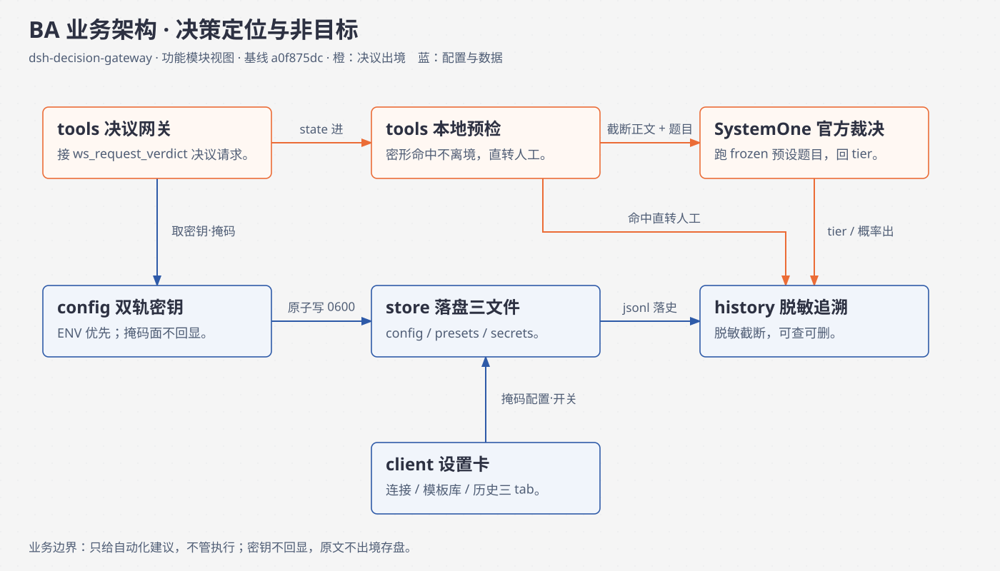
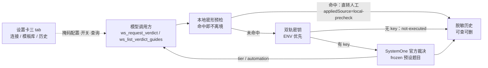
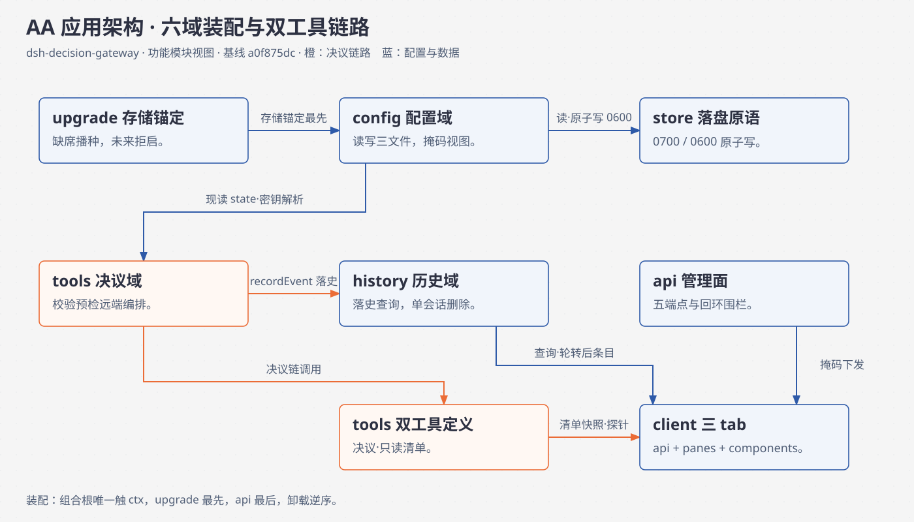
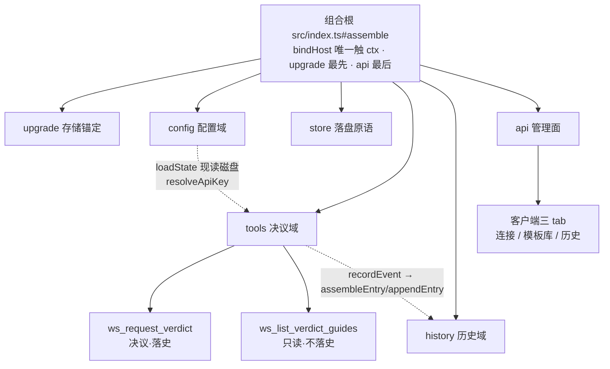
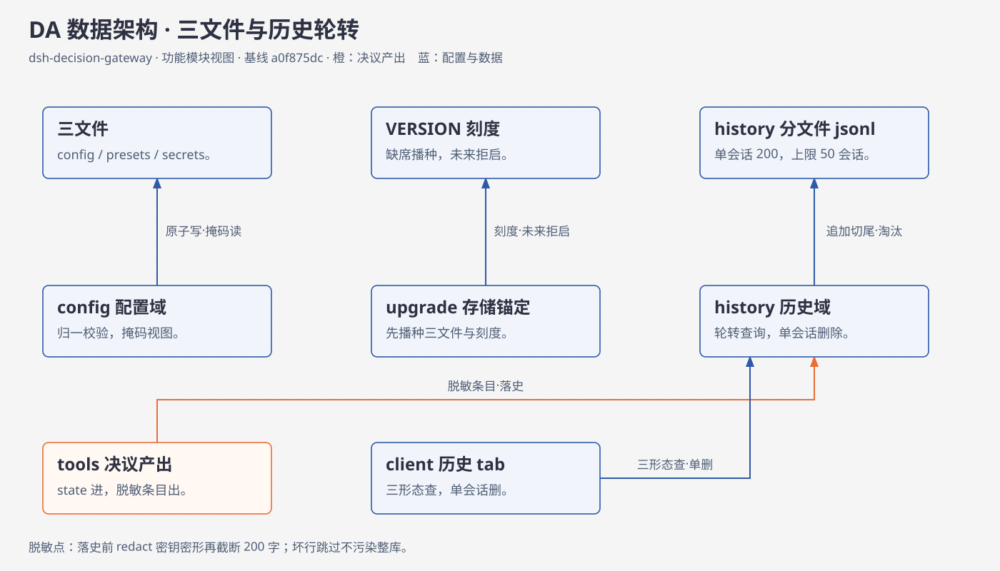
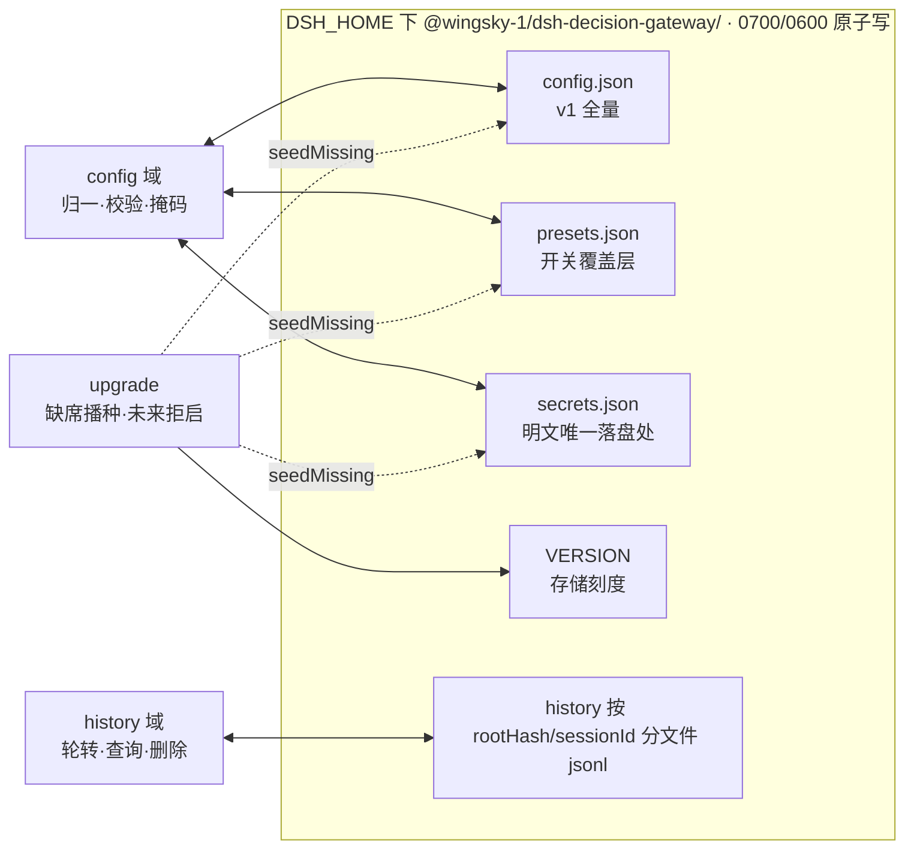
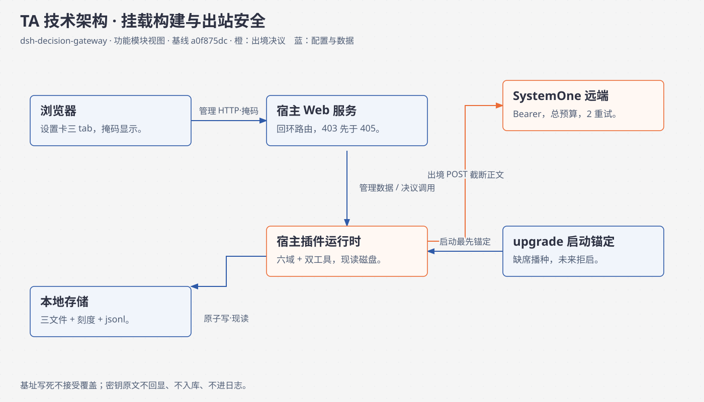
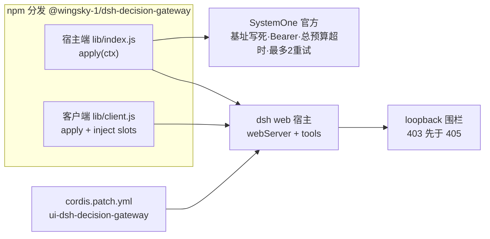

# dsh-decision-gateway 架构与运行机制（TOGAF 4A 四视图）

> 包：`@wingsky-1/dsh-decision-gateway` · 当前版本：0.1.0 · 源码：`packages/dsh-decision-gateway/`。
> 把一次“正文＋题目”的决议请求变成一次 frozen 预设裁决：本地密形预检先行，
> 密钥可用时才调 SystemOne 官方接口，结果与自动化等级回给模型并留下脱敏历史。
>
> 安装、配置与安全模型见 [包 README](../../packages/dsh-decision-gateway/README.md)。本文解释业务 BA、应用 AA、数据 DA、技术 TA。
> 与包 README 的分工：**本文讲原理（为什么这样画线），README 讲上手（怎么装、怎么配、怎么排障）**——配置项的缺省值与安全告警以 README 为准，本文只解释其机制含义。
> 证据基线：`a0f875dc`；证据为符号锚（`src/…#符号`，取自该树，后续提交会漂移，以符号搜索兜底）。
> `src/…` 省略包目录前缀。机制结论来自源码核对。#943 对账评论因本环境无 `gh` 未能拉取，下文只用包内代码事实，不转述评论内容。

## 四视图导航

| 视图 | 回答的问题 | 章节 | 图件 |
| --- | --- | --- | --- |
| BA | 决策定位、能力与非目标 | [§1](#ba) | [SVG](diagrams/decision-gateway-ba.svg) · [HTML](diagrams/decision-gateway-ba.html) |
| AA | 六域装配、双工具链路与三 tab | [§2](#aa) | [SVG](diagrams/decision-gateway-aa.svg) · [HTML](diagrams/decision-gateway-aa.html) |
| DA | 三文件、VERSION、历史 jsonl 与轮转 | [§3](#da) | [SVG](diagrams/decision-gateway-da.svg) · [HTML](diagrams/decision-gateway-da.html) |
| TA | 挂载、构建、出站安全与双轨密钥 | [§4](#ta) | [SVG](diagrams/decision-gateway-ta.svg) · [HTML](diagrams/decision-gateway-ta.html) |

四图沿用 worktree sidebar 点阵底纹、纸白/深灰、橙色主线和蓝色机制标注；节点只用功能模块词汇（宿主六域＋客户端三件＋SystemOne 远端＋落盘文件），边标注调用方向与数据；HTML 内联 SVG 自包含，独立 SVG 按仓库导出契约生成。

## 1. 业务架构（BA）

### 1.1 决策层定位与可见结果

| 能力 | 入口 | 可见结果与边界 |
| --- | --- | --- |
| frozen 预设裁决 | `ws_request_verdict(preset_id, state)` | 5 预设模板 frozen 在 `src/shared/contract.ts#FROZEN_PRESETS`（general / secret-leak / plan-review / risk-check / custom），`templateVersion` 恒为 1；成功输出以 `src/shared/contract.ts#DecideOutput` 为准，必带 provider / appliedSource / truncated / originalLength / tier / automation / 计费 codepoints / 重试次数 |
| 本地密形预检 | 全部预设（secret-leak 开关之外第二道闸） | 正文命中密钥密形（`sk-…`、`AKIA…`、`ghp_…`、私钥块、`password=` 等，`src/server/tools/impl/precheck.ts#localPrecheckHit`）即**不发任何出境请求**，直接返回人工接管（`appliedSource: local-precheck`，tier none / automation manual），本次仍落史 |
| 双轨密钥 | ENV 引用轨 / 明文轨 | `src/server/config/impl/service.ts#resolveApiKey`：`apiKeyRef` 指向的 ENV 非空即用（env 轨）；否则看明文，坏形状明文视同无 key 并告警；切到 ENV 轨即折叠清空 `secrets.json`（`src/server/config/impl/service.ts#savePatch`） |
| 置信分层与自动化建议 | tier / automationCap | tier 按序号映射 high/low/none（`Noul` 弃权强制 none）；automation 按封顶后序号给 manual/assisted/auto（none 一律 manual）；预设 `automationCap`（0=none 只人工，1=low，2=high）封顶；远端成功输出**被截断时强制 suggest-only**（local-precheck 的 manual 保持）（`src/server/tools/impl/service.ts` 文件头 R5） |
| 只读预设清单 | `ws_list_verdict_guides` | 不记录历史、不触网络（`src/server/tools/impl/define.ts` 文件头）；设置卡模板库 tab 的开关与三档 automationCap 即此清单的展示面 |

证据：`src/shared/contract.ts#FROZEN_PRESETS` / `#DecideOutput` / `#HistoryEntry`、`src/server/tools/impl/service.ts#decide`、`src/server/tools/impl/define.ts#buildToolDefinitions`。

### 1.2 非目标

- 不做自动执行。automation（manual/assisted/auto/suggest-only）只是**建议等级**，配合预设 automationCap 封顶；执行与否由调用方决定，本包不持执行器。
- 不做开放式推理。只跑 frozen 模板题目：custom 须自带全量题目（1–20 题任意），非 custom 的 override 须与模板等长同 id 集（`src/server/tools/impl/validate.ts` 文件头）；单题文本 1–255 codepoints，id 只许 ASCII（中文 id 即 400，state 正文中文合法）。
- 不提供可靠消息队列或事务组写。config/presets/secrets 三次独立原子写，非事务组写；写盘间隙崩溃的新旧混搭由读侧“缺口补默认”收敛（包 README“后续项”，deferred，非本版实现）。
- 不回显密钥。GET/PUT 成功响应一律掩码（只回 `apiKeyRef` 名与 `hasPlaintextKey`）；形状拒收 400 仅回 `empty|too-short|charset` 类别；落史 snippet 先脱敏后截断 ≤200 字，原始密钥永不入库（`src/shared/contract.ts#SNIPPET_MAX`）。
- 不保证上游可达。失败包络（`src/shared/contract.ts#ErrorEnvelope`）无概率字段，必含 errorCode＋category；无 key 时记 `not-executed` 落史，不伪造裁决。

## 2. 应用架构（AA）

### 2.1 唯一宿主组合根与五个功能域＋upgrade

`src/index.ts#apply` 以 `bindHost` 收窄 ctx（本文件唯一触 ctx 处），经 `assemble` 按依赖顺序接线；中途失败已装部分由调用方释放，卸载逆序由 `ctx.effect` 登记释放栈。配置每次现读磁盘（小文件，无缓存无过期）；状态住闭包，不住模块级变量。

| 域 | 装配与职责 | 实际能力依赖 |
| --- | --- | --- |
| upgrade | 最先同步锚定存储 | store 的读/原子写/列目录口；`seedDefaults` 由组合根按 `buildDefaultConfig` 供给 |
| config | 三文件读写、PUT 校验、双轨解析、掩码视图 | store 的读/原子写口；纯校验在 `impl/model.ts` |
| store | 落盘原语（目录 0700 / 文件 0600 / 临时文件＋随机后缀＋rename） | 无其它功能域依赖 |
| history | 分文件 jsonl 落盘/查询/单会话删除、脱敏组装 | store 的读/写/列目录/mtime/删文件/建目录口 |
| tools | 校验→开关→预检→截断→密钥→远端→落史编排；双工具定义 | config 的现读状态（enabled/cap/连接/密钥解析）、history 的落史口、注入的 fetch |
| api | 最后挂五条端点与围栏 | config 读写、history 查询/删除、tools 的预设清单、组合根的连接探针 |

证据：`src/index.ts#assemble`；各域 `interface.ts` 门面（只转出、不放实现）；`src/server/<域>/deps.ts` 的 Port。

### 2.2 决议链与双工具

`ws_request_verdict` 执行链（`src/server/tools/impl/service.ts#decide`）：参数校验 400（不落史）→ 预设开关关闭（不落史，`PRESET_DISABLED`）→ 按 `truncBudget` 截断（codepoints，不断字节）→ 本地预检命中（落史，直转人工）→ 密钥解析无 key（落史 `not-executed`）→ 远端调用（总预算超时＋有限重试＋信号量 `maxConcurrency`，`maxConcurrency` 变更时重建 gate）→ 成败落史。落史经 `safeRecord`：失败只记日志不污染结果，非法 sessionId 回落 unknown（文件名安全）。

`ws_list_verdict_guides` 只读：经组合根快照取 enabled/cap，不记录历史、不触网络（`src/server/tools/impl/define.ts#buildToolDefinitions` / `#rootOf` / `#sessionOf`，exec 防御式读取，缺席回落 unknown/process.cwd()）。

连接探针（`src/index.ts#probeConnection`）：空体合法，密钥取自服务端配置（不取自请求体），用 general 模板发一次真实调用，不记历史。

### 2.3 客户端三 tab

`src/client/index.ts` 干净模块（只 `apply`＋`inject`，`slots`）：设置卡三 tab——连接（ENV 名输入＋明文折叠免二次确认＋离线自检按钮＋高级折叠）/ 模板库（5 预设开关＋automationCap 三档＋导出 JSON，无导入）/ 历史（工作目录下拉＋会话下拉过滤，条目倒序，概率条＋tier＋截断徽标＋错误行，会话级清空仅 DELETE 单会话）。纯 DOM 文本节点渲染（无 innerHTML），零 bare import，样式独立 `style.css` 经 ensureStyle 注入，卸载进 `ctx.effect` disposer。

### 2.4 HTTP 面

路径统一前缀 `/api/dsh-decision-gateway`；事实源为 `src/server/api/impl/handlers.ts#buildEndpoints`，路由常量经 `src/shared/contract.ts#ROUTES` 双端共享（宿主 ROUTES 单一事实源经构建期注入客户端）。

| 路径 | 方法 | 语义 |
| --- | --- | --- |
| /health | GET | ok＋version＋templateVersion（恒 1） |
| /config | GET/PUT | 裸 v1 掩码体；PUT 体上限 64KB，嵌套包络归一，退役键 400 |
| /presets | GET | 只读清单（PUT 进方法表即 405） |
| /history | GET/DELETE | 查询（root 三形态＋limit 钳制）/ 仅单会话删除（root＋sessionId 双必填） |
| /test-connection | POST | 空体合法；ok 回 latencyMs，否则按码映射状态 |

围栏（`src/server/api/impl/route.ts#registerEndpoints`）：非回环一律 403（先于 405；cross-site 默认不放行）；方法不在表里给 405（带 Allow，不给 404）；失败体统一 errorCode＋category（`sendFailure`）。

## 3. 数据架构（DA）

### 3.1 三文件＋VERSION 与内存状态

根为 `DSH_HOME` 下 `@wingsky-1/dsh-decision-gateway/`（组合根 `home` 可覆盖；测试走 mkdtempSync 隔离目录）。文件名常量见 `src/shared/contract.ts`（`CONFIG_FILE_NAME` / `PRESETS_FILE_NAME` / `SECRETS_FILE_NAME` / `VERSION_FILE_NAME`）。

| 载体 | 协议 | 生命周期边界 |
| --- | --- | --- |
| config.json | v1 全量（`src/shared/contract.ts#ConfigV1`，`version` 唯一合法值 1）；缺省由 `buildDefaultConfig` 供给（8000/4/32000 与 200/50） | 运行期写只走 `savePatch`；读经 `loadState` 每次现读，无缓存 |
| presets.json | 开关覆盖层（`{presets}`，与 config 内 presets 同源快照） | 仅 presets 变更时写；ENV 轨切换不碰 |
| secrets.json | 明文唯一落盘处 | 明文写入免二次确认；切 ENV 轨即折叠清空；GET/PUT 永不回显 |
| VERSION | 单行存储刻度（目标 `STORAGE_TARGET`，基线 `BASELINE_VERSION`） | 缺席播种三文件＋刻度，已锚定空转，未来版本拒绝启动（fail-closed） |
| history jsonl | `history/<rootHash>/<sessionId>.jsonl`，一行一条目（`src/shared/contract.ts#HistoryEntry`） | 追加后超 `perSession`（200）只留末尾 N 行；会话文件超 `totalSessions`（50）按 mtime 淘汰最旧整文件 |

落盘原语（`src/server/store/interface.ts`）：目录 0700、文件 0600、临时文件＋随机后缀＋rename 原子写。三文件三次独立原子写，非事务组写（崩溃窗口被容忍，读侧缺口补默认收敛，deferred）。

### 3.2 配置一致性与掩码面

`loadState` 归一：退役键（`baseUrl` 等，`src/shared/contract.ts#RETIRED_KEYS`）剥离并告警，缺口补默认；PUT 显式带退役键直接 400（`src/server/config/impl/model.ts#normalizeLoadedConfig` / `#validatePutBody`）。`apiKeyRef` 须匹配大写 ENV 名形状（`src/shared/contract.ts#API_KEY_REF_RE`），与 `apiKeyPlaintext` 互斥（同时出现即 400；明文免二次确认，服务端仍校验互斥）；明文形状拒收 400 仅回类别，全大写长串（≥20 位字母数字混合，或 AKIA/ASIA 前缀）判 charset（`src/shared/contract.ts#keyShapeCategory`）。GET /config 与 PUT 成功响应均为裸 v1 掩码体（两端同时兼容裸体与 `{config}`/`{data}` 包装）。

### 3.3 历史轮转、查询与删除

追加（经 `appendEntry`）：读旧文＋一行→超限切尾→原子整文件替换→总量淘汰。总量淘汰只保“会话文件数 ≤totalSessions”语义：同毫秒 mtime 并列时淘汰并列中哪一个未定义，调用方只数总数（R1，`src/server/history/impl/service.ts` 文件头）。查询（`queryEntries`）：root 三形态——hex 直用 / 完整路径（含分隔符即哈希）/ basename 按 `rootDisplay` 逐条匹配；limit 缺省 100、上限 500，按 ts 倒序；坏行跳过（崩溃半截行不污染整库）。删除（`deleteSession`）：仅单会话，root 与 sessionId 双必填；basename 多命中即 400 歧义，不猜删。sessionId 形状先行校验（`SESSION_ID_RE`，防路径穿越；决议侧非法回落 unknown）。

条目组装（`assembleEntry`）：root 取指纹＋basename 双记（`rootHash`/`rootDisplay`），state 取哈希（`stateHashOf`），snippet 先脱敏（`redactSnippet`，密钥密形打码）后截断 ≤200 字；原始密钥永不入库（条目类型里就没有密钥字段）。

### 3.4 升级与卸载

upgrade（`src/server/upgrade/interface.ts#installUpgrade`）：装配期同步跑完迁移链，失败即抛、apply 随之失败；当前只做版本锚定（缺席按基线播种三文件＋刻度，已锚定空转，未来版本拒绝启动），配置形态自检与旧盘迁移留待加步骤时再写（deferred）。卸载无状态可收（写的是文件，无释放动作，`releaseUpgrade` 空转）；宿主组合根逆序摘除工具与路由。

## 4. 技术架构（TA）

### 4.1 挂载与构建依赖

cordis.patch.yml 以 ui-dsh-decision-gateway 插入 profile；宿主 exports→`lib/index.js`，客户端→`lib/client.js`；宿主 inject 为 webServer＋tools，客户端 inject 为 slots（另经 `dsh.client.inject` 拿 `@deepseek-ai/dsh-client-connection`，platform=web）。Node >=20；官方 optional peer 走 catalog，实际服务来自宿主，适配版本以仓库 pnpm-workspace.yaml 的 rc catalog 为准，不以本机 dsh 版本推断（`package.json#exports` / `dsh` / `engines`）。

build 为 clean-lib→tsc→scripts/build/bundle-host.ts；esbuild 内联第三方代码与 createRequire 垫片（`package.json#dsh.bundle.bannerJs`），发布物自包含。路由清单经入口 `ROUTES` 导出由 bundle-host 注入客户端；客户端零 bare import（不用 React，净化只用宿主已净化数据＋文本节点渲染）。

### 4.2 出站安全与密钥双轨

唯一出境点是 `callWithRetry` 向写死基址 `src/shared/contract.ts#JEV_BASE_URL`（加载断言防篡改，PUT 拒收 baseUrl 类键）的 POST：Bearer 认证，超时是**整次调用的总预算**（非逐次；默认 8000ms），可重试失败（超时/网络）最多 2 次重试，`retries` 如实回传供计费面；同进程并发上限 `maxConcurrency`（默认 4，信号量排队公平 FIFO）。离境正文是截断后文本＋题目（`truncated`/`originalLength` 如实回传；截断输出 automation 强制 suggest-only）。

密钥双轨：ENV 引用轨优先（`apiKeyRef` 只存 ENV 名，值永不落盘）；明文轨写入免二次确认、服务端仍校验互斥，切轨即清空对方（见 §3.1）。掩码面只出名与有无（`hasPlaintextKey`），密钥原文不回显、不入库、不进日志。

### 4.3 平台与兼容边界

`JEV_BASE_URL`、`ROUTES` 回环表、`TEMPLATE_VERSION`＝1、失败包络 errorCode＋category 是升级时需复核的耦合点；新增上游一律先报主代理裁决，不私自加基址（包 AGENTS.md 红线）。浏览器端只依赖 slots 的 settings.plugin.item 注入位与回环路由取数；缺 slots 即告警不挂载，不抛错打挂宿主。

### 4.4 门禁、证据与待核项

包 test 脚本 run-vitest.mjs --min 14 是下限契约，不是本文宣称的实际数量。测试全离线 mock（fetch 注入），落盘测试走 mkdtempSync；集成禁止写真实环境（env 经组合根注入）。结构门禁守跨域 interface/deps；pack:check 守声明合并可达性，contract/export-surface-snapshot 守公开面。新增文档链接的最终门禁按 [AGENTS.md](../../AGENTS.md) 执行 gate:pr；验证记录应区分本地门禁结果与 CI 状态，不以其中一项代替另一项。

待核：#943 对账评论未能拉取（本环境无 `gh`），本文与评论的一致性须由主代理在有 gh 环境复核；三文件组写崩溃窗口、mtime 并列淘汰语义、跨进程并发（信号量只限同进程）三处边界应在相关实现变更时同步复核。

## 5. 图源与维护

- [BA HTML](diagrams/decision-gateway-ba.html)、[AA HTML](diagrams/decision-gateway-aa.html)、[DA HTML](diagrams/decision-gateway-da.html)、[TA HTML](diagrams/decision-gateway-ta.html) 是独立图源（diagram-design 编辑风手写 SVG，节点只用功能模块词汇，边标调用方向与数据）。
- 方法论：[ARCHITECTURE-METHOD.md](../ARCHITECTURE-METHOD.md)；构建验证：[DEVELOPMENT.md](../DEVELOPMENT.md)。

导出命令：`python3 scripts/lib/export-diagram-svg.py docs/architecture/diagrams/decision-gateway-ba.html`，其它视图替换 ba 为 aa/da/ta。实际命令结果在交付说明单列，不由文中复现命令推定。
