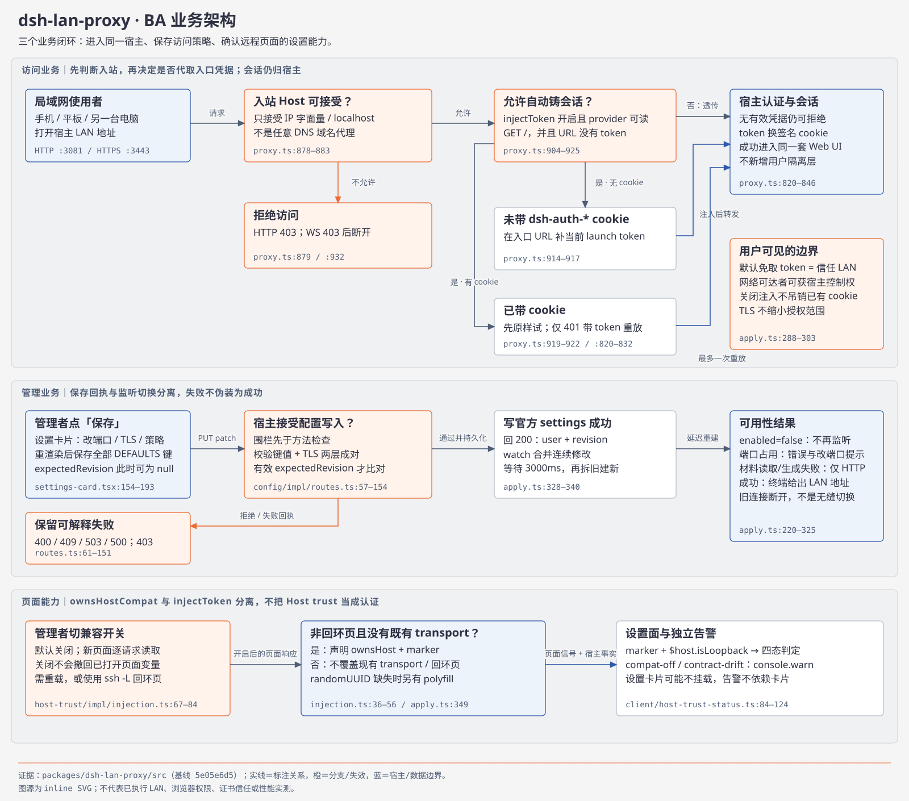
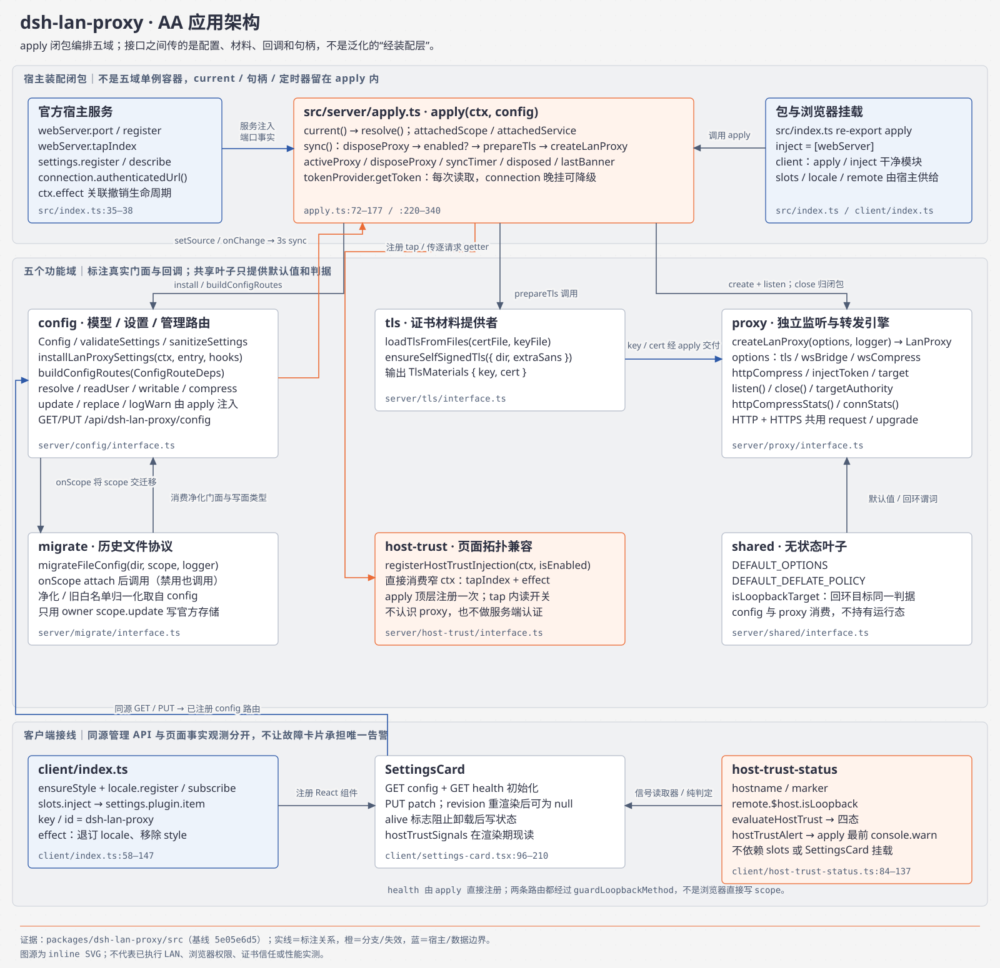
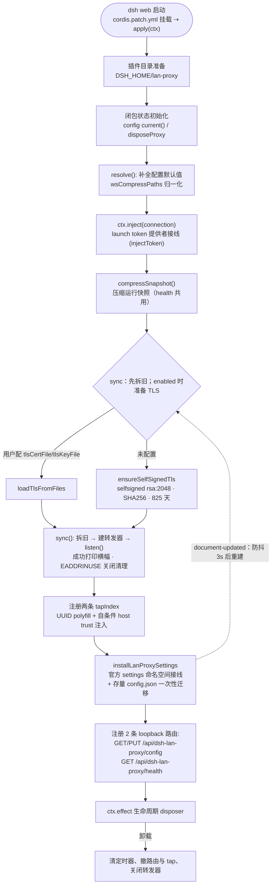
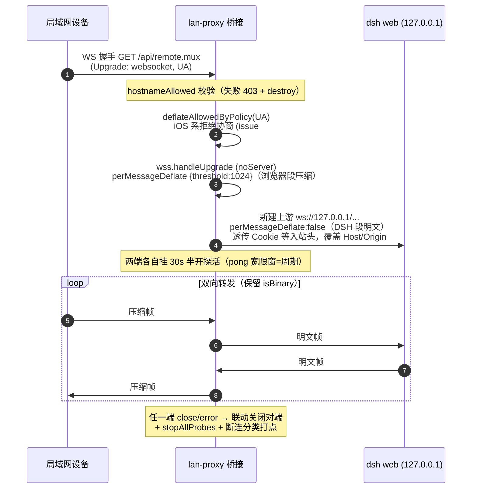
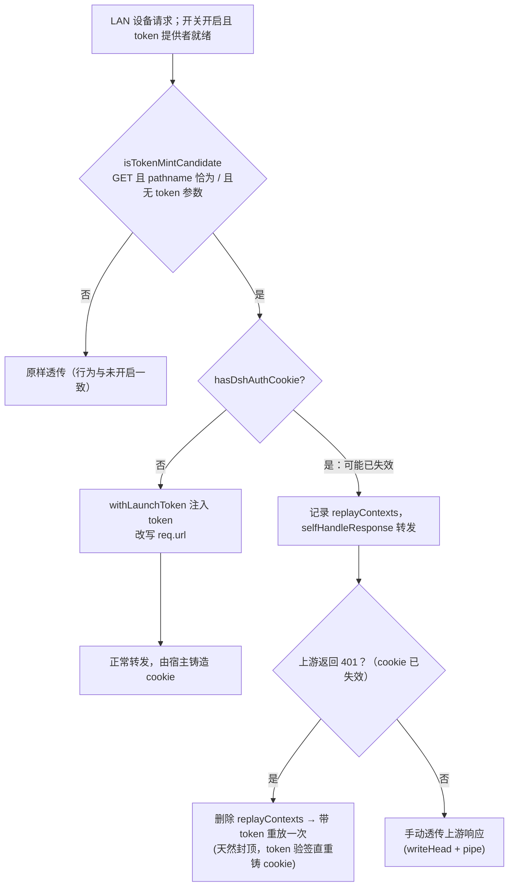
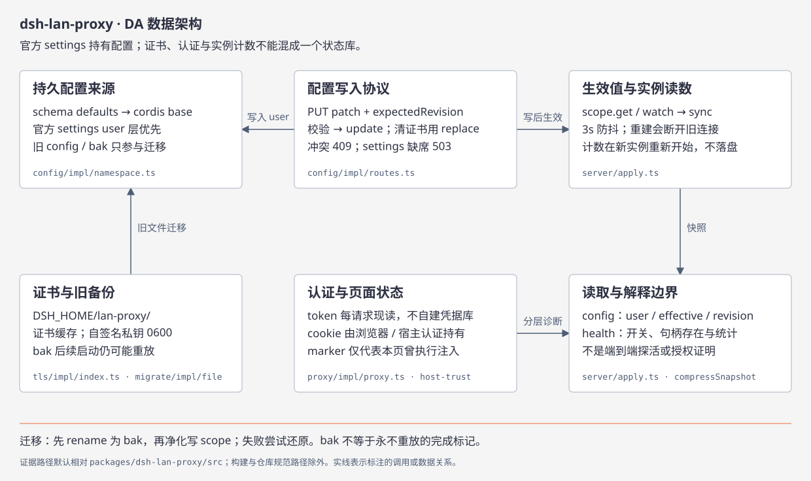
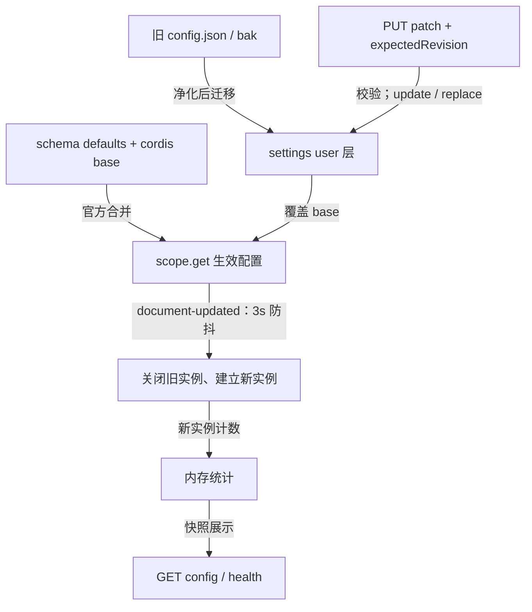
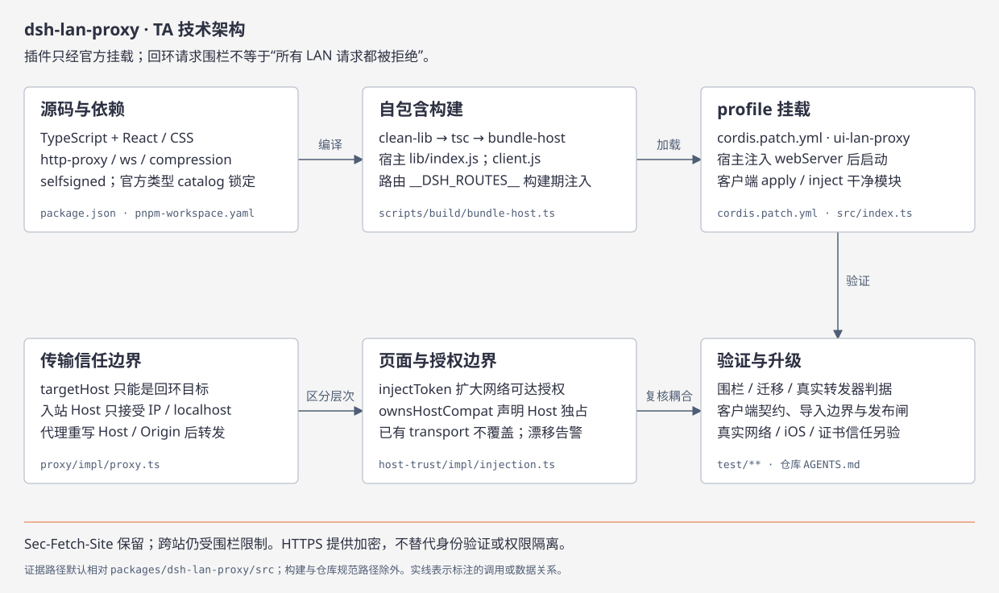

# dsh-lan-proxy 架构与运行机制（TOGAF 4A 四视图）

> 包：`@wingsky-1/dsh-lan-proxy` · 源码：`packages/dsh-lan-proxy/` · 版本：0.2.4
> 功能一句话：**局域网访问 dsh web UI**——在 `0.0.0.0:<port>` 监听，把 HTTP/HTTPS 与
> WebSocket/wss 转发到回环 web 服务器（默认 `127.0.0.1:3080`），并附带 DNS 重绑定防护、
> HTTPS 并存、WS 压缩桥接、HTTP 响应压缩与 launch-token 自动注入。
>
> 快速上手（安装 / 配置键 / 验证命令）见 [包 README](../../packages/dsh-lan-proxy/README.md)；本文讲**原理与运行机制**。

---

## 四视图导航

| 视图 | 回答的问题 | 图 |
|---|---|---|
| [BA 业务架构](#user-content-ba) | 谁使用、得到什么、不提供什么 | [BA 图](diagrams/lan-proxy-ba.svg) |
| [AA 应用架构](#user-content-aa) | 装配、功能域与客户端如何协作 | [AA 图](diagrams/lan-proxy-aa.svg) |
| [DA 数据架构](#user-content-da) | 配置、证书、认证材料与状态由谁持有 | [DA 图](diagrams/lan-proxy-da.svg) |
| [TA 技术架构](#user-content-ta) | 挂载、构建、信任边界与兼容性 | [TA 图](diagrams/lan-proxy-ta.svg) |

> 各视图的 SVG 由同名 HTML 导出；正文 Mermaid 讲关键链路。证据为 `路径:行号`（取自
> 80a8584a 树，后续提交会漂移，以符号搜索兜底）或可复现常量；不把历史性能读数当本次验证。
> 路径默认相对 `packages/dsh-lan-proxy/`。

<a id="ba"></a><a id="user-content-ba"></a>
## 1. 业务架构（BA）



### 1.1 使用者、能力与非目标

- 局域网设备访问同一台宿主的 dsh web，不创建第二套会话服务。
- 管理者经设置卡片调整监听端口、证书、压缩和访问策略；配置观察器驱动监听器重建。
- TLS 和压缩改善传输条件，不提供用户隔离；插件不是任意上游的通用代理，也不替代宿主认证。
- `injectToken` 默认开启会扩大访问授权；`ownsHostCompat` 默认关闭，仅影响页面 Host trust 声明，两者不是同一开关。

证据：`src/server/apply.ts:72`（apply）、`src/server/config/impl/model.ts:132`（`wsBridgeEnabled` 默认 true）、`:173`（`ownsHostCompat` 默认 false）、`src/client/settings-card.tsx`。

### 1.2 总体访问链

```text
局域网设备 ──HTTP/HTTPS/WS──▶ lan-proxy 转发器 ──回环转发──▶ dsh web
                               (Node 进程内)                 (127.0.0.1:3080)
```

原单图 `lan-proxy-architecture.{html,svg}` 保留为历史图源，当前结构以本页四视图为准。

关键设计取舍：

- **转发器是独立的监听层**，不改 dsh web 一行代码——经 `cordis.patch.yml` 挂载到
  profile 插件名册，宿主端 `apply(ctx)` 在回环 web 服务器绑定后启动，从
  `ctx.webServer.port` 解析真实上游端口（`--port 0` 也适用）；
- **两类流量两种处理**：普通 HTTP(S) 走 http-proxy 转发 + 响应压缩；默认所有 WS
  都终结后桥接以保活，只有压缩开关开启、白名单命中且 UA 策略允许时才协商压缩；
- **三条安全防线**：① `targetHost` 仅允许回环（防开放转发/SSRF）；② 入站 Host 仅接受
  IP 字面量或 `localhost`（DNS 重绑定防护）；③ 配置/health 路由走 `shared/loopback.js`
  的 loopback 围栏。

---

<a id="aa"></a><a id="user-content-aa"></a>
## 2. 应用架构（AA）



### 2.1 装配边界与域分工

`src/index.ts` 是包导出契约，实际组合根在 `src/server/apply.ts`。不要套用 notifier 的
八域单例模板：这里以装配闭包持有配置来源、监听器和定时器，各域经 `interface.ts` 供调用。

| 域 | 职责与依赖 | 主要证据 |
|---|---|---|
| config | schema、读写路由、官方 settings 接线；消费 shared 默认值 | `config/impl/model.ts:225`（`FILE_CONFIG_VALIDATORS`）、`config/impl/namespace.ts:18`（`SETTINGS_NS`）、`:28`（document-updated） |
| migrate | 旧格式迁移；消费 config 的净化与写端口 | `migrate/impl/file/index.ts:16`（`MIGRATED_BAK_NAME`） |
| tls | 加载成对证书或生成自签名材料，交给装配层 | `tls/impl/index.ts:50`（loadTlsFromFiles）、`:79`（ensureSelfSignedTls） |
| proxy | 独立 HTTP/HTTPS 监听、转发、压缩、WS 桥接 | `proxy/impl/proxy.ts:671`（createLanProxy） |
| host-trust | 经官方 tapIndex 注入自条件脚本；直接消费窄用途 ctx | `host-trust/impl/injection.ts:79`（registerHostTrustInjection） |

`src/server/shared/` 是默认值与回环目标判据的共享叶子。浏览器端由
`src/client/index.ts` 装配样式、locale、设置卡片与独立控制台观测；
`settings-card.tsx` 负责同源配置请求，`host-trust-status.ts` 负责信号判定。

### 2.2 装配与卸载时序

`apply(ctx)` 在宿主启动时被调用，按固定顺序装配（`src/server/apply.ts`，同步返回，转发器在
`sync()` 内立即启动）：



要点：

- **配置三通道**：官方 settings 命名空间 `dsh-lan-proxy`（`config/impl/namespace.ts:18`，user 层）
  ＝权威持久层 → 组合层 cordis config（base 层）→ schema 默认值兜底；解析顺序
  `defaults → base → user`。`settings/document-updated` 驱动 `scheduleSync`（`apply.ts:333-340`，**3000ms**
  防抖，`:339`），无需重启。防抖是刻意取舍：重建会 dispose 当前转发器、掐断经 lan-proxy
  正访问设置页的连接，先让保存回执发出再重建（`apply.ts:328-331` 注释明言「过早重建会丢失
  HTTP 响应（保存误报失败）」）；
- **存量 `<DSH_HOME>/lan-proxy/config.json`** 在 settings attach 后由 `migrateFileConfig`
  迁移进官方存储（`apply.ts:395-401` onScope 内，**前置于一切 enabled 判定**，禁用用户升级同样迁移）；
  原文件改名 `.migrated.bak`，bak 重放行为见 §3.2，不再把旧 config.json 当作配置权威源；
- **随机 UUID polyfill**：LAN 明文 HTTP 是非安全上下文，缺 `crypto.randomUUID`，
  否则客户端 RPC 的 `mintRpcId` 全抛错——`apply.ts:349-373` 经 `webServer.tapIndex` 以
  `<script id="__dshRandomUuidPolyfill__">` 幂等注入（`:352` 以 id 判重）；

---

### 2.3 转发与访问机制

#### 2.3.1 HTTP / HTTPS 转发

- `http-proxy@1.18.1`（构建期内联）＋ 上游 keep-alive 连接池（`proxy/impl/proxy.ts:688`，
  `Agent({ keepAlive: true, maxSockets: MAX_UPSTREAM_SOCKETS })`）；
- 每请求头重写 `rewriteHeaders`（`proxy.ts:282-290`）：只覆盖 `host`/`origin` 为回环
  authority，其余原样；**不使用 changeOrigin**——`forwardOptions`（`:769-773`）每请求前置
  重写，围栏逻辑不出本模块（`:760-763` 注释）；
- 断连传播（#308）：`proxyResReceived`（WeakSet，`proxy.ts:786`）为闸——仅当「未收到上游
  响应头」时 req `close` 才视为客户端断连并 destroy 上游请求（`:774-785` 注释解释了为什么
  不能用 `res.writableEnded`：正常请求会被误杀）；`proxy.on("error")` 回 502；

#### 2.3.2 HTTPS 并存

- 同一转发器同时监听 HTTP（默认 3081）与 HTTPS（默认 3443）；HTTPS 绑定失败**只降级
  HTTP-only**（warn），不拖垮 HTTP；
- 证书两级：用户配置 `tlsCertFile`/`tlsKeyFile`（成对校验，`apply.ts:199-210`，任一失败
  仅降级 HTTP-only）＞ 内置 selfsigned（`tls/impl/index.ts:79-104`）：rsa:2048 / sha256 /
  **825 天**（`:25`，≈2.25 年浏览器信任窗口），缓存到 `<DSH_HOME>/lan-proxy/`，私钥两次收敛
  0600（`:84`、`:100-103`）；SAN 除 `127.0.0.1`/`localhost`/`::1` 外并入本机全部非回环 IPv4
  （`:88` extraSans）——SAN 必需，Chrome 59+ 对缺失 SAN 的证书直接拒绝（`:5-7` 注释）；
  缓存复用条件是**剩余有效期 > 24h**（`:27` `MIN_REMAINING_SECONDS = 86400`，`:64-72` 判定），
  否则重签；

#### 2.3.3 WebSocket 压缩桥接（终结 + permessage-deflate）

插件装配默认 `wsBridgeEnabled:true`，所有 WS 升级都终结成两条连接并保活。
`wsCompressEnabled`、`wsCompressPaths`（默认 `["/api/remote.mux"]`）与 UA 策略只控制
浏览器段是否协商压缩；关压缩或清空白名单不丢保活。显式 `wsBridgeEnabled:false` 才全走字节透传。
直接调用 `createLanProxy` 且省略 `wsBridge` 时保留旧的按压缩路径选择桥接行为，
不能把这个底层兼容分支当作插件默认值。证据：`proxy/impl/proxy.ts:931-987` `handleUpgrade`
——围栏 403（`:932-935`）→ 三态判定（`:943-949`：true 全桥接 / false 全透传 / undefined
仅压缩路径桥接）→ 压缩判定 `:953`；透传路径按 UA 策略删 `sec-websocket-extensions`
（`:966-977`，上游不确认压缩则浏览器段不启用）。桥接四路 teardown（`:574-606`）方向不对称是
刻意的：上游 close/error → `browserWs.terminate()`（强拆，不依赖对端握手）；浏览器
close/error → `upstreamWs.close()`（握手级联）；转发器 close() 再经 `bridgeSockets`
登记（`:642-645`、`:758`）显式 terminate 上游不响应 close 的残留。半开探活两端独立计时
（`:534-555`，缺省 30s，`probeIntervalMs=0` 关闭），一个周期无 pong 即 terminate。

以下时序仅展示协商成功的压缩路径：



- **收益边界**：压缩率取决于帧内容与协商结果，本次文档更新未做性能基准；
- **不会双重压缩**：DSH 段固定不协商 `perMessageDeflate`，未来 DSH 自身开压缩也不冲突；
- **半开探活**：移动端切后台被系统静默掐断 TCP 时，`isAlive` 标记未复位 → `terminate()`，
  桥接不再僵死（issue #268）；判定强拆有可辨识 warn 日志。

#### 2.3.4 HTTP 响应压缩（Brotli/gzip，合并自 dsh-gzip）

- `compression@1.8.1` 中间件包在 HTTP 与 HTTPS 请求处理器外层（`proxy.ts:716-731` 经
  `withCompress` 接线，`:737-741`）——只作用于「本插件与 LAN 客户端之间」的链路，**回环直连
  web 不经过此层**；关闭时零开销直通（无中间件层）；
- 判定是 content-type filter（`:722-728`，复用 `isCompressible`，SSE 豁免）+ `threshold:
  1024`（`:721`），无路径白名单；filter 放行 ≠ 最终一定压缩（库按阈值/状态码二次判定），
  计数是**协商计数**（`:691-692` 注释）；本地生成的 403/预检/502 响应打 `LOCAL_RESPONSE`
  Symbol（`:711-713`、`:732-735`）不进计数，防诊断数字被非转发流量污染；
- 档位预设 0..3（0 默认 / 1 低 gzip1·br2 / 2 中 gzip5·br5 / 3 高 gzip9·br9），对 gzip 与
  Brotli 同时生效；`httpCompressEnabled:false` 一键关闭，装配默认档位为 1。
- 上游已带 `Content-Encoding` 时让位，不会二次压缩；不能承诺浏览器总能获得 Brotli。
  例如上游先协商了 gzip，本层就直接保留它（证据：包 AGENTS 与
  [官方 LAN 重叠评估](../../packages/dsh-lan-proxy/docs/official-lan-access-overlap-assessment.md)）。

#### 2.3.5 injectToken 自动注入（issue #380）

dsh web 的浏览器会话认证（launch token + 持久签名 cookie）无法关闭，token 每次重启
变化且只打印在本机终端——固定 LAN 设备拿不到实时 token。本插件经官方 connection 服务
公开 API `authenticatedUrl()` 动态读取 token，**仅在铸造入口自动补上**：



- **等效「信任整个局域网」**：开启后任何能网络到达该端口的客户端都免 token 获得完整
  dsh 控制权（bash 直通宿主机）——默认开启（维护者决策，家用固定内网场景），以启动
  横幅警示 + 设置卡片常驻警示 + 安全模型章节作缓解；不可信网段务必关闭；
- **关闭不吊销已发 cookie**：会话 cookie 有效期内（默认 30 天）已登录设备仍可直接进入；
  需立即收回时清空 dsh credentials 存储；
- **不注入范围**：仅 `GET /` 且无 token 参数（`isTokenMintCandidate`，`proxy.ts:334-342`，
  与上游铸造条件严格对齐）；WebSocket、非根路径、已带 token 的请求、provider 不可用时全部
  原样透传。带 cookie 判定按 RFC 6265 精确解析 cookie 名前缀 `dsh-auth-`
  （`hasDshAuthCookie`，`:305`、`:313-327`），注释明说**禁止整头子串匹配**——其他 cookie 值
  含该子串会误判；重放上下文存 `replayContexts` WeakMap（`:789`），401 时 `delete` 后带 token
  重放一次（`:820-829`），天然封顶。

---

### 2.4 Host trust 注入与可观测降级

`ownsHostCompat` 默认关闭（`config/impl/model.ts:173`）。`registerHostTrustInjection`
（`host-trust/impl/injection.ts:79-86`）只在 apply 顶层注册一次 tap——写进 `sync()` 会让
webServer 的 indexTaps 随每次配置热更新无界增长（`:14-18` 注释的硬纪律 1）；开关在 tap 内
**按请求**读取（`apply.ts:378` 传 `() => resolve().ownsHostCompat === true`，硬纪律 2：捕获
布尔后切开关要么不生效、要么被迫重建转发器掐断活跃连接）。脚本只在非回环页面（localhost /
`[::1]` / 整个 127/8，与上游 `isLoopbackHostname` 同口径，`injection.ts:42-48`）、且已有
`__DSH_TRANSPORT__` 未定义时写入 `{ ownsHost: true }` 和 `__DSH_LAN_PROXY_HOST_TRUST__`
marker（`:39`、`:52-53`）。已有 transport 不覆盖——为什么不用结构化注入行：`kind: "global"`
行渲染为整体赋值，会覆盖 desktop-host 等组合先行写入的 transport 且函数字段被 JSON 序列化
丢弃（`:9-12` 注释）。关闭时逐字节原样返回（`:68`）。这不是服务端身份验证，也不等于 TLS；
更改开关不会撤回已打开页面中的全局变量，需重新加载页面观察新结果。

观测器 `evaluateHostTrust`（`client/host-trust-status.ts:84-93`）结合 hostname、marker 与
`ctx.remote.$host.isLoopback`（防御式最小面 `RemoteLike`，`:28-30`）表驱动给出四态：
`loopback-page`（回环页，或无 marker 但 `isLoopback` 为 true 的宿主独占页——那是正常态，
`:86-89`）/ `compat-active` / `contract-drift` / `compat-off`。`contract-drift` 是 marker 在
而宿主事实非 true（**含未知**，fail-closed，`:91-92`）。告警经独立出口 `hostTrustAlert`
（`:109-124`）：在目标 dsh `0.1.7-rc.2` 上，设置卡片由
`configForms.whileServed(["dsh-lan-proxy"])` 门控并注册到 keyed
`plugins.row.config`；canonical row id 是 `dsh-lan-proxy`，settings namespace 是 `dsh-lan-proxy`，row key
是 `@wingsky-1/dsh-lan-proxy#dsh-lan-proxy`。上游把非回环页设置面降级为 memory scope
时，namespace 不存在，行与卡片根本不挂载（`:98-104` 注释：同一枚 isLoopback 信号既决定
卡片是否挂载、又决定判定结果，越需要判定的时刻承载面越不在场）——devtools 控制台是故障态
下唯一可见面，客户端 apply 最前面告警一次（`client/index.ts:71`），宿主横幅同时报告配置
开关（`apply.ts:295-303`，OFF 文案含 ssh -L 替代建议），不能只靠卡片呈现故障。

证据：`host-trust/impl/injection.ts:36-56`（脚本正文）、`client/host-trust-status.ts:84-93`
（判定）、`:109-124`（告警文案）、`client/index.ts:71`。

<a id="da"></a><a id="user-content-da"></a>
## 3. 数据架构（DA）



### 3.1 数据归属

| 数据 | 权威来源 / 生命周期 | 消费方 |
|---|---|---|
| 用户配置 | 官方 settings 的 `dsh-lan-proxy` 命名空间（`namespace.ts:18`） | `scope.get` + `settings/document-updated`、配置路由、装配层 |
| 旧 `config.json` / bak | 迁移输入；bak 可能再次重放，不是日常配置权威源 | `migrateFileConfig`（`migrate/impl/file/index.ts:115`） |
| TLS 材料 | 用户文件或 `<DSH_HOME>/lan-proxy/` 的 `dsh-lan-proxy-{key,cert}.pem`（`tls/impl/index.ts:21-22`） | TLS 域、HTTPS 监听器 |
| launch token / cookie | 宿主认证服务 / 浏览器；插件只持 WeakMap 单次重放上下文 | 转发器限定入口注入或透传 |
| 监听句柄与统计 | 转发器实例内存状态（`connStats` 八项计数，`proxy.ts:695-704`；转发器重建后清零） | health 与配置快照 |

证据：`config/impl/namespace.ts`、`tls/impl/index.ts:20-104`、`apply.ts:180-192`（compressSnapshot）。

### 3.2 迁移与瞬态数据生命周期

迁移是 **rename-first marker**（`migrate/impl/file/index.ts:4-6`）：先把 `config.json`
原子改名 `config.json.migrated.bak`（存在即「已处理过」），再 `sanitizeSettings` 净化、
旧白名单归一化（`:23-30`：显式保存过旧默认 `["/api/events.mux","/api/events.host"]` 的存量
升级后写为新默认 `["/api/remote.mux"]`，自定义白名单原样保留），经 owner `scope.update`
增量写入；写失败回滚改名让下次启动重试（`:216` 注释：数据始终存在于 config.json 或 bak
之一）。**中断态**（bak 存在且 config.json 不存在 = 改名后写入未完成）从 bak 重放
（`resumeMigrateFromBak`，`:53-112`），成功后保留 bak——update 同值 merge 幂等，后续启动
重放无害（`:50-51` 注释），所以 **bak 不是不可重放的完成标记**；损坏/空 JSON 只改名不写入
（防固化 schema 默认值，`:40-41`）并 warn 手动恢复路径。这里描述现有行为，不改迁移协议。
证据：`migrate/impl/file/index.ts:16`、`:115-120`（五步时序）、`:53`。

配置来源在 settings attach 后切换至 `scope.get()`；attach 前使用组合层配置。
即使 disabled，也保留 settings 与管理路由的装配，以允许迁移与重新启用。
监听器重建会断开当前转发连接，3 秒防抖让保存回执先返回，而非零断连切换。

压缩计数、断连计数属于转发器实例，不落盘；新实例重新计数。health 的 `listening`
来自 disposer 是否存在，并非主动网络探测，`httpPort` / `httpsPort` 是配置值；
禁用或监听失败时 `activeProxy` 引用不一定清空，统计可能是旧实例最后的读数。
不能把配置开关、句柄存在或页面 marker 单独当成端到端健康证明。token getter 每请求现读；
带 cookie 的候选请求使用 WeakMap 保存单次重放上下文，消费后删除，不形成凭据数据库。



### 3.3 路由与配置

本插件两条管理路由（`buildConfigRoutes`，`config/impl/routes.ts:160`；health，
`apply.ts:448-480`）走 loopback 围栏 + 方法白名单（`guardLoopbackMethod`，403 先于 405）。
围栏检查的是**到达宿主的请求**：经 lan-proxy 的同源请求被 `rewriteHeaders` 重写
Host/Origin 后从回环连接上游，合法同源请求可通过围栏，不能声称 LAN 一律 403。
`Sec-Fetch-Site` 原样透传（`proxy.ts:29` 注释），跨站仍可能被围栏拒绝；服务端围栏与
浏览器侧 Host trust 是不同层。

| 路由 | 方法 | 说明 |
|---|---|---|
| `/api/dsh-lan-proxy/config` | GET / PUT | 配置快照（含压缩运行态 `compress`）+ 增量 patch（`applyConfigPatch`：validate → sanitize → tls 成对 → update/replace） |
| `/api/dsh-lan-proxy/health` | GET | 健康检查：enabled / 端口 / 监听状态 / wsCompress 生效值 / 压缩协商计数 / connStats / configDir |

配置键集以 `config/impl/model.ts` 的 zod schema（`:132-206`，含 `wsBridgeEnabled` 默认
true、`ownsHostCompat` 默认 false）与 `FILE_CONFIG_VALIDATORS`（`:225`）双轨为准——schema
给默认值，validators 给非法键定位。GUI 保存经 PUT patch（`applyConfigPatch`，
`routes.ts:57-154`）：validate 定位首个非法键（`:79-87`）→ sanitize → TLS **两层成对校验**
（raw 层按键存在性 `:102-111`，防「单侧空串 + 另一侧缺席」残留孤儿半套证书；sanitize 层
`:113-120`）→ 清除语义走 `replace` 整节替换（update 是 merge 无法 unset，`:53-55`）→
冲突 `SETTINGS_CONFLICT` 回 409（`:140-147`）、settings 缺席 503（`:61-68`）、写入异常对外
收敛固定文案（P2-2，`:148-151`），异常原文只进服务端日志。

---

<a id="ta"></a><a id="user-content-ta"></a>
## 4. 技术架构（TA）



### 4.1 挂载与构建

`cordis.patch.yml` 经 profile 加载插件；`src/index.ts` 保留契约与导出，
`src/server/apply.ts` 装配运行时。包构建依次执行清理、TypeScript 编译与
`scripts/build/bundle-host.ts`，产出 `lib/index.js` 与 `lib/client.js`。客户端路由
通过构建期 `__DSH_ROUTES__` 注入，React 由宿主提供；第三方转发库构建期内联。
依赖版本以包 `package.json` 与仓库 `pnpm-workspace.yaml` catalog 为准。

### 4.2 安全模型

| 机制 | 实现位置 | 要点 |
|---|---|---|
| targetHost 回环白名单 | `isLoopbackTarget`（`server/shared/net.ts#isLoopbackTarget`，配置校验与引擎入口共用的同一份实现）+ 配置层校验 + `createLanProxy` 入口强校验 | 只允许 `localhost`/`127.0.0.1`/`::1`，防开放转发/SSRF（三层防线） |
| 入站 Host 校验（DNS 重绑定防御） | `hostnameAllowed`（`server/proxy/impl/proxy.ts#hostnameAllowed`） | 仅接受 IP 字面量或 `localhost`，任何 DNS 域名 403/断开；对 HTTP 与 WS 入站同样生效 |
| 配置/health 路由围栏 | `isLoopbackRequest`（shared/loopback.js） | remoteAddress 回环 + Host 回环 + 非 cross-site + Origin 与 Host 一致 |
| 凭据透传范围 | `rewriteHeaders` / `bridgeUpstreamHeaders` | 只覆盖 Host/Origin，Cookie/Authorization 原样透传；WS 桥接剥离 hop-by-hop 与 sec-websocket-* 头；上游被 targetHost 强制回环，凭据只向本机回环上游转发，不保证不跨进程 |
| HTTPS 私钥 | `server/tls/impl/index.ts` | 自签名私钥落盘 0600；用户证书文件成对校验 |
| injectToken | `server/proxy/impl/proxy.ts#withLaunchToken` / `#isTokenMintCandidate` | 仅「GET / 且无 token」注入；有 cookie 首次不注入；仅上游 401 时带 token 重放一次 |

> 全量安全语义（含跨站残余面分析、health 元数据可见性等）见包 README「安全模型」节。

---

### 4.3 测试、门禁与兼容性

- 代码判据分布在 `test/unit/`、`test/integration/`、`test/e2e/`、`test/client/` 与
  `test/client-unit/`；重点覆盖回环围栏、真实转发器、配置迁移、证书、桥接与 host trust 判定。
  测试文件存在不等于本次已执行；实跑范围与 exit code 以任务交付说明为准。
- 结构与发布约束由仓库门禁守卫：导入目录边界、公共导出快照、客户端契约、发布物自包含。
  验证档位遵循 [仓库 AGENTS](../../AGENTS.md)，不在本文复制易过期的阈值和用例数。
- 官方耦合面包括 `webServer.port/register/tapIndex`、settings owner scope、
  `connection.authenticatedUrl()`、客户端 settings 插槽、`__DSH_TRANSPORT__` 与
  `$host.isLoopback`。其中 host trust 是兼容性声明，不是官方对远程页面权限的长期承诺。
- `injectToken` 默认扩大 LAN 访问权；`ownsHostCompat` 进一步让非回环页面被视为 Host
  独占。开启后必须按宿主控制权限评估暴露面；HTTPS 只解决传输，不缩小授权范围。
- 本次不进行真实 LAN、浏览器权限、iOS 或证书信任实测；这些部署结果不能由单元测试替代。

### 4.4 已知限制

- HTTPS 自签名证书无外部命令依赖；未配置证书且生成失败时 HTTPS 自动降级关闭
  （`apply.ts:212-217` 仅 warn）；
- 换网段导致 IP 变化时自签名证书需重新生成（SAN 含旧 IP，`tls/impl/index.ts:88`）或配置
  证书文件路径；剩余有效期 >24h 的旧证书不会主动重签；
- WS 桥接有额外连接与压缩开销；关闭桥接会同时失去其保活能力（移动端切后台会被上游心跳
  判死，`proxy.ts:91-101`），不应只为关闭压缩而关桥接；
- health 的 `listening` 是 `disposeProxy !== undefined`（`apply.ts:465`），`connStats` 来自
  `activeProxy`（`:476`）——禁用或监听失败后统计可能是旧实例最后的读数，不是端到端探活。
