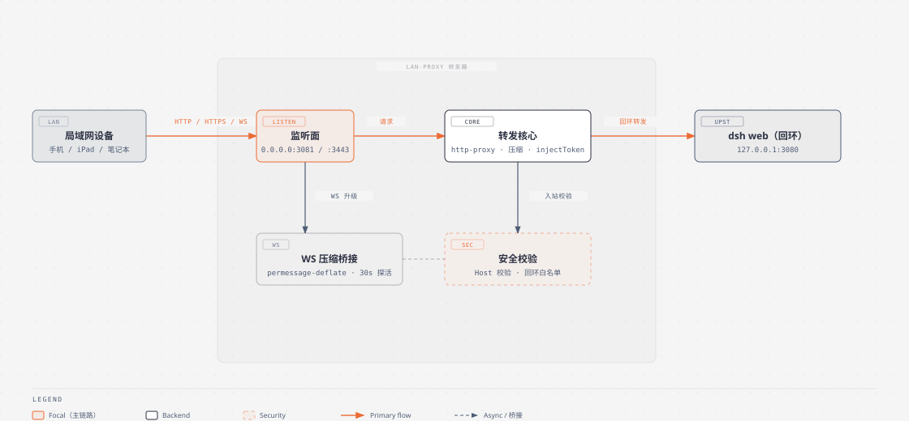
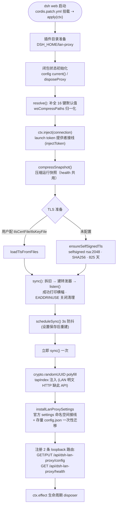
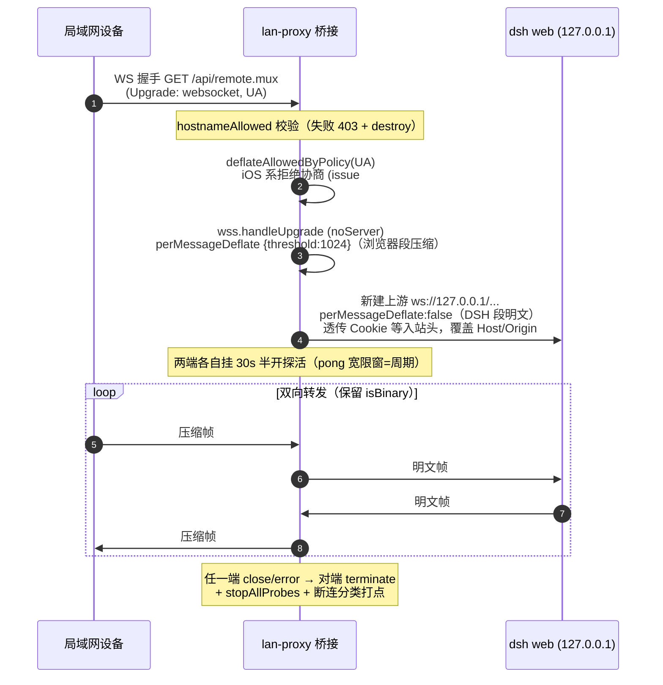
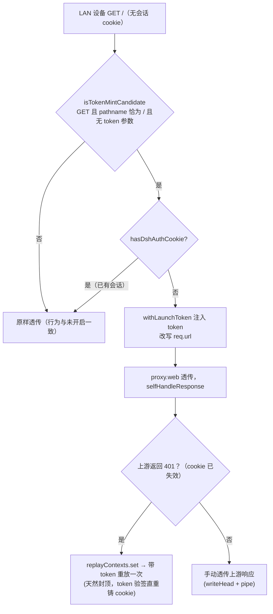

# dsh-lan-proxy 架构与运行机制（图解）

> 包：`@wingsky-1/dsh-lan-proxy` · 源码：`packages/dsh-lan-proxy/` · 版本：0.2.0
> 功能一句话：**局域网访问 dsh web UI**——在 `0.0.0.0:<port>` 监听，把 HTTP/HTTPS 与
> WebSocket/wss 转发到回环 web 服务器（默认 `127.0.0.1:3080`），并附带 DNS 重绑定防护、
> HTTPS 并存、WS 压缩桥接、HTTP 响应压缩与 launch-token 自动注入。
>
> 快速上手（安装 / 配置键 / 验证命令）见 [包 README](../../packages/dsh-lan-proxy/README.md)；本文讲**原理与运行机制**。

---

## 1. 总体架构

```text
局域网设备 ──HTTP/HTTPS/WS──▶ lan-proxy 转发器 ──回环转发──▶ dsh web
                               (Node 进程内)                 (127.0.0.1:3080)
```



> 图源：`docs/architecture/diagrams/lan-proxy-architecture.html`（diagram-design，
> 可打开调整后重新导出 SVG）。

关键设计取舍：

- **转发器是独立的监听层**，不改 dsh web 一行代码——经 `cordis.patch.yml` 挂载到
  profile 插件名册，宿主端 `apply(ctx)` 在回环 web 服务器绑定后启动，从
  `ctx.webServer.port` 解析真实上游端口（`--port 0` 也适用）；
- **两类流量两种处理**：普通 HTTP(S) 走 http-proxy 字节转发 + 响应压缩；命中的
  WebSocket 路径（默认 `/api/remote.mux`）走「终结 + permessage-deflate」压缩桥接；
- **三条安全防线**：① `targetHost` 仅允许回环（防开放转发/SSRF）；② 入站 Host 仅接受
  IP 字面量或 `localhost`（DNS 重绑定防护）；③ 配置/health 路由走 `shared/loopback.js`
  的 loopback 围栏。

---

## 2. 插件装配流程

`apply(ctx)` 在宿主启动时被调用，按固定顺序装配（`src/apply.ts`，同步返回，转发器在
`sync()` 内立即启动）：



要点：

- **配置三通道**：官方 settings 命名空间 `dsh-lan-proxy`（user 层）＝权威持久层 →
  组合层 cordis config（base 层）→ schema 默认值兜底；解析顺序
  `defaults → base → user`。`scope.watch` 驱动热更新（3s 防抖重建转发器），无需重启；
- **存量 `~/.dsh/lan-proxy/config.json`** 在 settings attach 后一次性迁移进官方存储
  （原文件改名 `.migrated.bak` 备份，中断可重放），此后手改 config.json 不再生效；
- **随机 UUID polyfill**：LAN 明文 HTTP 是非安全上下文，缺 `crypto.randomUUID`，
  否则客户端 RPC 的 `mintRpcId` 全抛错——经 `webServer.tapIndex` 幂等注入补丁脚本。

---

## 3. 核心机制

### 3.1 HTTP / HTTPS 转发

- `http-proxy@1.18.1`（构建期内联）＋ 上游 keep-alive 连接池（`maxSockets: 64`）；
- 每请求头重写 `rewriteHeaders`：只覆盖 `host`/`origin` 为回环 authority，其余原样；
  **不使用 changeOrigin**（围栏逻辑留本模块）；
- 断连传播：`proxyRes` 记 `httpClientAborted` 并 `res.destroy()`；`proxyReq` 监听底层
  socket close（防移动端切后台占用 keep-alive 槽位）；`proxy.on("error")` 回 502。

### 3.2 HTTPS 并存

- 同一转发器同时监听 HTTP（默认 3081）与 HTTPS（默认 3443）；HTTPS 绑定失败**只降级
  HTTP-only**（warn），不拖垮 HTTP；
- 证书两级：用户配置 `tlsCertFile`/`tlsKeyFile`（mkcert 零警告）＞ 内置 selfsigned 自动
  生成并缓存到 `<DSH_HOME>/lan-proxy/`（私钥 0600，SAN 含 localhost/127.0.0.1/::1/本机
  局域网 IP，剩余有效期 <24h 自动重签）。

### 3.3 WebSocket 压缩桥接（终结 + permessage-deflate）

命中 `wsCompressPaths`（默认 `["/api/remote.mux"]`，dsh 0.1.2 起 api-gateway 的 Remote
流 mux 端点）的 WS 升级**不做字节透传**，而是终结后重新建两条独立连接：



- **收益**：remote.mux 承载实时事件流/会话轨迹等大流量帧，实测压缩省 **75~79%**；
- **不会双重压缩**：DSH 段固定不协商 `perMessageDeflate`，未来 DSH 自身开压缩也不冲突；
- **半开探活**：移动端切后台被系统静默掐断 TCP 时，`isAlive` 标记未复位 → `terminate()`，
  桥接不再僵死（issue #268）；判定强拆有可辨识 warn 日志。

### 3.4 HTTP 响应压缩（Brotli/gzip，合并自 dsh-gzip）

- `compression@1.8.1` 中间件包在 HTTP 与 HTTPS 请求处理器外层——只作用于「本插件与
  LAN 客户端之间」的链路，**回环直连 web 不经过此层**；
- 判定依据是 content-type filter（JSON/`+json`/`text/*`，**SSE `text/event-stream` 豁免**）
  + threshold 1024，无路径白名单（README 中「路径白名单」指 WS 桥接的 `wsCompressPaths`）；
- 档位预设 0..3（0 默认 / 1 低 gzip1·br2 / 2 中 gzip5·br5 / 3 高 gzip9·br9），对 gzip 与
  Brotli 同时生效；`httpCompressEnabled:false` 一键关闭。

### 3.5 injectToken 自动注入（issue #380）

dsh web 的浏览器会话认证（launch token + 持久签名 cookie）无法关闭，token 每次重启
变化且只打印在本机终端——固定 LAN 设备拿不到实时 token。本插件经官方 connection 服务
公开 API `authenticatedUrl()` 动态读取 token，**仅在铸造入口自动补上**：



- **等效「信任整个局域网」**：开启后任何能网络到达该端口的客户端都免 token 获得完整
  dsh 控制权（bash 直通宿主机）——默认开启（维护者决策，家用固定内网场景），以启动
  横幅警示 + 设置卡片常驻警示 + 安全模型章节作缓解；不可信网段务必关闭；
- **关闭不吊销已发 cookie**：会话 cookie 有效期内（默认 30 天）已登录设备仍可直接进入；
  需立即收回时清空 dsh credentials 存储；
- **不注入范围**：仅 `GET /` 且无 token 参数；WebSocket、非根路径、已带 token 的请求、
  provider 不可用时全部原样透传。

---

## 4. 路由与配置

所有 `/api` 路由走 loopback 围栏（非回环 403 / 方法错 405）：

| 路由 | 方法 | 说明 |
|---|---|---|
| `/api/dsh-lan-proxy/config` | GET / PUT | 配置快照（含压缩运行态 `compress`）+ 增量 patch（`applyConfigPatch`：validate → sanitize → tls 成对 → update/replace） |
| `/api/dsh-lan-proxy/health` | GET | 健康检查：enabled / 端口 / 监听状态 / wsCompress 生效值 / 压缩协商计数 / connStats / configDir |

配置 16 键（`enabled, host, port, httpsEnabled, httpsPort, tlsCertFile, tlsKeyFile,
targetHost, targetPort, printBanner, wsCompressEnabled, wsCompressPaths, wsDeflatePolicy,
httpCompressEnabled, httpCompressLevel, injectToken`），GUI 在「设置 → 插件 → 局域网访问」
卡片中编辑，保存即热更新。

---

## 5. 安全模型

| 机制 | 实现位置 | 要点 |
|---|---|---|
| targetHost 回环白名单 | `isLoopbackTarget`（proxy.ts:275-278）+ 配置层校验 + `createLanProxy` 入口强校验 | 只允许 `localhost`/`127.0.0.1`/`::1`，防开放转发/SSRF（三层防线） |
| 入站 Host 校验（DNS 重绑定防御） | `hostnameAllowed`（proxy.ts:261-272） | 仅接受 IP 字面量或 `localhost`，任何 DNS 域名 403/断开；对 HTTP 与 WS 入站同样生效 |
| 配置/health 路由围栏 | `isLoopbackRequest`（shared/loopback.js） | remoteAddress 回环 + Host 回环 + 非 cross-site + Origin 与 Host 一致 |
| 凭据透传范围 | `rewriteHeaders` / `bridgeUpstreamHeaders` | 只覆盖 Host/Origin，Cookie/Authorization 原样透传；WS 桥接剥离 hop-by-hop 与 sec-websocket-* 头；上游被 targetHost 强制回环，凭据不出进程边界 |
| HTTPS 私钥 | cert.ts | 自签名私钥落盘 0600；用户证书文件成对校验 |
| injectToken | proxy.ts 303/311-818 | 仅「GET / 且无 token」注入；有 cookie 绝不注入（防 303 死循环）；401 重放一次封顶 |

> 全量安全语义（含跨站残余面分析、health 元数据可见性等）见包 README「安全模型」节。

---

## 6. 已知限制

- HTTPS 自签名证书无外部命令依赖；未配置证书且生成失败时 HTTPS 自动降级关闭；
- 换网段导致 IP 变化时自签名证书需重新生成（SAN 含旧 IP）或配置证书文件路径；
- WS 压缩桥接多一跳 + 额外压缩 CPU，仅建议对 remote.mux 这类大流量路径开启；
  其余 WebSocket 走 TCP 字节透传（`wsDeflatePolicy` 可调 UA 策略）。