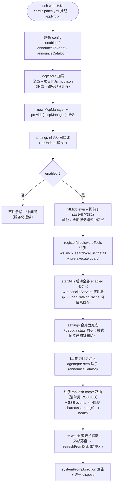
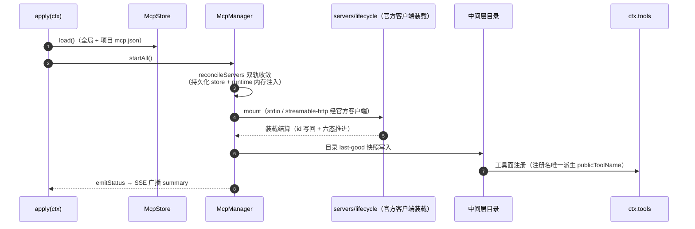
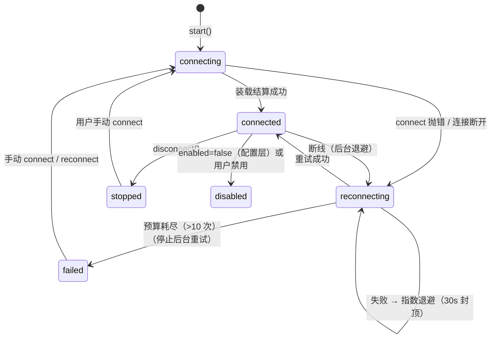
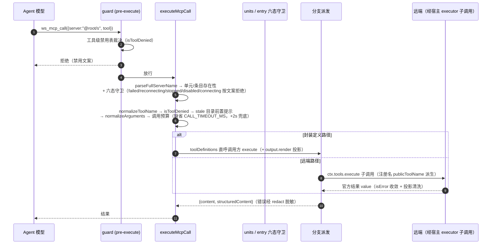

# dsh-mcp-manager 架构与运行机制（图解）

> 包：`@wingsky-1/dsh-mcp-manager` · 源码：`packages/dsh-mcp-manager/` · 版本见包 `package.json`（本文不复述版本号）
> 功能一句话：**DSH 的 MCP 服务器管理器**——管理 stdio / streamable-http 两种传输的
> MCP 服务器，把已连接服务器的工具收敛为四个原子工具
> （`ws_mcp_list` / `ws_mcp_detail` / `ws_mcp_search` / `ws_mcp_call`）供模型访问。
>
> 快速上手（安装 / 配置 / 验证）见 [包 README](../../packages/dsh-mcp-manager/README.md)；本文讲**原理与运行机制**。
>
> 唯一事实源（本文不复述会漂移的计数，条数以源码为准）：配置键见 `src/server/config/config-schema.ts`；
> 存储布局与权限见 `src/server/shared/paths.ts`；跨端状态键与路由见 `src/shared/status.ts` 与
> `src/shared/routes.ts` 的 `ROUTES`；模型可见注册名的唯一派生点是 `src/server/shared/tool-names.ts` 的
> `publicToolName`；调用预算与目录边界常量见 `src/server/connection/runtime/limits.ts` 与
> `src/server/shared/constants.ts`。

---

## 1. 总体架构：单轨模型面（单池）

**全部服务器只有一条轨道**：中间层收敛。项目级、全局级（`@global`）与 runtime 注入的
封装定义条目都由中间层连接池持有，模型面恒为四个原子工具
（`ws_mcp_list` / `ws_mcp_detail` / `ws_mcp_search` / `ws_mcp_call`，两级发现：
list 盘点 → detail 拉 schema），统一经 `ws_mcp_call` 寻址执行。

> 图源：`docs/architecture/diagrams/mcp-manager-architecture.html`（diagram-design）。

| 面 | 事实 |
|---|---|
| 模型可见面 | 4 个原子工具（`ws_mcp_*`）；宿主注册名 `mcp__<id>__<tool>` 是内部标识，**不在模型工具列表里**（per-agent 视角隐藏，见 §3.4），禁止直呼 |
| 池归属 | 恒为「全部服务器」。每个工作空间一套常驻连接（project root 或虚拟 root `@global`），按会话 cwd 路由、跨空间不串台 |
| 配置键 | 见 `config-schema.ts`（`enabled` / `announceToAgent` / `storePath` / `announceCatalog` / `catalogMaxEntries` / `debug` / `ui`）——**没有**模式键或策略键（两键已在 #767 笔 2 整体删除，见 §4） |
| 代价 | 多一跳（中间层转发）；目录是 last-good 快照，`tools/list_changed` 变化需重连/刷新 |

池归属恒为「全部服务器」，不再有条件分支：模式键（三档）与策略键
两键随 #767 笔 2 整体删除。为什么是整删而不是保留兼容：重构后只剩「全部经中间层」这一种
能力，保留键只会留下永远走不到的分支；放弃的是 `allowTools`/`denyTools` 准入闸能力，
缺口单列、替代品归阶段 3 的 governance/visibility（见 §4 与发布素材）。

---

## 2. 插件装配流程

`apply(ctx)` 启动顺序（`src/index.ts`）：

---

## 3. 核心机制

### 3.1 服务器生命周期（配置 → 连接 → 目录 → 注册）

要点：

- **命名规则** `publicToolName`（`server/shared/tool-names.ts`，唯一派生点）：`mcp__<id>__<tool>`；非法字符
  替换为 `_`；≤64 字符直接用，否则 `sha256(server\\0tool)` 前 12 位做哈希后缀
  （`前51字符_<hash12>`）；
- **工具定义**：远端结果经统一投影收敛（白名单清洗，不裸透传远端字段）；
  文本提取走 `extractText`（image/audio/resource 降级占位符；现状不截断，截断上限常量见
  `DEFAULT_RESULT_TRUNCATE_BYTES`）；调用预算读 `server.toolCallTimeoutMs`（缺省
  `CALL_TIMEOUT_MS`），`withTimeout` 兜底统一 +2s；
- **双轨 reconcile**（`orchestrator/manager.ts#reconcileServers`）：desired = 持久化 store
  （全局 + 项目）+ runtimeRegistry（同名 runtime 优先），变化才动作；
- **runtime 注入**：其他插件可经 `ctx.mcpManager.registerServer({...toolDefinitions})`
  运行时注册（内存态不落盘，同名 runtime 优先）；带 `toolDefinitions` 时 execute 来自调用方封装
  （调用方可先做预处理再内部转发底层命令），底层 client 不外露。
- 为什么自研连接栈不再出现：四文件在 #767 S1-5c 整体退役，连接改由官方客户端承接
  （换引擎后官方运行时只导出最小面，「拿一个 client 去 callTool」这条路不再存在，
  转发走 §3.4 的子调用链路）；退出条件是官方装载语义变化时先改 servers/lifecycle 域，
  不在本文另起第二套描述。

### 3.2 断线重连（官方客户端承接，有界指数退避）

重连由官方客户端承接：per-server `reconnect` 键（`enabled` / `initialDelayMs` /
`maxDelayMs` / `maxAttempts`，与官方 `Reconnect` schema 逐字同值；未知键静默丢弃），
默认值 500ms 起、30s 封顶、10 次上限（见 `config/normalize.ts#RECONNECT_DEFAULTS`）：

- 未知重连键静默丢弃（口径与顶层未知字段一致）：配置面是用户手写 JSON，写错键宁可丢弃
  也不在连接期爆炸；真正改变重连语义的错值（时长越界、预算非正整数）仍在配置写入时拒绝；
- 调用守卫把「后台重连中」纳入未就绪范畴：退避窗口内派发会打到不可信的工具面，
  `ws_mcp_call` 在该窗口直接拒绝并提示稍后重试或重新连接。

### 3.3 状态分级与推送（六态 + 三重防线）

- 状态全集：`connected / connecting / reconnecting / stopped / disabled / failed`
  （见 `src/shared/status.ts#SERVER_STATES`，跨端契约单点）；投影以中间层池 entry 为准，
  禁用（配置 `enabled=false` 或用户禁用）投影为 `disabled`；
- **推送链**：状态变化 → `manager.emitStatus()`（coalesce，同 tick 只广播一次）→
  向全部 SSE 连接写 `summary` 帧；
- **SSE 三重防线**：服务端 data ping 心跳（默认 30s，见 `shared/sse-hub.js`，喂客户端 watchdog）＋
  客户端无帧 watchdog 强重建 ＋ 回前台受控重建（`POST /resume`，宿主侧忽略现有状态 force 重建）——
  移动端切后台被静默掐断的半开连接可自愈，不堆积僵尸连接；
- 客户端 SSE 故障降级：放弃 SSE 改轮询。

### 3.4 中间层机制（核心）

**连接池**：中间层以 `units: Map<root, ProjectUnit>` 维护每个项目根一套连接
（惰性连接 + 超时 + LRU 淘汰，上限见 `evictIfNeeded` 默认参数）；`ws_mcp_call` 执行时按**调用方会话 cwd**路由到
对应单元，`server` 全名 `@<root>/<server>` 一致性校验防跨空间串台（`@global/<s>` 与
`@@global/<s>` 归一化防单双 @ 分裂，见 workspace 域 `full-name`）。

**一次 ws_mcp_call 完整链路**（见 `servers/dispatch/impl/call/index.ts#executeMcpCall`）：

- 远端转发**不带 agent**（留 `parent` / `signal`，无 signal 时现造一个）：
  带了等于把子调用挂回该 agent 的作用域，而本包已把 `mcp__*` 从每个 agent 的模型视野摘掉，
  自家转发会被自己那条 deny 一起打死；不带走全局面（guard 靠 parent 放行）。
  代价是官方执行器那次图片准入退化成文本，由 A+ 经 `finalizeContent` 补回来（见下）；
- **per-agent 视角隐藏**：`mcp__*` 从每个 agent 的模型视野摘掉（visibility 域经宿主
  `restrict` 实现，三触发点 reconcile），全局注册面与目录仍在（`ws_mcp_list` 可见）。
  为什么是隐藏而不是注销：宿主没有 `unregister`，注册方的 disposer 不交本包，
  唯一手段就是 per-agent `restrict`；退出条件是宿主提供注销面后再收敛；
- **A+ 图片准入**：远端原始图片块经外层 exec 的 agent 解路由、四值白名单与 base64 校验后，
  由官方 `finalizeContent` 接缝换成真附件块；任何拒绝只降级成 `[image unavailable: …]`
  文案、不抛错，无图片时返回 `undefined` 保持结果面不变；
- **中间层只读边界**：`ws_mcp_list` / `ws_mcp_detail` / `ws_mcp_search` 纯读本地目录缓存
  （不触达远端、不执行工具）；`ws_mcp_call` 是唯一执行远端工具的入口，执行前经工具级
  禁用表（`isToolDenied`）裁决。

### 3.5 传输层

- 自研传输与协议适配层已在 #767 S1-5c 整体退役；stdio 与 streamable-http
  传输由官方客户端实现，本包只做配置与装载编排。为什么退役：自研栈的协议适配、重连、
  工具同步与官方实现重复，且官方是唯一随协议演进的一方；退出条件同 §3.1；
- **stdio 环境净化**（`config/impl/env/index.ts`）：凭据词根 `SECRET_ENV_NAME`
  形状变量过滤后再合并显式 env，显式值支持 `${ENV}` 引用展开——避免把宿主机密透传给
  MCP 子进程；
- **streamable-http**：headers 同样走配置值展开面；`Mcp-Session-Id` 会话保持、SSE 流式响应由官方客户端承担。

---

## 4. 路由与配置

路由清单的唯一事实源是 `src/shared/routes.ts#ROUTES`（含方法围栏 `ROUTE_FENCE`）：

| 路由 | 方法 | 说明 |
|---|---|---|
| `/api/dsh-mcp/config` | GET/POST | UI 配置（GET 允许非 loopback 只读；POST loopback-only，未知顶层键 400 且不落盘） |
| `/api/dsh-mcp/servers` | GET/POST/PATCH/DELETE | 纯读快照 / 新增 / 更新 / 删除（`?name=&scope=`） |
| `/api/dsh-mcp/session` | POST | 切换会话 cwd（`{cwd}`） |
| `/api/dsh-mcp/resume` | POST | 回前台受控重建当前工作空间连接 |
| `/api/dsh-mcp/servers/connect` | POST | 连接（`?name=&scope=&cwd=`） |
| `/api/dsh-mcp/servers/disconnect` | POST | 断开（`?name=&scope=&cwd=`） |
| `/api/dsh-mcp/servers/reconnect` | POST | 重连（`?name=&scope=&cwd=`） |
| `/api/dsh-mcp/import/json` | POST | 粘贴 mcpServers JSON 导入 |
| `/api/dsh-mcp/tool-disable` | PATCH | 工具级禁用（`{server, tool, disabled}`） |
| `/api/dsh-mcp/events` | GET | SSE 状态推送（心跳见 shared/sse-hub.js） |
| `/api/dsh-mcp/health` | GET | 健康/计数诊断 |

配置布局（见 `server/shared/paths.ts`，S2 已同构）：全局
`<DSH_HOME>/@wingsky-1/dsh-mcp-manager/mcp.json`、项目级
`<项目根>/.dsh/@wingsky-1/dsh-mcp-manager/mcp.json`（随仓库走、可提交 git）；
旧扁平路径（全局 `dsh-mcp.json`、项目级 `.dsh/mcp.json`）只做迁移读面、不回写；
runtime 注入为内存态；用户禁用态落用户状态文件（见 `userStatePath()`）。

旧配置键不报错、不迁移、不写用户文件（M2：未知键静默丢弃，boot 时旧键照常启动；
真机已验证带已删键的旧配置仍 200 启动）。两键整体删除的能力缺口单列（M3：
`allowTools`/`denyTools` 准入闸随策略键消失，替代品归阶段 3
governance/visibility，见发布素材）。

---

## 5. 安全模型

- **env 净化**（config/impl/env）：父进程环境按 `SECRET_ENV_NAME`
  （`(KEY|TOKEN|SECRET|PASSWORD|PASSWD|CREDENTIAL|AUTH)` 形状）过滤敏感变量，
  再合并显式 env（`${ENV}` 引用展开）——避免把宿主机密透传给
  MCP 子进程；
- **redactor 脱敏**（pipeline/impl/redact）：从全部服务器配置收集 secret
  （env 值、URL 双形态等），错误消息逐值替换
  `[REDACTED]`；
- **loopback 围栏**：全部 `/api/dsh-mcp/*` 路由（唯一例外：GET /config 只读非敏感展示）；
- **0600 + 原子写**：配置落盘显式 0600（未登记路径回落既有 0600 行为）+ tmp/rename；
  目录缓存与用户状态同款原子写；
- **stdio 子进程继承宿主权限**：MCP 服务器命令在宿主进程权限下执行，仅配置可信服务器；
  工具结果原样返回可能含敏感信息，先确认再操作；
- **工作空间隔离**：路由以调用方会话 cwd 为唯一输入，server 全名一致性校验防跨空间串台；
  工具级禁用三入口统一经 `isToolDenied` 裁决（笔 2 后这是唯一裁决）。

---

## 6. 已知限制

- 不订阅 MCP 的 `tools/list_changed` 通知；工具列表变化在重连/手动
  刷新时重新同步；
- 中间层目录是「采集边界内的 last-good 快照」（单服务器工具数与总量上限见
  `runtime/limits.ts`，目录 TTL 见 `CATALOG_TTL_MS`），
  发现失败时 list 透出 `unavailable` 原因；
- 仅桥接工具能力；MCP 的 resources 与 prompts 尚无 harness 消费接口；
- 依赖 Node ≥ 20。
