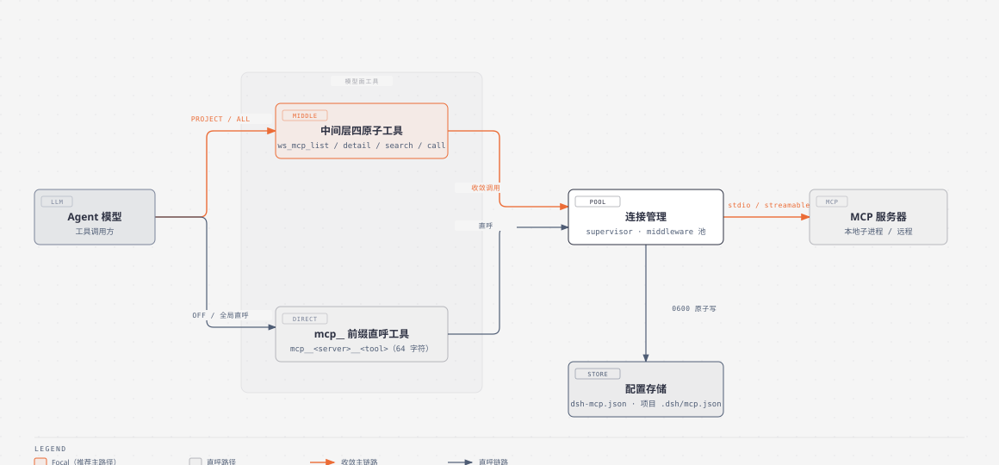
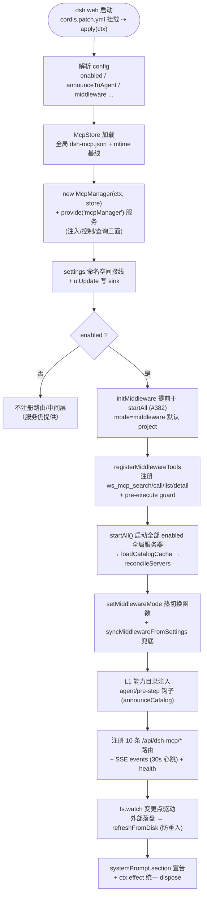
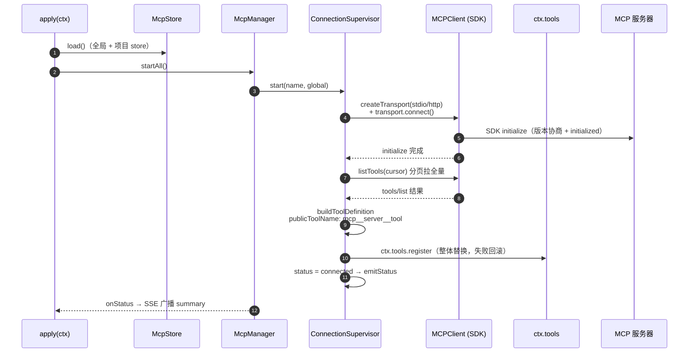
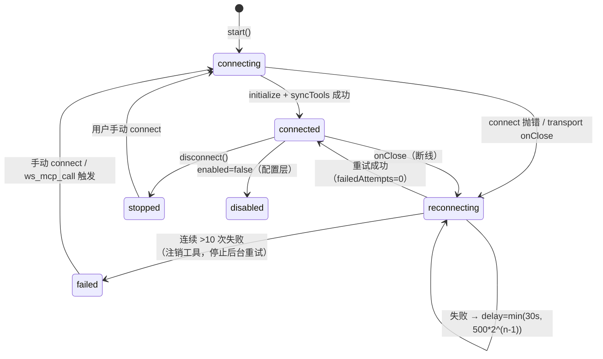
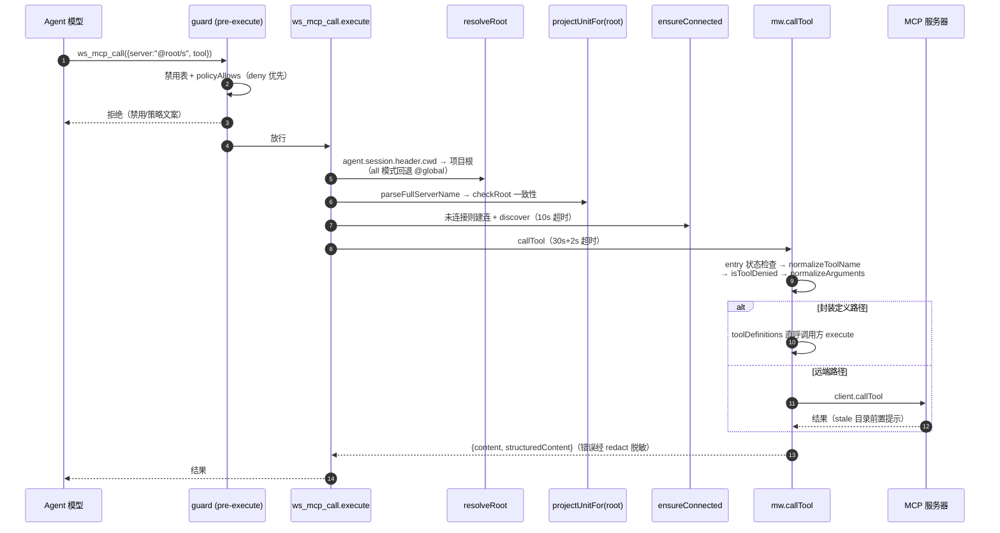

# dsh-mcp-manager 架构与运行机制（图解）

> 包：`@wingsky-1/dsh-mcp-manager` · 源码：`packages/dsh-mcp-manager/` · 版本：0.2.0
> 功能一句话：**DSH 的 MCP 服务器管理器**——管理 stdio / streamable-http 两种传输的
> MCP 服务器，把已连接服务器的工具注册给模型，并提供三档中间层模式把项目级工具面
> 收敛为四个原子工具（`ws_mcp_list` / `ws_mcp_detail` / `ws_mcp_search` / `ws_mcp_call`）。
>
> 快速上手（安装 / 配置 / 验证）见 [包 README](../../packages/dsh-mcp-manager/README.md)；本文讲**原理与运行机制**。

---

## 1. 总体架构：双轨模型面

模型访问 MCP 工具有两条轨道——**中间层收敛**（project / all 模式，推荐）与
**直呼注册**（off 模式 / 全局服务器）：

> 图源：`docs/architecture/diagrams/mcp-manager-architecture.html`（diagram-design）。

两条轨道的分工与取舍：

| 轨道 | 触发条件 | 模型面 | 优势 | 代价 |
|---|---|---|---|---|
| **中间层收敛** | `middleware: project`（默认，项目级服务器）/ `all`（全局 + runtime 也收敛） | 4 个原子工具（两级发现：list 盘点 → detail 拉 schema） | 项目级接多少台服务器、多少个工具都不膨胀系统提示词；按会话 cwd 路由连接池、跨空间不串台 | 多一跳（中间层转发）；目录是 last-good 快照，`tools/list_changed` 变化需重连/刷新 |
| **直呼注册** | `middleware: off`（全部）/ project 模式下的全局服务器 | 每工具一个 `mcp__<server>__<tool>`（64 字符、哈希后缀） | 零中间跳，工具定义直接进系统提示词 | 服务器多时上下文膨胀；不同工作空间同名 server 会冲突 |

`middlewareTakes(name, scope)`（manager.ts:646-650）是唯一判定口径：`off` → 全部直呼；
`scope===project` → 中间层接管（project 与 all 模式皆然）；`all && scope===global` →
接管（含 runtime 注入条目）。

---

## 2. 插件装配流程

`apply(ctx)` 启动顺序（`src/apply.ts`）：

---

## 3. 核心机制

### 3.1 服务器生命周期（配置 → 连接 → 目录 → 注册）

要点：

- **命名规则** `publicToolName`（supervisor.ts:57-68）：`mcp__<server>__<tool>`；非法字符
  替换为 `_`；≤64 字符直接用，否则 `sha256(server\0tool)` 前 12 位做哈希后缀
  （`前51字符_<hash12>`）；
- **工具定义**：parameters 原样直传 MCP inputSchema；输出 schema 只收严格子集，不落子集
  回退自由 JsonValue；render 走 `extractText`（image/audio/resource 降级占位符）+
  `truncateText`（默认 8KB 截断）；execute 走 `client.callTool`（默认 15s 超时）；
- **协议薄适配**（protocol.ts）：`listTools` / `callTool` 刻意走 `Protocol.request` +
  宽松 `ResultSchema`，绕过 SDK `Client.listTools()` 的 outputSchema 缓存强校验；
- **双轨 reconcile**（manager.ts:525-573）：desired = 全局 store + 项目 store（同名全局
  优先）+ runtimeRegistry（同名 runtime 优先），变化才动作；
- **runtime 注入**：其他插件可经 `ctx.mcpManager.registerServer({...toolDefinitions})`
  运行时注册（内存态不落盘，同名幂等）；带 `toolDefinitions` 时 execute 来自调用方封装
  （如 dsh-codegraph 先 sync 再内部转发 CLI），底层实现不外泄。

### 3.2 断线重连（有界指数退避）

两套实现参数同源（500ms 起、30s 封顶、10 次上限）：

- supervisor 路径（supervisor.ts:397-427）：曾连接且离线 ≥ maxDelayMs 重置失败计数；
  放弃后注销全部工具并置 `failed`；
- 中间层路径（middleware.ts:274-292）：`500*2^min(n-1,6)`，>10 次停止后台重试
  （保留 failed，手动 connect 或调用可复活）；
- **防双进程探测重试**（#382）：探测到同名 `mcp__` 已注册（如官方 dsh-mcp-client）
  → 落 failed + 3s 一次性重试（每代只一次）。

### 3.3 状态分级与推送（六态 + 三重防线）

- 状态全集：`connected / connecting / reconnecting / stopped / disabled / failed`；
  由 `summarize` 投影（被中间层接管 → 取池 entry 状态；userDisabled → stopped；
  否则 supervisor 状态）；
- **推送链**：`setStatus` → `manager.emitStatus()`（coalesce，同 tick 只广播一次）→
  向全部 SSE 连接写 `summary` 帧；
- **SSE 三重防线**：服务端 30s data ping 心跳（喂客户端 watchdog）＋ 客户端 60s 无帧
  watchdog 强重建 ＋ `visibilitychange`/`pageshow` 回前台 `forceReconnect` +
  `POST /resume` 宿主侧忽略现有状态 force 重建——移动端切后台被静默掐断的半开连接
  可自愈，不堆积僵尸连接；
- 客户端 SSE 故障降级：`onerror` CLOSED 计数 ×3 → 放弃 SSE 改 10s 轮询。

### 3.4 中间层机制（核心）

**连接池**：`McpMiddleware` 以 `units: Map<root, ProjectUnit>` 维护每个项目根一套连接
（LRU 淘汰 ≤16 单元，`@global` 豁免）；`ws_mcp_call` 执行时按**调用方会话 cwd**路由到
对应单元，`server` 全名 `@<root>/<server>` 一致性校验防跨空间串台（`@global/<s>` 与
`@@global/<s>` 归一化防单双 @ 分裂）。

**一次 ws_mcp_call 完整链路**：

**中间层只读边界**：`ws_mcp_list` / `ws_mcp_detail` / `ws_mcp_search` 纯读本地目录缓存
（不触达远端、不执行工具、不经过策略 guard）；`ws_mcp_call` 是唯一执行远端工具并受
`middlewarePolicy` 约束的入口。

### 3.5 传输层

- **stdio**（transport.ts:121-173）：包官方 `StdioClientTransport`；`buildChildEnv` 净化
  父环境（见 §5）；保留 `stderrTail`（最近 4000B 供启动失败诊断）；`onClose` 与 SDK
  叠加式链（不覆盖 SDK 内部链）；
- **streamable-http**（transport.ts:61-92）：包官方 `StreamableHTTPClientTransport`；
  headers 支持 `${ENV}` 引用展开；`Mcp-Session-Id` 会话保持、SSE 流式响应由 SDK 承担。

---

## 4. 路由与配置

| 路由 | 方法 | 说明 |
|---|---|---|
| `/api/dsh-mcp/config` | GET/POST | UI 配置 + middleware（GET 允许非 loopback 只读；POST loopback-only 热切） |
| `/api/dsh-mcp/servers` | GET/POST/PATCH/DELETE | 纯读快照 / 新增 / 更新 / 删除（`?name=&scope=`） |
| `/api/dsh-mcp/session` | POST | 切换会话 cwd（`{cwd}`） |
| `/api/dsh-mcp/resume` | POST | 回前台受控重建当前工作空间连接 |
| `/api/dsh-mcp/servers/connect·disconnect·reconnect` | POST | 连接控制（`?name=&scope=&cwd=`） |
| `/api/dsh-mcp/import/json` | POST | 粘贴 mcpServers JSON 导入 |
| `/api/dsh-mcp/tool-disable` | PATCH | 工具级禁用（`{server, tool, disabled}`） |
| `/api/dsh-mcp/events` | GET | SSE 状态推送（30s 心跳） |
| `/api/dsh-mcp/health` | GET | 健康/计数诊断 |

配置分三级：全局 `<DSH_HOME>/dsh-mcp.json`、项目级 `<项目根>/.dsh/mcp.json`
（随仓库走、可提交 git）、runtime 注入（内存态）；用户禁用态
`<DSH_HOME>/dsh-mcp-user-state.json`（合并写盘）。

---

## 5. 安全模型

- **env 净化**（buildChildEnv）：父进程环境剔除 `(KEY|TOKEN|SECRET|PASSWORD|PASSWD|CREDENTIAL|AUTH)`
  形状变量 + `DSH_*` 前缀，再合并显式 env（`${ENV}` 引用展开）——避免把宿主机密透传给
  MCP 子进程；
- **redactor 脱敏**（createRedactor）：从全部服务器配置收集 secret（env 值、args 中
  token/secret/pass/key/auth 标志值、headers、URL 及查询参数），错误消息逐值替换
  `[REDACTED]`；
- **loopback 围栏**：全部 `/api/dsh-mcp/*` 路由（唯一例外：GET /config 只读非敏感展示）；
- **0600 + 原子写**：`McpStore.save` 显式 0600 + tmp/rename；目录缓存与用户状态同款
  原子写；body 限长 2MB；
- **stdio 子进程继承宿主权限**：MCP 服务器命令在宿主进程权限下执行，仅配置可信服务器；
  工具结果原样返回可能含敏感信息，先确认再操作；
- **工作空间隔离**：路由以调用方会话 cwd 为唯一输入，server 全名一致性校验防跨空间串台；
  工具级禁用三入口一致裁决（callTool / pre-execute guard / 纪律裸名声明）。

---

## 6. 已知限制

- 不订阅 MCP 的 `tools/list_changed` 通知（无 SSE 长连接）；工具列表变化在重连/手动
  刷新时重新同步；
- 中间层目录是「采集边界内的 last-good 快照」（单服务器 ≤512 工具 / ≤256KB 总量），
  发现失败时 list 透出 `unavailable` 原因；
- 仅桥接工具能力；MCP 的 resources 与 prompts 尚无 harness 消费接口；
- 依赖 Node ≥ 20。
