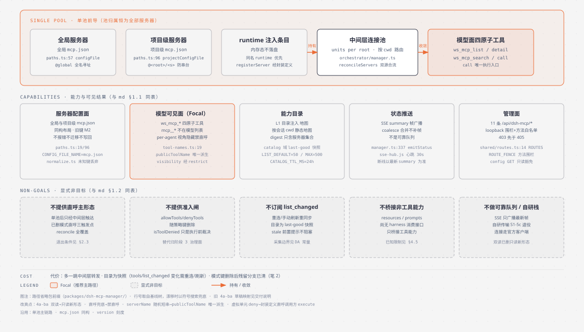
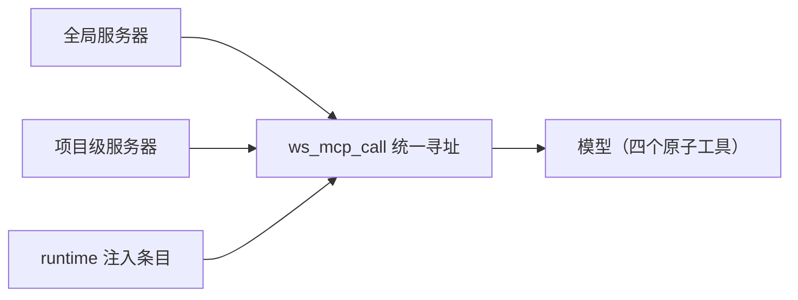
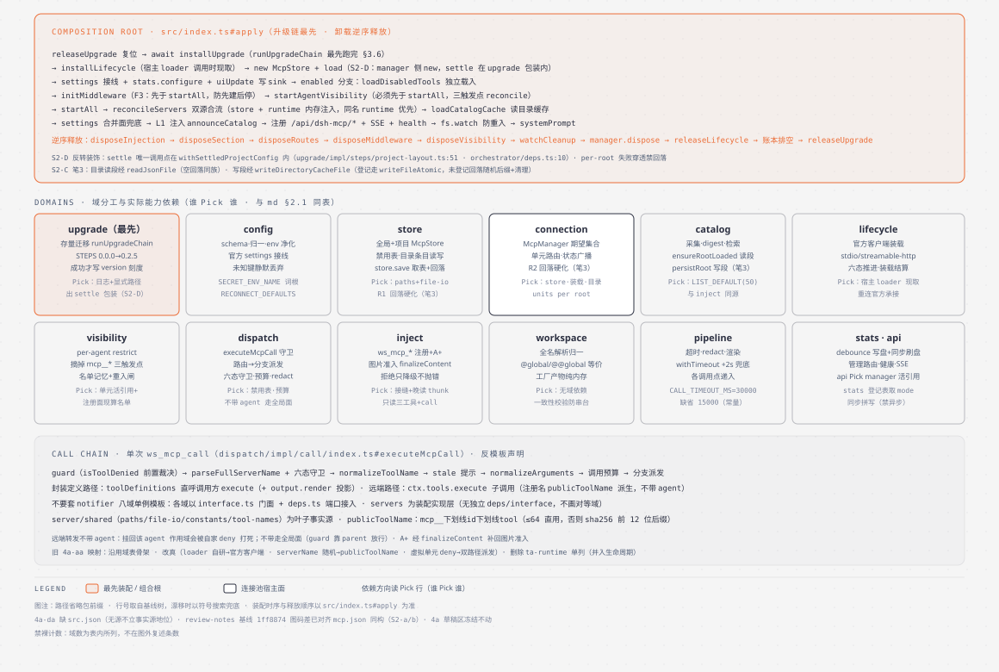
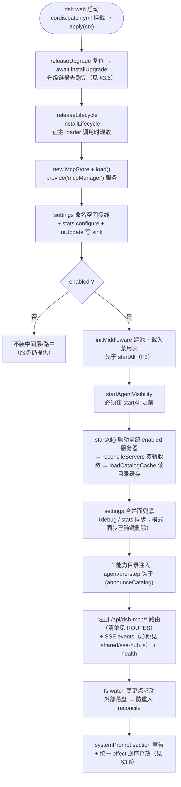
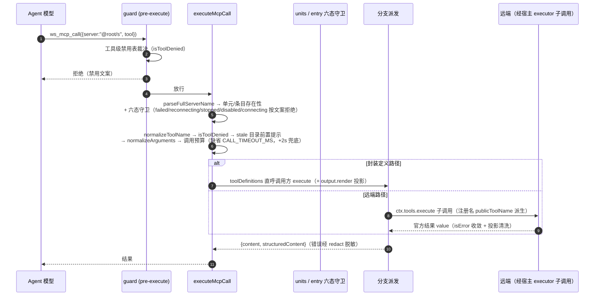
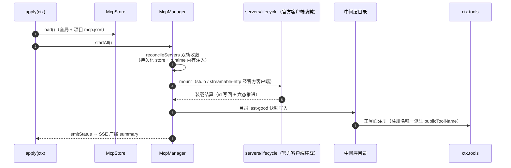
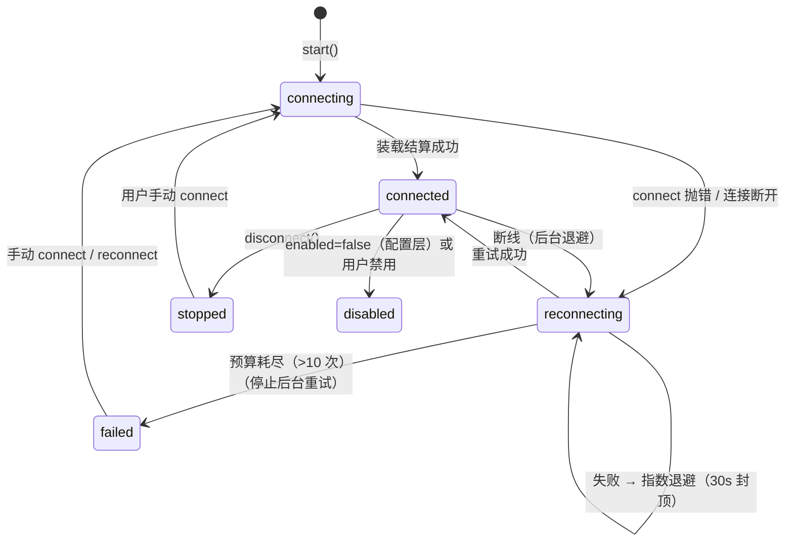
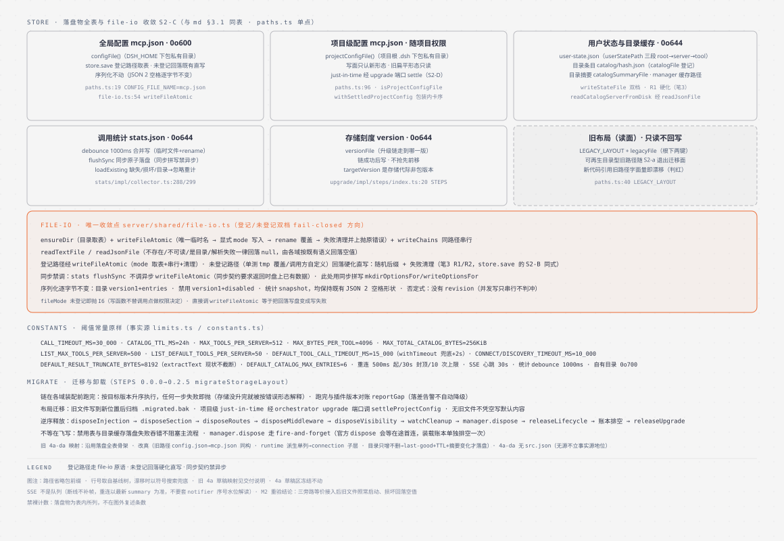
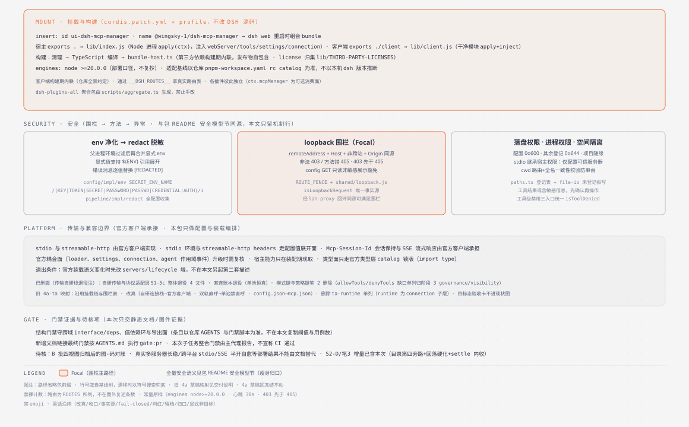

# dsh-mcp-manager 架构与运行机制（TOGAF 4A 四视图）

> 包：`@wingsky-1/dsh-mcp-manager` · 源码：`packages/dsh-mcp-manager/` · 版本见包 `package.json`（本文不复述版本号）
> 功能一句话：**DSH 的 MCP 服务器管理器**——管理 stdio / streamable-http 两种传输的 MCP 服务器，把已连接服务器的工具收敛为四个原子工具（`ws_mcp_list` / `ws_mcp_detail` / `ws_mcp_search` / `ws_mcp_call`）供模型访问。
>
> 快速上手（安装 / 配置 / 验证）与全量安全语义见 [包 README](../../packages/dsh-mcp-manager/README.md)；本文按 TOGAF 四视图（业务 BA / 应用 AA / 数据 DA / 技术 TA）讲**原理与运行机制**。
> 证据基线：`da4eea6e`（S2-D/筆3已含；图源本笔落盘）；证据为 `路径:行号`（取自该树，后续提交会漂移，以符号搜索兜底）或可复现常量。
> `src/…` 省略包目录前缀（即 `packages/dsh-mcp-manager/`）。机制结论来自源码核对，不将历史图片或既有测试文件当成本次实测结果。
>
> 唯一事实源（本文不复述会漂移的计数，条数以源码为准）：配置键见 `src/server/config/config-schema.ts`；存储布局与权限见 `src/server/shared/paths.ts`；跨端状态键与路由见 `src/shared/status.ts` 与 `src/shared/routes.ts` 的 `ROUTES`；模型可见注册名的唯一派生点是 `src/server/shared/tool-names.ts` 的 `publicToolName`；调用预算与目录边界常量见 `src/server/connection/runtime/limits.ts` 与 `src/server/shared/constants.ts`。

## 四视图导航

| 视图 | 回答的问题 | 章节 | 图件 |
| --- | --- | --- | --- |
| BA | 能力、单池归属与显式非目标 | [§1](#ba) | `diagrams/mcp-manager-ba.svg` |
| AA | 组合根装配、域分工与调用链路 | [§2](#aa) | `diagrams/mcp-manager-aa.svg` |
| DA | 落盘物、配置一致性、SSE、迁移与卸载 | [§3](#da) | `diagrams/mcp-manager-da.svg` |
| TA | 挂载、构建、安全边界、门禁与待核项 | [§4](#ta) | `diagrams/mcp-manager-ta.svg` |

> 各视图节首 SVG 已生效（见 §5）；节内 mermaid 讲关系逻辑（链路、依赖方向、判定分支）。两者不是同一张图的两种画法，改一处不必同步另一处。

## 1. 业务架构（BA）

> 图源 `diagrams/mcp-manager-ba.html`（已归档，见 §5；证据基线 da4eea6e，S2-D/笔3 已含）。

**单池前导**：全部服务器只有一条轨道——项目级、全局级（`@global`）与 runtime 注入的封装定义条目都由中间层连接池持有，模型面恒为四个原子工具（两级发现：list 盘点 → detail 拉 schema），统一经 `ws_mcp_call` 寻址执行。池归属恒为「全部服务器」：每个工作空间一套常驻连接（project root 或虚拟 root `@global`），按会话 cwd 路由、跨空间不串台。请求经中间层转发一跳；目录是 last-good 快照，`tools/list_changed` 变化需重连/刷新。

能力面唯一：模式键与策略键已删除（Config 键集见 `src/server/config/config-schema.ts`）；`allowTools`/`denyTools` 准入闸能力缺口单列，替代品归阶段 3 的 governance/visibility（见 §3.2 M3）。

### 1.1 能力与可见结果

| 能力 | 入口 | 可见结果与边界 |
| --- | --- | --- |
| 服务器配置面 | 全局与项目级 `mcp.json`、运行时注入 | 同构布局（见 §3.2）；旧键不报错、不迁移、不写用户文件（M2） |
| 模型可见面 | 四个原子工具 `ws_mcp_*` | 宿主注册名 `mcp__<id>__<tool>` 是内部标识，**不在模型工具列表里**（per-agent 视角隐藏，见 §2.3），禁止直呼 |
| 能力目录 | L1 目录注入（agent/pre-step 钩子） | 按会话 cwd 的静态能力地图；digest 只含服务器集合（见 §3.5） |
| 状态推送 | SSE `summary` 帧 | coalesce 合并广播；不是可靠队列（见 §3.3） |
| 管理面 | 11 条 `/api/dsh-mcp/*` 路由 | loopback 围栏 + 方法白名单（见 §3.4） |

证据：`src/server/shared/paths.ts`、`src/server/shared/tool-names.ts#publicToolName`、`src/shared/routes.ts#ROUTES`、`src/shared/status.ts#SERVER_STATES`。

### 1.2 显式非目标

| 非目标 | 依据 |
| --- | --- |
| 不提供直呼主形态 | 单池后全部服务器只经中间层单元触达；`mcp__*` 已从模型视野摘掉（visibility 域经宿主 `restrict`，三触发点 reconcile）。宿主没有 `unregister`，退出条件是宿主提供注销面后再收敛 |
| 不提供准入闸 | `allowTools`/`denyTools` 随策略键删除；工具级禁用表（`isToolDenied`）是执行前裁决，不是准入 |
| 不订阅 `tools/list_changed` | 工具列表变化在重连/手动刷新时重新同步；目录是采集边界内的 last-good 快照 |
| 不桥接 resources / prompts | 尚无 harness 消费接口，只桥接工具能力 |
| 不做可靠消息队列 | SSE 只广播最新 `summary`，断线期间的帧不补（见 §3.3） |

## 2. 应用架构（AA）

> 图源 `diagrams/mcp-manager-aa.html`（已归档，见 §5；证据基线 da4eea6e，S2-D/笔3 已含）。

### 2.1 组合根与域分工

`src/index.ts#apply` 是唯一认识宿主 `ctx` 的组合根：经 `bindHost` 收窄能力面，按依赖顺序装配各域（upgrade 最先、lifecycle 次之，`enabled` 分支再装中间层与路由），卸载时逆序释放（见 §3.6）。各域以 `interface.ts` 门面 + `deps.ts` 端口接入，`servers` 是装配实现层（无独立 `deps.ts`/`interface.ts`，不画成对等域），`server/shared`（`paths`/`file-io`/`constants`/`tool-names`）是叶子事实源。

| 域 | 装配与职责 | 实际能力依赖 |
| --- | --- | --- |
| upgrade | 存量迁移，装配前最先跑 `runUpgradeChain` | 日志与显式路径；成功才写存储刻度 |
| config | schema、归一化、env 净化、官方 settings 接线 | 共享层常量（模块求值期） |
| store | 全局与项目级 `McpStore`、禁用表与目录条目的落盘读写 | `paths` 单点 + `file-io` 原语 |
| connection | 连接池宿主面（`McpManager`）：期望集合、单元路由、状态广播 | store 读写面、lifecycle 装载、catalog 目录 |
| catalog | 目录采集、digest、检索 | `LIST_DEFAULT_TOOLS_PER_SERVER`（与 inject 同源） |
| lifecycle | 经官方客户端装载（stdio / streamable-http） | 宿主 loader（调用时现取） |
| visibility | per-agent `restrict` 摘掉 `mcp__*` | 单元表活引用 + 注册面现算名单 |
| dispatch | `executeMcpCall`：守卫 → 路由 → 分支派发 | 工具级禁用表、调用预算、redact |
| inject | `ws_mcp_*` 注册 + A+ 图片准入 | `finalizeContent` 接缝、晚读 thunk |
| workspace | 全名解析归一（`@global`/`@@global` 等价）与 id 表 | 无域依赖（工厂产物，纯内存） |
| pipeline | 超时、redact、结果渲染 | 各调用点递入 |
| stats | 调用统计：debounce 写盘 + 同步刷盘 | 登记表取 mode（同步拼写） |
| api | 管理路由、健康、SSE 接线 | manager 活引用 |

证据：`src/index.ts#apply` / `#assembleEnabledRuntime`；各域 `interface.ts` 门面与 `deps.ts` 端口。

### 2.2 装配时序

`apply(ctx)` 的安装顺序（组合根 `src/index.ts`，升级链最先、lifecycle 次之）：

要点：

- **升级链最先**：链是异步的，先 await 跑完再装配各域（旧文件届时已归档，早装配会读到空盘）；
- **读路径落定走包装**：项目级 store 读前落定不由调用方直调原语，而经 upgrade 的 `withSettledProjectConfig` 包装（先落定包分区新形态再跑读回调，触发时机由包装内卡；`new McpStore` 留 manager 侧经既有 ConfigStorePort；落定失败即抛，读回调不执行）；仅缓存命中后的磁盘重读（`reloadIfChanged`）保留有声 warn（见 `manager.ts#projectStoreFor`）；
- **F3 中间层提前**：`initMiddleware` 在 `startAll` 之前（防「先建后停」竞态）；禁用表由 `initMiddleware` 内载入，失败即 `apply` 中止（无回退实例，见 `#392 遗留⑤`）；
- **隐藏面卡位**：`startAgentVisibility` 必须在 `startAll` 之前——连接与工具注册发生在 `startAll` 期间，先挂隐藏面初始 reconcile 才能覆盖已 live 的 agent，后注册的经 `tools/change` 收敛；
- **设置合并面兜底**：`syncFromSettings` 在运行期变更与启动后各调一次（`debug`/`stats` 同步；模式同步已随键删除）。

### 2.3 单次 `ws_mcp_call` 链路

**一次 ws_mcp_call 完整链路**（见 `servers/dispatch/impl/call/index.ts#executeMcpCall`）：

- 远端转发**不带 agent**（留 `parent` / `signal`，无 signal 时现造一个；带 agent 会把子调用挂回已被摘掉 `mcp__*` 的作用域而被自己的 deny 打死）。官方执行器那次图片准入退化成文本，由 A+ 经 `finalizeContent` 补回来（见下）；
- **per-agent 视角隐藏**：`mcp__*` 从每个 agent 的模型视野摘掉（visibility 域经宿主 `restrict` 实现，三触发点 reconcile），全局注册面与目录仍在（`ws_mcp_list` 可见）。宿主没有 `unregister`（注册方的 disposer 不交本包），故用 per-agent `restrict`；宿主提供注销面后收敛；
- **A+ 图片准入**：远端原始图片块经外层 exec 的 agent 解路由、四值白名单与 base64 校验后，由官方 `finalizeContent` 接缝换成真附件块；任何拒绝只降级成 `[image unavailable: …]` 文案、不抛错，无图片时返回 `undefined` 保持结果面不变；
- **中间层只读边界**：`ws_mcp_list` / `ws_mcp_detail` / `ws_mcp_search` 纯读本地目录缓存（不触达远端、不执行工具）；`ws_mcp_call` 是唯一执行远端工具的入口，执行前经工具级禁用表（`isToolDenied`）裁决。

**连接池**：中间层以 `units: Map<root, ProjectUnit>` 维护每个项目根一套连接（惰性连接 + 超时 + LRU 淘汰，上限见 `evictIfNeeded` 默认参数）；`ws_mcp_call` 执行时按**调用方会话 cwd**路由到对应单元，`server` 全名 `@<root>/<server>` 一致性校验防跨空间串台（`@global/<s>` 与 `@@global/<s>` 归一化防单双 @ 分裂，见 workspace 域 `full-name`）。

### 2.4 生命周期与重连

要点：

- **命名规则** `publicToolName`（`server/shared/tool-names.ts`，唯一派生点）：`mcp__<id>__<tool>`；非法字符替换为 `_`；≤64 字符直接用，否则 `sha256(server\\0tool)` 前 12 位做哈希后缀（`前51字符_<hash12>`）；
- **工具定义**：远端结果经统一投影收敛（白名单清洗，不裸透传远端字段）；文本提取走 `extractText`（image/audio/resource 降级占位符；现状不截断，截断上限常量见 `DEFAULT_RESULT_TRUNCATE_BYTES`）；调用预算读 `server.toolCallTimeoutMs`（缺省 `CALL_TIMEOUT_MS`），`withTimeout` 兜底统一 +2s；
- **双轨 reconcile**（`orchestrator/manager.ts#reconcileServers`）：desired = 持久化 store（全局 + 项目）+ runtimeRegistry（同名 runtime 优先），变化才动作；
- **runtime 注入**：其他插件可经 `ctx.mcpManager.registerServer({...toolDefinitions})` 运行时注册（内存态不落盘，同名 runtime 优先）；带 `toolDefinitions` 时 execute 来自调用方封装（调用方可先做预处理再内部转发底层命令），底层 client 不外露。
- 连接由官方客户端承接（`servers/lifecycle`），自研栈已在 S1-5c 退役，转发走 §2.3 的子调用链路；官方装载语义变化时先改 `servers/lifecycle` 域。

重连由官方客户端承接：per-server `reconnect` 键（`enabled` / `initialDelayMs` / `maxDelayMs` / `maxAttempts`，与官方 `Reconnect` schema 逐字同值；未知键静默丢弃），默认值 500ms 起、30s 封顶、10 次上限（见 `config/normalize.ts#RECONNECT_DEFAULTS`）：

- 未知重连键静默丢弃（口径与顶层未知字段一致）；改变重连语义的错值（时长越界、预算非正整数）在配置写入时拒绝；
- 调用守卫把「后台重连中」纳入未就绪范畴：退避窗口内派发会打到不可信的工具面，`ws_mcp_call` 在该窗口直接拒绝并提示稍后重试或重新连接。

### 2.5 模型面（四个原子工具）

| 工具 | 语义 | 读写 |
| --- | --- | --- |
| `ws_mcp_list` | 盘点：本地目录缓存的工具清单（每服务器默认 `LIST_DEFAULT_TOOLS_PER_SERVER` 条，硬上限 `LIST_MAX_TOOLS_PER_SERVER`） | 只读（不触达远端） |
| `ws_mcp_detail` | 拉 schema：指定工具的参数面 | 只读 |
| `ws_mcp_search` | 检索：按关键字找工具 | 只读 |
| `ws_mcp_call` | 唯一执行入口：`{server:"@<root>/<s>", tool}` 寻址执行 | 执行（`isToolDenied` 前置裁决） |

证据：`src/server/inject/middleware-register.ts`；`src/server/connection/runtime/limits.ts`（`LIST_MAX_TOOLS_PER_SERVER`）；`src/server/shared/constants.ts`（`LIST_DEFAULT_TOOLS_PER_SERVER`）。管理路由（11 条 `/api/dsh-mcp/*`）见 §3.4——模型面与管理面分表，改一处只改一处（去重）。

## 3. 数据架构（DA）

> 图源 `diagrams/mcp-manager-da.html`（已归档，见 §5；证据基线 da4eea6e，S2-D/笔3 已含）。

### 3.1 落盘物全表与 file-io 收敛（S2-C）

根只认 `DSH_HOME` 一个变量（经仓库共享层 `shared/dsh-home.js` 的 `dshHome`，隔离验证换掉它即换掉全部落盘位置）。

| 载体 | 路径（`paths.ts` 单点） | mode | 读写收敛 |
| --- | --- | --- | --- |
| 全局配置 `mcp.json` | `configFile()`（`<DSH_HOME>/@wingsky-1/dsh-mcp-manager/mcp.json`） | `0o600` | `store.save`：登记路径取表，未登记（用户 `storePath` 显式接管）回落既有 `0o600` 行为；序列化不动 |
| 项目级配置 `mcp.json` | `projectConfigFile()`（`<项目根>/.dsh/@wingsky-1/dsh-mcp-manager/mcp.json`） | `null`（随项目权限模型） | 写面只认新形态；旧扁平形态只读（见 §3.2） |
| 用户状态 `user-state.json` | `userStatePath()`（disabledTools 三段 root→server→tool[]） | `0o644` | `middleware-state#writeStateFile` 双档（见下；回落硬化 R1：随机后缀 + 失败清理） |
| 目录条目 `<hash>.json` | `catalogFile()`（`catalog/` 目录下一行登记） | `0o644` | 第四旁路：`ensureRootLoaded` 读经 `readJsonFile`（byRoot 短路保留，缺失/损坏回落空值）；`persistRoot` 写经 `writeDirectoryCacheFile`（登记走 `writeFileAtomic`，未登记回落硬化直写；runtime 过滤/空采集早返/路径求值位置不动）；`readCatalogServerFromDisk` 经 `readJsonFile` |
| 目录摘要 | `catalogSummaryFile()` / manager 缓存路径 | `0o644` | `manager#writeCatalogCacheFile` 双档（见下；回落硬化 R2：随机后缀 + 失败清理） |
| 调用统计 `stats.json` | `statsFile()` | `0o644` | 同步形态（见下）；`loadExisting` 缺失/损坏/目录→忽略重计 |
| 存储刻度 `version` | `versionFile()`（升级链走到哪一版，不是插件版本） | `0o644` | 链成功后写，见 §3.6 |
| 旧布局（读面） | `LEGACY_LAYOUT` + `legacyFile()`（根下两键） | — | 只读不回写；可再生的目录型旧路径随 S2-a 退出迁移面 |

`server/shared/file-io.ts` 是落盘 IO 唯一收敛点：`ensureDir`（目录取表）＋ `writeFileAtomic`（唯一临时名 → 显式 mode 写入 → `rename` 覆盖 → 失败清理临时名并上抛原错误）＋ `readTextFile`/`readJsonFile`（不存在/不可读/是目录/解析失败一律回落 `null`，由各域按既有语义回落空值）。同目标路径的写经 `writeChains` 串行（模块级，跨调用点生效）。

- **登记/未登记双档（fail-closed 方向）**：`fileMode` 未登记即抛（I6，写函数不替调用点做权限决定）。登记路径经 `writeFileAtomic`（mode 取表＋串行＋清理）；未登记路径（单测 tmp 覆盖、调用方自定义）回落既有直写形状（`middleware-state#writeStateFile`、`manager#writeCatalogCacheFile` 与 S2-B 的 `store.save` 同式，不可直调 `writeFileAtomic`）；回落三处同式硬化（R1 `middleware-state`、R2 manager 目录缓存、`directory/` 未登记分支）：临时名加随机后缀＋失败清理临时名并上抛原错误，mode 沿既有回落形状（无 mode），只补唯一性与清理，不改写盘语义；
- **同步禁调**：`stats#flushSync` 不调异步 `writeFileAtomic`（同步契约要求返回时盘上已有数据；`ensureDir` 自身异步故此处用同步拼写 `mkdirOptionsFor`/`writeOptionsFor`，未登记回落既有形状）；
- **序列化逐字节不变**：收敛只换 IO 原语，不动字节——目录 `{version:1,entries}`、禁用 `{version:1,disabled}` / `{version:1,disabledTools:payload}`、统计 `snapshot()`，均保持既有 `JSON.stringify(·,null,2)` 形状；
- **旧路径字面量归 `paths`**：`middleware-state` 只认 `userStatePath`/`catalogFile` 单点；`manager` 的旧注释已改真（外部手动编辑 `mcp.json` 指新布局）。新代码引用旧路径字面量即漂移（对账时判红）。

阈值常量（原样，事实源见表上 `limits.ts` / `constants.ts`）：`CALL_TIMEOUT_MS = 30_000`；`CATALOG_TTL_MS = 24h`；`MAX_TOOLS_PER_SERVER = 512`；`MAX_BYTES_PER_TOOL = 4096`；`MAX_TOTAL_CATALOG_BYTES = 256KiB`；`LIST_MAX_TOOLS_PER_SERVER = 500`；`LIST_DEFAULT_TOOLS_PER_SERVER = 50`；`DEFAULT_TOOL_CALL_TIMEOUT_MS = 15_000`（调用预算缺省，`withTimeout` 兜底统一 +2s）；`CONNECT_TIMEOUT_MS = DISCOVERY_TIMEOUT_MS = 10_000`；`DEFAULT_RESULT_TRUNCATE_BYTES = 8192`（`extractText` 现状不截断）；`DEFAULT_CATALOG_MAX_ENTRIES = 6`；重连 `500ms` 起、`30s` 封顶、`10` 次上限；SSE 心跳 `30s`；统计 debounce `1000ms`；自有目录 `0o700`。

分层语义：`file-io` 层只串行不判冲（见其头注释）；`store.save` 在链内复检基线（mtime + 全文快照），失配即 fail-closed 抛错（见 `store.ts#writeSnapshot`）；**SSE 不是队列**（见 §3.3）。

### 3.2 配置一致性与用户确认

全局与项目级 `mcp.json` 同构：写面只认新形态；旧扁平路径（全局 `dsh-mcp.json`、项目级 `.dsh/mcp.json`）只做迁移读面、不回写；runtime 注入为内存态（同名 runtime 优先）；用户禁用态落用户状态文件（见 `userStatePath()`）。

M2（旧键不报错、不迁移、不写用户文件）：未知键静默丢弃；boot 时旧键照常启动；S2-C 三旁路等价接入后重验通过（见 §3.5）。

M3（能力缺口单列）：`allowTools`/`denyTools` 准入闸随策略键消失，替代品归阶段 3 的 governance/visibility。

### 3.3 SSE 不是可靠消息队列

`makeEventsRoute` 内惰性建 hub；状态变化 → `manager.emitStatus()`（coalesce，同 tick 只广播一次，防 SSE 风暴）→ 向全部 SSE 连接写 `summary` 帧；服务端 data ping 心跳（默认 `30s`，见 `shared/sse-hub.js`，喂客户端 watchdog）＋ 客户端无帧 watchdog 强重建 ＋ 回前台受控重建（`POST /resume`，宿主侧忽略现有状态 force 重建）；客户端 SSE 故障降级改轮询。

否定：hub 只管句柄/心跳/回收——断线期间的状态变化不补帧，重连后以最新 `summary` 为准；句柄数不是在线设备数或送达数；本包无 notifier 式序号水位与补拉语义，不要套用它的队列解读。

证据：`src/server/connection/orchestrator/manager.ts#emitStatus`；`shared/sse-hub.js#createSseHub`；`src/shared/routes.ts#ROUTES`（`resume`/`events`）。

### 3.4 管理路由与方法围栏

路由清单的唯一事实源是 `src/shared/routes.ts#ROUTES`（11 条，键序与值均为跨端契约），围栏数据见 `ROUTE_FENCE`（非 loopback 403、白名单外 405，**403 先于 405**；`config` 是唯一有 loopback 豁免的路由，GET 只读非敏感展示）：

| 路由 | 方法 | 说明 |
|---|---|---|
| `/api/dsh-mcp/config` | GET/POST | UI 配置（GET 允许非 loopback 只读；POST loopback-only，未知顶层键 400 且不落盘） |
| `/api/dsh-mcp/servers` | GET/POST/PATCH/DELETE | 纯读快照 / 新增 / 更新 / 删除（`?name=&scope=`） |
| `/api/dsh-mcp/session` | POST | 切换会话 cwd（`{cwd}`） |
| `/api/dsh-mcp/resume` | POST | 回前台受控重建当前工作空间连接 |
| `/api/dsh-mcp/servers/connect` | POST | 连接（`?name=&scope=&cwd=`） |
| `/api/dsh-mcp/servers/disconnect` | POST | 断开（`?name=&scope=&cwd=`） |
| `/api/dsh-mcp/servers/reconnect` | POST | 重连（`?name=&scope=&cwd=`） |
| `/api/dsh-mcp/import/json` | POST | 粘贴 mcpServers JSON 导入 |
| `/api/dsh-mcp/tool-disable` | PATCH | 工具级禁用（`{server, tool, disabled}`） |
| `/api/dsh-mcp/events` | GET | SSE 状态推送（心跳见 shared/sse-hub.js） |
| `/api/dsh-mcp/health` | GET | 健康/计数诊断 |

### 3.5 目录缓存与统计行为（留档）

- **目录缓存**：per-server 条目 + 摘要两层 last-good 快照；摘要变化才落盘（`recordCatalogTools`），落盘失败只记 warn、不阻塞主流程；损坏/缺失 → 空缓存（`readTextFile` null 回落），不崩溃；采集边界与 TTL 见 §3.1 常量；发现失败时 list 透出 `unavailable` 原因；
- **统计**：`debounce 1000ms` 合并写（临时文件 + rename）；`flushSync` 同步原子落盘（见 §3.1 同步禁调）；`loadExisting` 从磁盘恢复计数（缺失/损坏/目录 → 忽略重计，与 `readJsonFile` 的 null 回落同族）；`configure` 是同步契约，file-io 只有异步读，此处不可调；
- **M2 重验结论**：S2-C 以等价清单（mode/原子/错误语义逐条不变）接入三旁路（`middleware-state`、manager 目录缓存、stats），本笔零测试改动；M2（旧文件照常启动、损坏文件回落空值）复验通过。

### 3.6 迁移与卸载

`STEPS` 见 `upgrade/impl/steps/index.ts`（本次迁移的一步为 `0.0.0 → 0.2.5`，即 `migrateStorageLayout`）：`version` 文件是本次新增的刻度，存量安装一律从 `0.0.0` 起算；`targetVersion` 是存储形态代际，不是 `package.json` 值。链在各域装配前跑完：按目标版本升序执行，任何一步失败即抛，刻度在 `run` 成功后写（不抢先前移）；跑完与插件版本对账（`reportGap`，落差告警、不自动降级）。

- 布局迁移：旧文件写到新位置后归档（首代固定名 `.migrated.bak`，已存在则 `.2`/`.3` 多代，目录占位仍抛）；项目级 just-in-time 经 orchestrator 的 upgrade 端口调 `withSettledProjectConfig` 包装（先落定包分区新形态再跑读回调，两段 `await` 串行；落定原语 `settleProjectConfig` 的唯一调用点在包装内，业务域禁直调；`UpgradePort` 两键必填；upgrade 零值 import store）；无旧文件不凭空写默认内容，各域按既有语义回落空值；
- 逆序释放：`disposeInjection → disposeSection → disposeRoutes → disposeMiddleware → disposeVisibility → watchCleanup → manager.dispose → releaseLifecycle → mountLedger 排空 → releaseUpgrade`（upgrade 最先装配、最后复位；`src/index.ts#apply` 的 effect 清理）；
- 不等在飞写：禁用表与目录缓存落盘失败吞错、不阻塞主流程；`manager.dispose` 走 fire-and-forget（官方 dispose 会等在途首连，挂死的服务器能拖到 SDK 超时，故装载账本单独排空一次，错因降日志）。

## 4. 技术架构（TA）

> 图源 `diagrams/mcp-manager-ta.html`（已归档，见 §5；证据基线 da4eea6e，S2-D/笔3 已含）。

### 4.1 挂载与构建

`cordis.patch.yml` 经 profile 加载插件；宿主 `exports` → `lib/index.js`，客户端 → `lib/client.js`；构建依次执行清理、TypeScript 编译与 `bundle-host.ts`（第三方依赖构建期内联，发布物自包含）；客户端构建期内联（仓库全景约定，见本目录 README）。依赖 Node 版本见包 `engines`（部署口径，不复抄）。适配基线以仓库 `pnpm-workspace.yaml` 的 rc catalog 为准，不以本机 dsh 版本推断。

### 4.2 安全模型

| 机制 | 实现位置 | 要点 |
| --- | --- | --- |
| env 净化 | `config/impl/env`（`SECRET_ENV_NAME` 形状） | 父进程环境过滤敏感变量后再合并显式 env（显式值支持 `${ENV}` 引用展开），避免把宿主机密透传给 MCP 子进程 |
| redactor 脱敏 | `pipeline/impl/redact` | 从全部服务器配置收集 secret，错误消息逐值替换 `[REDACTED]` |
| loopback 围栏 | `ROUTE_FENCE` + 仓库 `shared/loopback.js` | 403 先于 405；`config` GET 只读豁免。经 lan-proxy 回环上游的同源请求可满足围栏（见 [LAN proxy 架构](dsh-lan-proxy.md)） |
| 落盘权限 | `paths.ts` 登记表 + `file-io` | 配置 `0o600`，其余登记 `0o644`、项目随缘（见 §3.1）；未登记拒绝写 |
| stdio 继承宿主权限 | 进程模型 | MCP 服务器命令在宿主进程权限下执行，仅配置可信服务器；工具结果可能含敏感信息，先确认再操作 |
| 工作空间隔离 | `workspace` 全名归一 | 调用方会话 cwd 路由 + server 全名一致性校验，防跨空间串台；工具级禁用三入口统一经 `isToolDenied` 裁决 |

> 全量安全语义见 [包 README](../../packages/dsh-mcp-manager/README.md)「安全模型」节（瘦身归口，本文只留机制行）。

### 4.3 传输与兼容边界

自研传输与协议适配层已在 S1-5c 整体退役；stdio 与 streamable-http 传输由官方客户端实现，本包只做配置与装载编排（退出条件是官方装载语义变化时先改 `servers/lifecycle` 域，不另起第二套描述）。`stdio` 环境与 `streamable-http` headers 走配置值展开面；`Mcp-Session-Id` 会话保持、SSE 流式响应由官方客户端承担。官方耦合面（loader、settings、connection、agent 作用域事件）升级时需复核；宿主能力只在装配期现取，类型面只走官方类型层 catalog 锁版。

### 4.4 门禁、证据与待核项

结构门禁守跨域 `interface`/`deps`、值依赖环与导出面（条目以仓库 AGENTS 与门禁脚本为准，不在本文复制阈值与用例数）。新增文档链接的最终门禁按 [AGENTS.md](../../AGENTS.md) 执行 `gate:pr`；本次子任务只交静态文档/图件证据，整合门禁由主代理报告，不宣称 CI 通过。

待核：B 批四视图归档后的图-码对账；`removeRootEntry` 直读直写未收敛进 file-io、stats 同步拼写与 file-io 的字面统一需共享同步原语（属 API 设计事项，未完成）；正向图片准入待验证（自持准入能力在，降级路径已验证；解除条件：真实 LLM 凭据＋声明 image 输入的模型路由＋双档验证）；真实多服务器长稳、跨平台 stdio、SSE 半开自愈等部署结果不能由文档替代。

### 4.5 已知限制

- 仅桥接工具能力；MCP 的 resources 与 prompts 尚无 harness 消费接口；
- 目录 TTL 与采集边界见 §3.1 常量（语义，不复抄）；
- 依赖 Node 版本见包 `engines`。

## 5. 图源与维护

- `diagrams/mcp-manager-ba.html`、`diagrams/mcp-manager-aa.html`、`diagrams/mcp-manager-da.html`、`diagrams/mcp-manager-ta.html` 为四视图独立图源（已归档；节首 SVG 即时生效，证据基线 da4eea6e，S2-D/笔3 已含）。
- 原 [mcp-manager-architecture.svg](diagrams/mcp-manager-architecture.svg) 与 [HTML](diagrams/mcp-manager-architecture.html) 保留为历史单图，不作为当前事实源。
- 方法论：[ARCHITECTURE-METHOD.md](../ARCHITECTURE-METHOD.md)；构建验证：[DEVELOPMENT.md](../DEVELOPMENT.md)。

导出命令（已执行，四视图均 OK/XML valid，明细见交付说明，不由文中推定）：`python3 scripts/lib/export-diagram-svg.py docs/architecture/diagrams/mcp-manager-ba.html`，其余视图替换 `ba` 为 `aa`/`da`/`ta`。
