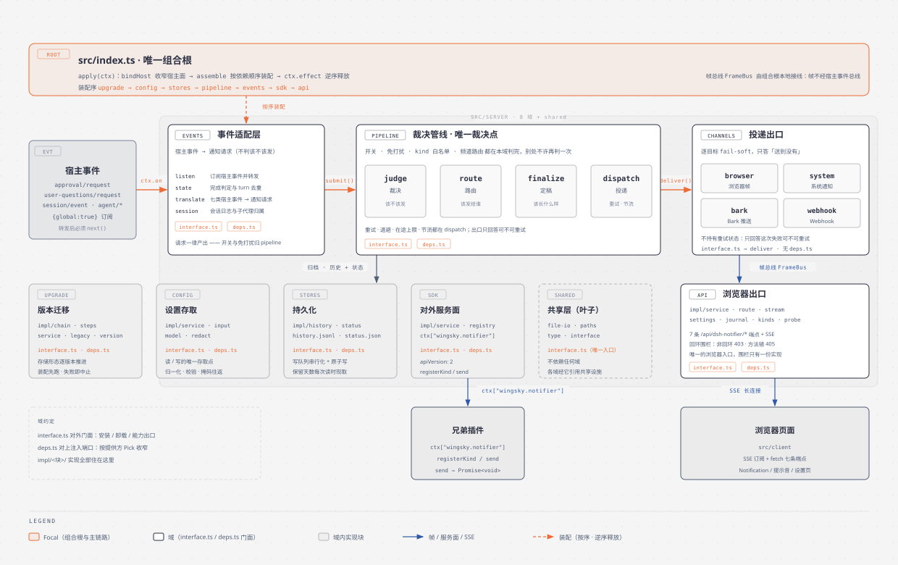
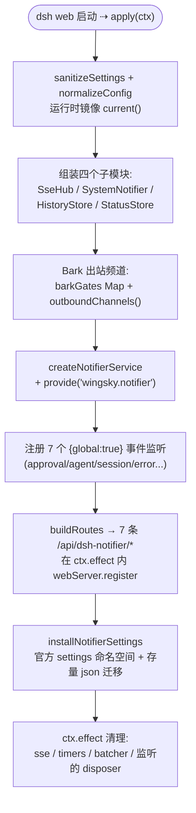
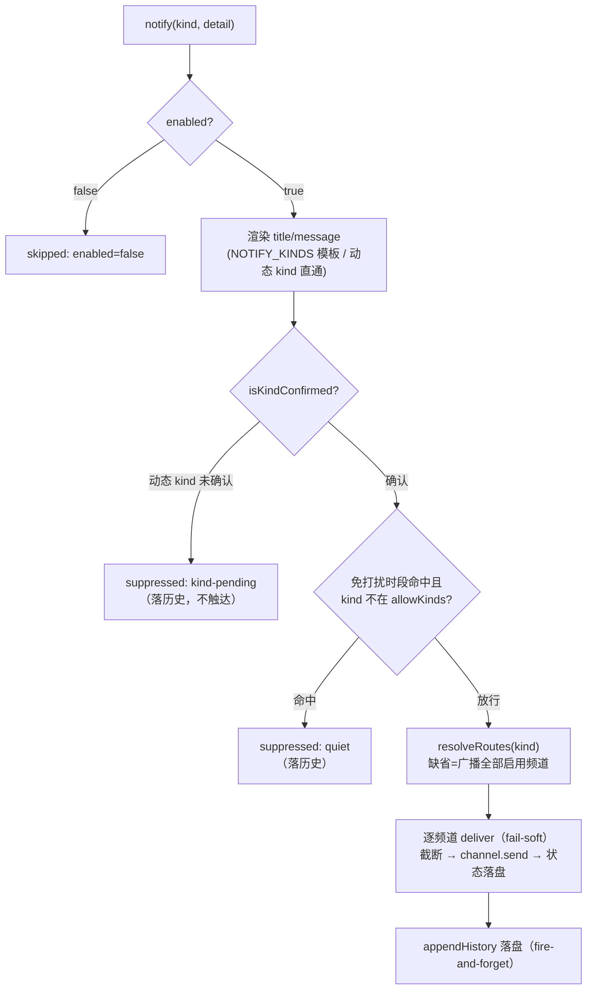
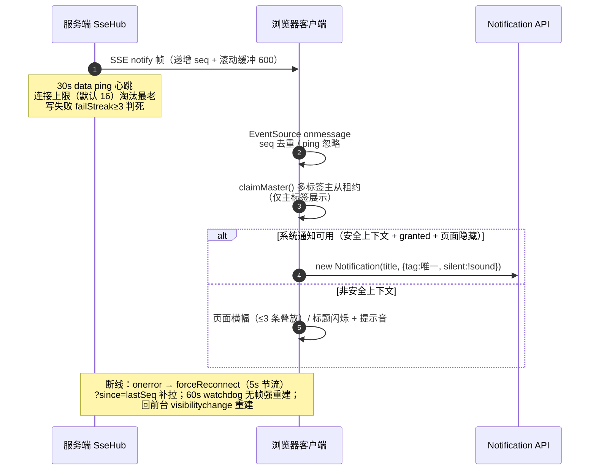

# dsh-notifier 架构与运行机制（图解）

> 包：`@wingsky-1/dsh-notifier` · 源码：`packages/dsh-notifier/` · 版本：0.2.0
> 功能一句话：**审批 / 完成 / 错误事件的离屏提醒**——人不在浏览器前也能收到通知：
> 系统 toast（WinRT / osascript / notify-send）+ 浏览器 Notification + 可选 Bark 推送，
> 支持免打扰时段、完成风暴聚合、错误合并与全链路脱敏。
>
> 快速上手（安装 / 配置 / 验证）见 [包 README](../../packages/dsh-notifier/README.md)；本文讲**原理与运行机制**。

---

## 1. 总体架构：事件 → 管线 → 通道

> 图源：`docs/architecture/diagrams/notifier-architecture.html`（diagram-design）。

设计要点：

- **被动监听，不改宿主**：7 个 `ctx.on` 监听（全部 `{global: true}`）消费宿主事件
  （approval/request、internal/service、session/event、agent/status、agent/disposed、
  agent/error、agent/turn-stopping），事件到达后构造消息、走统一管线、分发通道；
- **单源文案**：`NOTIFY_KINDS` 文案单表（test/ask/question/done/subagent-done/error/
  turn-end 七内置 kind），标题即结论、正文结论先行、不含时间戳；
- **通道可扩展**：内置 browser（SSE＋Notification）与 system（宿主 toast），M2 起支持
  Bark 出站频道（配置实例即插即用）；`ctx.provide("wingsky.notifier")` 对兄弟插件开放。

---

## 2. 插件装配流程

`apply(ctx)` 启动顺序（`src/index.ts`，装配全部在 index.ts——无独立 apply.ts）：

注意（源码勘误）：任务清单常写的 `src/apply.ts` **不存在**——装配全部在
`src/index.ts` 的 `apply(ctx)` 中。路由注册**必须**在 `ctx.effect` 内进行（宿主注释：
apply 主体直接调会在 cordis isolate 链就绪前访问服务，触发 Cyclic __proto__ 报错）。

---

## 3. 核心机制

### 3.1 事件订阅与完成判定（双源判据）

| 事件 | 门控 | 职责 |
|---|---|---|
| `approval/request` | `notifyAsk` | 构造 askDetail → `notify("ask")`；`askRemindMin>0` 起超时二次提醒定时器；**在 `await next()` 之前通知**（不短路） |
| `internal/service` | — | 服务注册 `userQuestions` 时包装 `svc.ask` 补发 question 通知（热重载安全：先解包残留包装） |
| `session/event` | — | `turn/end` 写 `eventStreamEnds[sessionId]`（完成判定**主证据**，post-commit 同步派发） |
| `agent/status` | `notifyTaskDone` / `notifySubagentDone` | running→idle 跃迁做完成判定（双源证据 + abort-early 冻结 + kind 白名单 completed） |
| `agent/disposed` | — | 清理各 Map/Set 条目（防无界增长） |
| `agent/error` | `notifyTaskError` | 脱敏 → 60s 滚动窗口合并 → `notify("error")` |
| `agent/turn-stopping` | `notifyTurnEnd`（默认关） | `(agentId, turn)` 去重 → `notify("turn-end")`；serial 事件签名无 next，**不要调 next()** |

**完成提醒双源判据**（`index.ts#apply`）：以 `session/event` 推送流（`eventStreamEnds`）
记忆的最新 `turn/end` 为**主证据**（恒定新鲜）；快照回读（`lastTurnEndOf`）仅在 push 缺失
时兜底（插件中途挂载 / 重载窗口）；`abort-early 冻结` 防止把 `running` 期间的旧 turn
误判为完成；kind 白名单仅 `"completed"` 通知完成——aborted/interrupted/error/blocked
一律静默（失败由错误提醒负责），但 `lastEndedTurn` 照常推进（同 turn 再现 idle 不重复）。

### 3.2 通知管线（sendKind 七步）

关键语义：

- **主证据 / 铁律 1**：`send` 受理同步返回 ok，终态（成功/失败）异步可见——
  状态经 `statusStore` 落盘 + `wingsky-notify/sent` 事件广播，设置页频道卡实时可见；
- **完成风暴聚合**（`createDoneBatcher`）：首条「完成」立即通知 + 起 3s 窗口
  （`doneMergeWindowMs`，0=关闭），窗口内后续完成只累积 → 到点补发一条聚合通知
  （「另有 N 个任务已完成」）；不同 kind 先 flush 再入队；
- **错误合并**：`errorMergeWindowMs`（默认 60s）内 per-agent 合并（lastMessages 保最近
  2 条各 80 字符），窗口过期后下一条新错误带 `mergedCount`；免打扰拦截时不消耗合并窗口；
- **免打扰**（quiet-hours.ts）：`isInQuietHours` 解析 start/end，**支持跨午夜**
  （22:00→08:00）；`allowKinds` 豁免（默认候选高频阻塞型：审批/提问/出错；设置页可勾选
  全部 6 个内置事件）。

### 3.3 双通道实现

**系统通知**（server.ts `createSystemNotifier`）：1s 节流；命令构造走纯函数
`buildSystemCommand`——

| 平台 | 命令 | 备注 |
|---|---|---|
| Windows | `powershell -NoProfile -File <toast.ps1> -Payload <base64(UTF-8 JSON)>` | 单 token base64 规避 PS 5.1 解析歧义（issue #238）；脚本幂等注册 AUMID `DSH.dsh-notifier` |
| macOS | `osascript -e 'display notification ...'` | 转义 `\` 与 `"`，换行→空格 |
| Linux | `notify-send title message` | 启动时探测一次，不可用则通道跳过 |

系统通知失败静默（仅日志）——子进程 `error` 事件必挂监听，绝不冒泡打挂宿主（issue #1）。

**浏览器通知**（SSE + Notification API）：

**Bark 推送**（channel-bark.ts，M2）：`POST {baseUrl}/push` + JSON body（device_key 走
body 不落 URL）；10s 硬超时、网络错误/5xx 重试 ×2（4xx 不重试）、实例级在途并发 ≤2；
成功判定双查 HTTP 2xx + 响应体 `code===200`；`levels` 紧急度优先级
`levels[kind] > level > severity 映射`（failure→timeSensitive / warning·success→active /
info→passive）；投递终态落盘 + `wingsky-notify/sent` 广播。

### 3.4 脱敏实现（sanitizeErrorText）

`SANITIZE_RULES` 有序表（`message.ts#SANITIZE_RULES`，**顺序即数据**）：用户路径 → `<path>`；
PEM 私钥块 → `<private-key>`；DB/消息队列连接串凭据 → `scheme://<redacted>@host`；
GitHub PAT（classic + fine-grained）/ JWT / AWS AKIA / ≥24hex·≥32base64 长串 → `<token>`；
密钥字段赋值 → `键=<redacted>`；邮箱 → `<email>`。

- 审批理由/提问文本截断 120 字符；错误文本截断 300 字符；任务标题先脱敏后截断 40；
- **已知取舍**：40 位 git commit SHA 与「≥24 位 hex 密钥」同形不可区分，会被打码为
  `<token>`（接受误伤换取密钥覆盖面）；已证伪不收录：IPv4 / 手机号 / 信用卡。

---

## 4. 路由与配置

所有 `/api/dsh-notifier/*` 路由走 loopback 围栏（非回环 403）——**经 lan-proxy 局域网
直连时一律 403 属预期**（安全护栏），需走 HTTPS 代理或隧道形态访问（见 README 部署节）。

| 路由 | 方法 | 说明 |
|---|---|---|
| `/api/dsh-notifier/config` | GET/PUT | 配置快照（deviceKey 掩码）/ 增量 patch（乐观并发 `expectedRevision`） |
| `/api/dsh-notifier/events` | GET | SSE 通知帧（`?since=<seq>` 断线补拉） |
| `/api/dsh-notifier/test` | POST | 测试通知（收敛到管线、绕过免打扰；可指定单频道） |
| `/api/dsh-notifier/history` | GET/DELETE | 最近 200 条记录 / 清空 |
| `/api/dsh-notifier/status` | GET | 频道投递状态（脱敏错误摘要） |
| `/api/dsh-notifier/kinds` | GET/POST | 动态 kind 清单与确认 |
| `/api/dsh-notifier/health` | GET | 健康检查 |

配置存官方 settings 命名空间 `dsh-notifier`（settings.yaml），GUI 设置卡片读写；旧版
`~/.dsh/dsh-notifier.json` 启动时一次性迁移（改名 `.migrated.bak` 备份）。

---

## 5. 安全与边界

- 通知文本只含任务标题/工具名/申请理由等元信息，**不含工具参数**；
- 错误通知/审批理由/提问文本经脱敏规则表打码再截断（见 3.4）；
- **两个通道到达的机器不同**：浏览器通知推到你正在用的浏览器客户端（Mac/手机都算），
  系统 toast 弹在 **dsh web 宿主机器**（headless 服务器上无桌面则不可用）——部署形态
  决定哪个通道有效，设置卡片/health 会体现；
- 浏览器通知需安全上下文（HTTPS 或 localhost）；局域网 HTTP 自动降级横幅/提示音；
  权限在手势内请求；iOS Safari 普通标签页无 Web Notification API（A2HS 后可用）；
- **Bark 频道**：baseUrl 限 http(s)、拒带凭据 URL、丢弃 query/hash；不做域名白名单
  （内网自建 bark-server 合法）；device key 不出现在 URL、响应单出口掩码、错误四路出口
  统一脱敏；已知残余风险：局域网内可访问者借 `/test` 触发一次对 baseUrl 的出站 POST。

---

## 6. 已知限制

- 完成判定需 `completed` 白名单 kind——`max-tokens` / `blocked` 等不报完成（由错误
  提醒或人工处理）；
- SSE 连接上限默认 16：含义是**服务端未释放句柄数**而非在线设备数；多设备×多页签
  峰值超限时淘汰最老连接（客户端自动重连 + since 补拉无感知），长期超限应调大；
- Windows toast 依赖 PowerShell（系统自带）；AUMID 注册无需管理员。