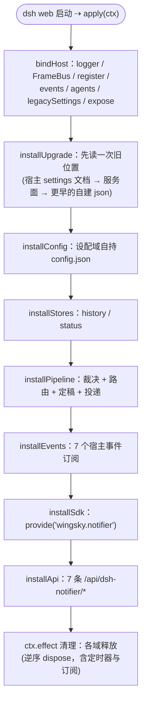
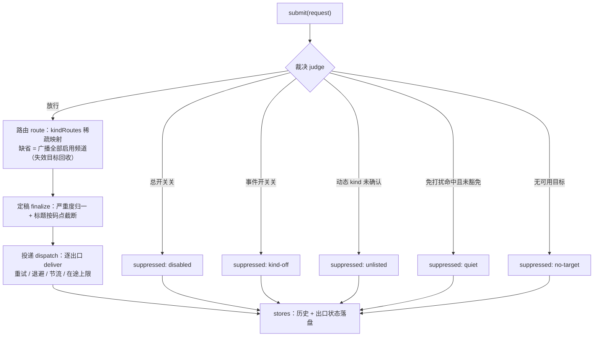

# dsh-notifier 架构与运行机制（图解）

> 包：`@wingsky-1/dsh-notifier` · 源码：`packages/dsh-notifier/` · 版本：0.2.3
> 功能一句话：**审批 / 提问 / 完成 / 出错的离屏提醒**——人不在浏览器前也能收到通知：
> 系统 toast（WinRT / osascript / notify-send）+ 浏览器 Notification + Bark / Webhook 出站推送，
> 支持免打扰时段、逐出口投递策略（重试 / 退避 / 节流）与动态通知种类。
>
> 本文描述 **#733 按域重写后**的结构：唯一组合根 + 8 个功能域 + 1 个共享层。
> 快速上手（安装 / 配置 / 验证）见 [包 README](../../packages/dsh-notifier/README.md)；本文讲**结构与运行机制**。

---

## 1. 总体结构：组合根 + 八个域

> 图源：`docs/architecture/diagrams/notifier-architecture.html`。

- **唯一组合根** `src/index.ts`：只有它接触宿主 `ctx`（`logger` / `webServer` / 事件总线 /
  `agents` 注册表 / 旧 `settings` 服务 / `provide`）。各域拿到的是**能力对象**（端口），不是上下文——
  域因此可以在没有宿主的情况下被装配与替身。
- **每个域一种形状**：`<域>/interface.ts`（对外门面，别的域只能从这里进）、
  `<域>/deps.ts`（本域对上依赖的端口，按提供方分组、用 `Pick<typeof providerApi, "…">` 收窄到实际用到的方法）、
  `<域>/impl/<块>/{type.ts,index.ts}`（实现；`impl/` 根目录只放聚合器）。
- **主链**：`events`（宿主事件 → 通知请求）→ `pipeline`（裁决 → 路由 → 定稿 → 投递）→ `channels`（四个出口）。
  其余域各司其职：`api` 供设置页读写、`sdk` 供兄弟插件调用、`config` 持有设置、`stores` 落盘、
  `upgrade` 负责存量迁移、`shared` 是包内共享层（叶子，不依赖任何域）。
- **重试 / 退避 / 节流 / 在途上限全在 `pipeline/impl/dispatch`**：出口只回答「这次失败可不可重试」
  （`DeliverResult.retryable`），自身不持有重试状态——出口因此是无状态、可替身的。

---

## 2. 插件装配流程

`apply(ctx)` 的安装顺序（全部在 `src/index.ts`，**没有独立的 apply.ts**）：

装配置得注意的地方（都是踩过的坑）：

- **路由注册必须在 `ctx.effect` 内**：apply 主体直接调用会在 cordis isolate 链就绪前访问服务，
  触发 `Cyclic __proto__` 报错；
- **帧总线是组合根本地设施**，不是宿主事件总线上的事件——总线上的名字是公共面，谁都能收发，
  而帧只该从投递走到浏览器出口；
- **事件处理包在「绝不向宿主抛错」的壳里**：`approval/request` 与提问是 waterfall，从这里抛出去会让
  `next()` 不被调用，症状是「审批框不弹了」，与本插件毫无字面关联；壳里失败只记 `logger.warn`，
  不静默吞掉（否则「通知不工作」会变成查不出原因的现象）。

---

## 3. 核心机制

### 3.1 事件域：7 个宿主事件 → 通知请求

| 事件 | 门控 | 职责 |
|---|---|---|
| `approval/request` | `notifyAsk` | 构造申请详情 → `ask`；**在 `await next()` 之前通知**（不短路审批） |
| `internal/service` | — | 服务注册 `userQuestions` 时包装 `svc.ask` 补发 `question`（热重载安全：先解包残留包装） |
| `session/event` | — | `turn/end` 记入本轮的推送证据（完成判定**首选证据**） |
| `agent/status` | `notifyTaskDone` / `notifySubagentDone` | running→idle 跃迁做完成判定 → `done` / `subagent-done` |
| `agent/disposed` | — | 清理该 agent 的状态机条目（防无界增长） |
| `agent/error` | `notifyTaskError` | 转发官方 agent 载荷（含错误原文）→ `error` |
| `agent/turn-stopping` | `notifyTurnEnd`（默认关） | `(agentId, turn)` 去重 → `turn-end`；serial 事件签名无 `next`，**不要调 `next()`** |

**完成判定用的是「推送优先 + 快照兜底」双源**：`session/event` 推送流记住的最新 `turn/end` 是首选证据
（恒定新鲜）；只有在推送缺失时（插件中途挂载 / 重载窗口）才回读会话快照，且快照 turn ≤ 本轮基线 turn
时判为陈旧丢弃。判定不通过的一轮同样记账，否则 abort 之后同一 turn 的旧证据会在下一次 idle 被当成新完成。
只有 `completed` 报完成，aborted / interrupted / error / blocked 一律静默（失败由 `error` 负责）。

### 3.2 管线域：裁决 → 路由 → 定稿 → 投递

- **判据顺序即短路顺序**：`disabled` → `kind-off` → `unlisted` → `quiet`（→ 无目标时 `no-target`）。
  `test` 跳过事件开关与免打扰——它没有宿主事件也就没有开关，而用户是主动按下它的。
  外部（兄弟插件）注册的 kind 没有「开关」这一关，只认用户是否确认过（确认态的物理形态就是 `allowKinds`）。
- **抑制原因随记录写进历史**：它是「为什么我没收到」的唯一答案来源，被拦截的通知同样落盘（带 `suppressed` 标记）。
- **投递策略是 per-出口的表**（`pipeline/impl/dispatch`，按 `DeliveryTarget["type"]` 取）：

  | 出口 | 重试次数 | 退避 | 在途上限 | 节流 |
  |---|---|---|---|---|
  | bark | 2 | 1000ms × 第几次 | 2 | — |
  | system | 0 | — | — | 1s（沿用上一次结果直通，同一秒内的重复不重复弹） |
  | webhook | 0 | — | — | — |
  | browser | 0 | — | — | — |

### 3.3 出口域：四个出口与投递阶段

`channels/impl/deliver` 是四个出口共用的投递阶段：按出口能力截断 → 交给出口 → 归一结果
（`{status:"ok"}` / `{status:"failed", reason, retryable}`）。展示上限按码点（值取自 0.2.3 的 channel capabilities）：

| 出口 | 标题上限 | 正文上限 | 说明 |
|---|---|---|---|
| system | 64 | 256 | 宿主机器上弹原生 toast；Linux 经宿主自播事件音（主题音缺失时改用运行时合成的提示音） |
| browser | 64 | 2048 | SSE 帧 → 浏览器 Notification（非安全上下文降级为页面横幅 + 提示音 + 标题） |
| bark | 64 | 4096 | `POST {baseUrl}/push`，`device_key` 走 body 不落 URL；成功判定 = HTTP 2xx 且响应体 `code===200` |
| webhook | 64 | 4096 | 两步法模板（预置 ntfy / gotify / custom），凭据只进 header/body |

失败原因摘要单独截断到 300 码点——状态页只有一行，原因是摘要不是全文。

系统出口的 Linux 自播回退链（链序、运行期判据、临时音频素材、能力面三态与未实测面）的
设计依据见 [系统提示音功能设计](../../packages/dsh-notifier/docs/sound-playback-design.md)。

### 3.4 存储域与共享层

| 文件 | 位置 | 语义 |
|---|---|---|
| `config.json` | `<DSH_HOME>/@wingsky-1/dsh-notifier/` | 用户设置（插件自持，不再用官方 settings 命名空间存新值） |
| `history.jsonl` | 同上 | 追加写；读面最多交出最近 200 条，`historyMaxAgeDays` 按天过滤；写侧串行队列 |
| `status.json` | 同上 | 出口最近终态 + 连续失败计数；内存镜像 + 500ms 防抖落盘；条目上限 64 |
| `seq.json` | 同上 | SSE 序号计数器（重启后续计数） |
| `version` | 同上 | **存储版本刻度**（存储升到哪版），不是插件版本 |

共享层 `shared/` 提供三件事：日志端口、原子文本读写（读 / 异步写 / 同步写）、产品布局路径解析。
它是叶子——不依赖任何域，且所有跨域引用只走 `shared/interface.ts` 门面。

---

## 4. 路由与配置

7 条 `/api/dsh-notifier/*` 路由全部走 loopback 围栏（非回环 403）——**经 lan-proxy 局域网直连时一律 403 属预期**
（安全护栏），需走 HTTPS 代理或隧道形态访问（见 README 部署节）。

| 路由 | 方法 | 说明 |
|---|---|---|
| `/api/dsh-notifier/config` | GET/PUT | GET 设置快照（凭据掩码）/ PUT 增量 patch（可选 `expectedRevision` 乐观并发） |
| `/api/dsh-notifier/events` | GET | SSE 通知帧（`?since=<seq>` 断线补拉） |
| `/api/dsh-notifier/test` | POST | 测试通知（收敛到管线、跳过免打扰；可指定单频道） |
| `/api/dsh-notifier/history` | GET/DELETE | 最近 200 条记录 / 清空 |
| `/api/dsh-notifier/status` | GET | 出口投递状态（原文截断的错误摘要） |
| `/api/dsh-notifier/kinds` | GET/POST | 动态 kind 清单与确认（确认结果持久化进 `allowKinds`） |
| `/api/dsh-notifier/health` | GET | 健康检查 |

**升级链**（`upgrade` 域）：启动时读一次旧位置——**宿主 settings 文档文件**优先（`describe()` 只列**已注册**的
命名空间，而本插件 0.2.4 起不再注册它，服务面那条路读不到存量的 user 层，故退为兜底），更早的自建 json 最后；
读到的用户层写进 `config.json`，此后只有这一个读写面。旧存储位置（`DSH_HOME` 根目录下的文件）由
`impl/steps/storage-layout` 搬到包私有目录，并在 `version` 里留下刻度。

---

## 5. 机器强制的结构约束

本包的结构不是靠自觉维持的，靠门禁：

| 门禁 | 盯什么 |
|---|---|
| `verify-dir-imports` | 跨模块引用只能落在目标域的 `interface.ts`；`impl` 不得直引他域实现；跨模块**值**依赖图不得成环；`src` 下每个文件必须在变异拓扑的 mutate/exclude 面内 |
| `forbid-module-state-src` | `src` 顶层禁止 `let` / `var`（模块级可变状态是跨实例串味的源头） |
| `pack:check` | 声明合并（`Context` 上的服务名）必须可达 `lib/index.d.ts` |
| `pnpm contract` / `export-surface-snapshot` | 对外导出面与冻结基线零 diff；新导出必须登记分类 |
| `forbid-src-tests` | 测试不得写进 `src/` |

类型纪律（`src/server/` 内）：零 `unknown`、零 `| null`、零 `| undefined` 联合——用判别联合代替
（`{ok:true} | {ok:false}`、`{found:true;…} | {found:false}`），让「没有」成为显式分支而不是漏判。

---

## 6. 安全与边界

- 通知文本只含任务标题 / 工具名 / 申请理由等元信息，**不含工具参数**；
- **内容脱敏规则表已删除**（#733 收敛）：正文按原文落盘与投递，长度只受出口展示上限约束；
  需要「某类文本永不出现」的部署应在事件源处理；
- **bark 出口的 4xx 响应体会被回显**（服务端可能把 `device_key` 原文写回），因此它会进入
  服务端日志、`status.json` 与 `GET /status`。这是已知且已登记的残余风险；
- **两个通道到达的机器不同**：浏览器通知推到你正在用的浏览器客户端，系统 toast 弹在 **dsh web 宿主机器**
  （headless 服务器上无桌面则不可用）——部署形态决定哪个通道有效；
- 浏览器通知需安全上下文（HTTPS 或 localhost），局域网 HTTP 自动降级；权限在手势内请求；
- **Bark 出口**：baseUrl 限 http(s)、拒带凭据 URL、丢弃 query/hash；不做域名白名单（内网自建 bark-server 合法）；
  已知残余风险：局域网内可访问者借 `/test` 触发一次对 baseUrl 的出站 POST。

---

## 7. 已知限制

- 完成判定只认 `completed`：`max-tokens` / `blocked` 等不报完成（由错误提醒或人工处理）；
- SSE 连接表**不设连接数上限**：半开连接（设备息屏 / 切网 / NAT 静默掐断）不发 FIN、
  close/error 不触发，只能等超窗回收。真正把这类连接数收住的是 **stalled**——一条不再消费的连接
  会让心跳写返回 false，连续超 90s 即判死回收；**maxAge 轮换**（存活超 120min 且业务空闲超 15min）
  处理的是「长命但空闲」的另一类：心跳写不算业务活动，业务帧会刷新空闲计时，所以有稳定通知流时
  这一路不触发，活跃连接本来也不该被它回收。这里的连接数含义是**服务端未释放句柄数**而非在线设备数；
- 系统出口的半开失败（子进程已写、进程未退）只记日志，不影响其它出口（沿用 0.2.3 语义）；
- Windows toast 依赖 PowerShell（系统自带），AUMID 注册无需管理员；
- **没有请求身份契约**：SDK 的 `send` 入参不含调用方标识，因此「同一请求的重复通知」在架构上不可识别——
  错误合并、完成聚合、审批超时二次提醒这三个依赖身份的语义**已整体删除**，不做半成品。
