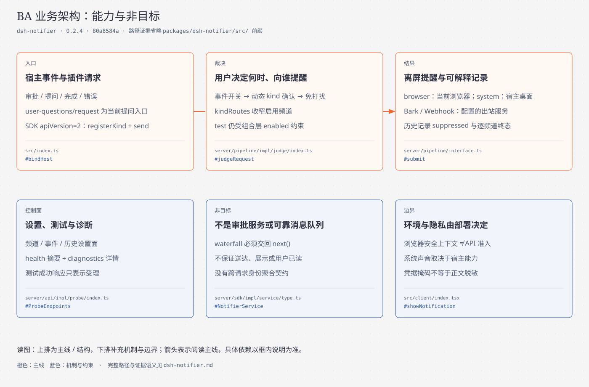
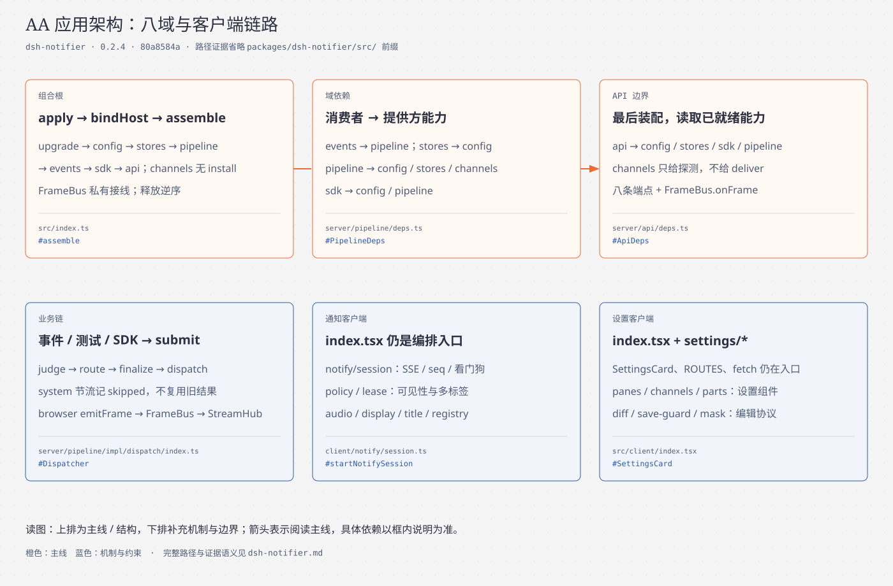
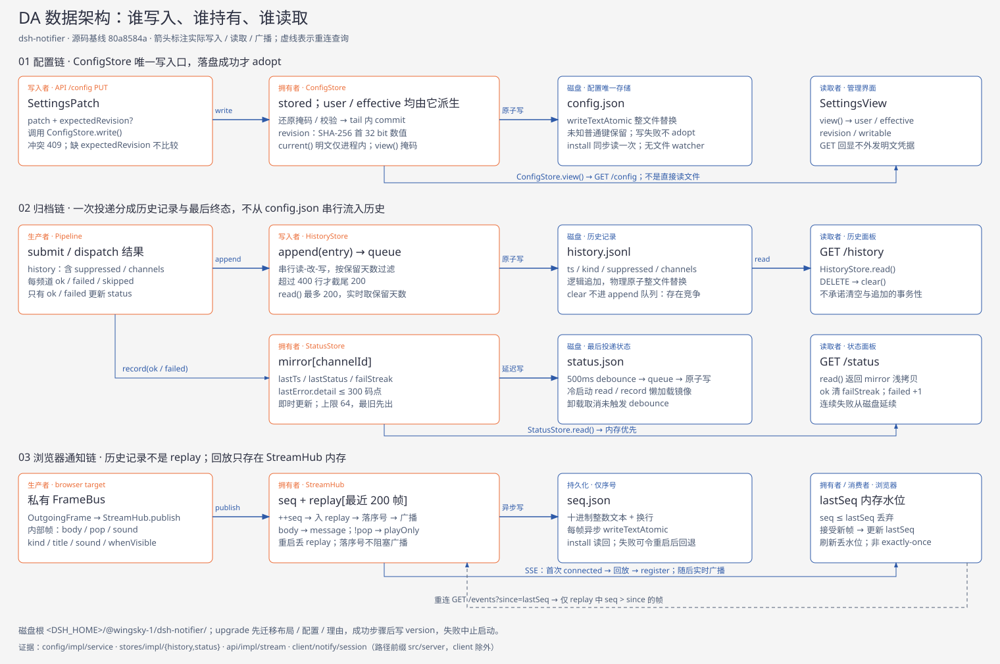
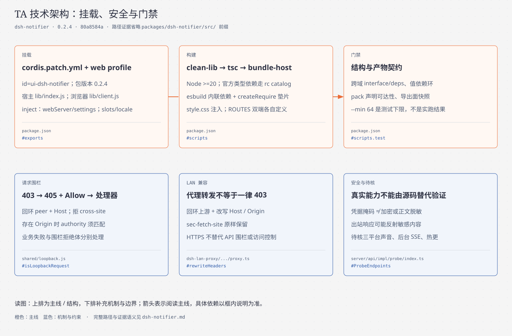

# dsh-notifier 架构与运行机制（TOGAF 4A 四视图）

> 包：`@wingsky-1/dsh-notifier` · 当前版本：0.2.4 · 源码：`packages/dsh-notifier/`。
> 把审批、提问、完成与错误转成可配置的离屏提醒，并留下投递与抑制记录。
>
> 安装、配置与安全模型见 [包 README](../../packages/dsh-notifier/README.md)。本文解释业务 BA、应用 AA、数据 DA、技术 TA。
> 证据基线：`80a8584a`；证据为 `路径:行号`（取自该树，后续提交会漂移，以符号搜索兜底）或可复现常量。
> `src/…` 省略包目录前缀。机制结论来自源码核对，不将历史图片或既有测试文件当成本次实测结果。

## 四视图导航

| 视图 | 回答的问题 | 章节 | 图件 |
| --- | --- | --- | --- |
| BA | 能力、用户控制与非目标 | [§1](#ba) | [SVG](diagrams/notifier-ba.svg) · [HTML](diagrams/notifier-ba.html) |
| AA | 真实域依赖与客户端链路 | [§2](#aa) | [SVG](diagrams/notifier-aa.svg) · [HTML](diagrams/notifier-aa.html) |
| DA | 配置、历史、状态、SSE、迁移与生命周期 | [§3](#da) | [SVG](diagrams/notifier-da.svg) · [HTML](diagrams/notifier-da.html) |
| TA | 挂载、构建、门禁与安全兼容边界 | [§4](#ta) | [SVG](diagrams/notifier-ta.svg) · [HTML](diagrams/notifier-ta.html) |

四图沿用 worktree sidebar 点阵底纹、纸白/深灰、橙色主线和蓝色机制标注；HTML 内联 SVG 自包含，独立 SVG 按仓库导出契约生成。

## 1. 业务架构（BA）

### 1.1 能力与可见结果

| 能力 | 入口 | 可见结果与边界 |
| --- | --- | --- |
| 宿主事件提醒 | 审批、提问、agent 状态与错误 | 七项订阅（`src/server/events/impl/listen/index.ts:31-43`）：onApprovalRequest / onUserQuestion / onSessionEvent / onAgentStatus / onAgentDisposed / onAgentTurnStopping / onAgentError；订阅集合卸载期逐个退订（`:47-53`），单例重复装配当场抛错（`:27`） |
| 多出口投递 | browser / system / Bark / Webhook | 浏览器提醒到当前客户端，系统提醒到 dsh 宿主，远程推送到配置服务 |
| 用户控制打扰 | 频道、事件、免打扰、kindRoutes | 内置频道分别控制 enabled/popup/sound，browser 另有 whenVisible；动态 kind 须确认 |
| 自检与解释 | 测试、历史、状态、诊断 | 测试只表示受理；历史说明抑制与逐频道结果；诊断区分弹窗和声音能力 |
| 兄弟插件扩展 | wingsky.notifier | apiVersion=2，registerKind/send；无自我确认、无自定义出口注册口 |

证据：`src/server/events/impl/listen/index.ts#EventListener`、`src/server/pipeline/impl/judge/index.ts#judgeRequest`、`src/server/sdk/impl/service/type.ts#NotifierService`、`src/server/api/impl/probe/index.ts#ProbeEndpoints`。

### 1.2 非目标

- 不接管审批决策。两条 waterfall 均以 `{ global: true }` + prepend 旁观（`src/index.ts:74` `GLOBAL_LISTEN`——宿主事件默认按 fiber 作用域过滤，漏掉的表现是「有些会话不通知」且只在多会话下出现，`:70-73` 注释），通知处理失败记日志后仍交回 next。
- 不提供可靠消息队列或用户已读回执。SDK send 返回 Promise<void>；browser 帧交接不证明系统已展示（`src/server/sdk/impl/service/type.ts#NotifierService`、`src/server/pipeline/interface.ts#submit`）。
- 不把所有 idle 当任务成功。只有新鲜 completed 证据产生完成提醒；abort、blocked 等不冒充完成（`src/server/events/impl/state/index.ts#settleIdle`）。
- 不做错误合并、完成聚合、审批超时二次提醒。SDK 请求无调用方/请求身份契约，不能据此推导跨请求去重（`src/server/sdk/impl/service/type.ts#NotifyRequest`）。
- 不保证任意 OS、浏览器或后台挂起状态下均能响铃、弹窗；凭据掩码不等于正文脱敏。

## 2. 应用架构（AA）

### 2.1 唯一宿主组合根与八个功能域

`src/index.ts#apply` 以 bindHost 收窄 ctx，经 assemble 按依赖顺序接线。inject 是 webServer/settings；settings 虽不再保存新配置，仍是启动迁移的必需依赖。

| 域 | 装配与职责 | 实际能力依赖 |
| --- | --- | --- |
| upgrade | 最先同步迁移磁盘 | logger、legacySettings；不用尚未装配的 config 写面 |
| config | 同步加载用户配置 | logger；频道参数类型引用 channels，不是运行时投递依赖 |
| stores | 历史与频道状态 | config.readConfig（按需读保留期） |
| pipeline | 唯一裁决与投递编排 | config.readConfig；stores.appendHistory/recordStatus；channels.deliver；FrameBus.emit |
| events | 七项订阅与完成状态机 | pipeline.submit；宿主事件与 agent 注册表 |
| sdk | 服务面与动态 kind 管理 | config.readConfig/writeConfig；pipeline.isBuiltinKind/submit；expose.provide |
| api | 最后挂八条端点与 SSE | config 读写；stores 查询/清空；pipeline.submit；sdk 清单/确认；channels 只读探测；FrameBus.onFrame |
| channels | 无域级 install，投递与能力探测 | 无其它功能域依赖；系统执行端口在 impl/system/deps.ts；releaseSoundTemps 收音频目录 |

证据：`src/index.ts#assemble`；`src/server/<域>/deps.ts` 的 Port 与 `interface.ts`。channels 无域级 deps.ts，不能画成“八个同构 install 单例”；api 拿不到 channels.deliver。

`src/server/shared/interface.ts` 是宿主路径、IO、理由/文本设施；`src/shared/interface.ts` 是双端频道/kind/声音/拒绝码/释放栈契约，不应混成一个目录。

### 2.2 事件、裁决与投递

七事件为 approval/request、**user-questions/request**、session/event、agent/status、agent/disposed、agent/error、agent/turn-stopping（`src/server/events/impl/listen/index.ts:31-43`，七条订阅一一对应七个翻译器）；当前没有 internal/service 包装 svc.ask 的链路。事件域只搬运不含判断（`:2-3` 文件头「本块只做搬运不含判断」），不产出通知是常态（`forward`，`:57-59`），开关统一由管线判定（`src/index.ts#bindHost`）。

完成判定推送优先、快照兜底：running 记基线；session/event 的 turn/end 优先；推送缺席才读快照，快照 turn 不比基线新则弃用。idle 无论是否通知都记 lastEndedTurn，防旧证据复用；disposed 清理状态；turn-stopping 按 agent+turn 去重（`src/server/events/impl/state/index.ts#AgentStateMachine`）。

三入口 events / api 测试 / sdk 均进 submit：

1. judgeRequest（`src/server/pipeline/impl/judge/index.ts:43-59`）：disabled → **test 短路**（`:52`，唯一例外：过了总开关即放行，注释明言「被静音吃掉等于测试按钮失效」）→ kind-off（`:53`）→ unlisted（`:54`，动态 kind 只认 allowKinds）→ quiet（`:55-57`）。quiet 支持跨午夜（`start > end`，`:33-34`），`start === end` 零长窗口与解析失败一律未命中——脏设置不该把通知全部吃掉（`:24` 注释）；豁免只认显式 `allowKinds`（`:72-75`）。每条判据一个有名函数、顺序在四行里读得出来（`:37-42` 注释：此前四条规则混在一个函数体里）。
2. routeTargets：只取 enabled 频道；kindRoutes 空或缺省表示全部启用频道；onlyChannel 收窄且绕过 kindRoutes。失效 id 被识别，不代表自动重写用户配置。
3. finalize 与出口展示上限：按码点截断；标题均 64，正文 system 256、browser 2048、Bark/Webhook 4096。
4. dispatch：逐目标 fail-soft，策略表 `POLICIES` 按出口类型键控（`src/server/pipeline/impl/dispatch/index.ts:13`）。Bark 仅可重试失败最多重试 2 次，退避 1s/2s、每频道在途 2，等待队列无上限。system 1s 节流当前记 skipped/reasonThrottled，**不沿用上次成功结果**；其它出口不重试。节奏按 channelId 键控，skipped 不更新「最后投递状态」。

证据：`src/server/pipeline/impl/judge/index.ts#judgeRequest`、`impl/route/index.ts#narrowRoutes`、`impl/dispatch/index.ts#POLICIES` / `Dispatcher`；`src/server/channels/impl/deliver/caps.ts#displayCaps`。

browser target 的 emitFrame 经组合根私有 FrameBus 到 api StreamHub，不经过宿主公共事件总线；api 只消费帧（`src/index.ts#FrameBus`、`src/server/pipeline/impl/route/index.ts#browserTarget`）。

### 2.3 客户端的实际拆分

`src/client/index.tsx` 只导出 apply/inject（slots、locale），但仍持有 ROUTES、fetch 包装、SettingsCard 与通知展示编排，不是已经彻底拆薄的入口。

| 模块 | 职责 |
| --- | --- |
| notify/session.ts | SSE、lastSeq、看门狗、主动重连 |
| notify/policy.ts、lease.ts | 可见性策略、localStorage 多标签租约 |
| notify/audio.ts、display.ts、title.ts、registry.ts | 音频、横幅、标题、带 owner 的通知回收 |
| settings/panes、channels、parts | 频道/事件/历史面板，频道卡片，诊断状态与控件 |
| settings/diff.ts、save-guard.ts、mask.ts | 差量、并发保存防护与掩码交互 |
| capabilities.ts、api-error.ts、reason-text.ts、locale.ts/locales.ts | 客户端能力、结构化拒绝、理由本地化与字典 |

apply 不要求打开设置卡片就启动通知半区；回前台恢复标题并请求重连。释放栈回收连接、看门狗、监听、通知与样式；owner 防旧实例 teardown 删除新实例资源（`src/client/index.tsx#apply` / `pageOwner`、`src/client/notify/session.ts#startNotifySession`）。

### 2.4 HTTP 面

路径统一前缀 /api/dsh-notifier；事实源为 `src/server/api/impl/service/index.ts#ApiService.install`。

八条端点以字面量表登记（`src/server/api/impl/service/index.ts:31-44`）：

| 路径 | 方法 | 语义 |
| --- | --- | --- |
| /config | GET/PUT | 掩码视图；增量 patch 与可选 expectedRevision |
| /history | GET/DELETE | 最近历史 / 清空 |
| /status | GET | 频道最后终态与连续失败 |
| /kinds | GET/POST | 动态 kind 清单 / 用户确认 |
| /test | POST | 固定测试通知、可选 channelId；只报告受理 |
| /health | GET | 平台、sseEvicts、能力摘要 |
| /diagnostics | GET | 完整宿主能力与修复建议 |
| /events | GET | SSE，`?since=N` 补拉（`:40-43` 包一层保 this，裸传丢 this） |

health/diagnostics 共用 Promise 缓存探测，8s 总预算；失败/超预算回“无法判定”，不让附属诊断拖垮 health 主面（`src/server/api/impl/probe/index.ts#ProbeEndpoints`）。

## 3. 数据架构（DA）

### 3.1 五份落盘物与内存状态

根为 `<DSH_HOME>/@wingsky-1/dsh-notifier/`，由仓库 `shared/dsh-home.js#dshHome` 与包内 `src/server/shared/paths.ts#notifierFile` 决定。

| 载体 | 协议 | 生命周期边界 |
| --- | --- | --- |
| config.json | stored 原样 → user 净化 → effective 完整；同步加载、排队原子写 | 不是文件 watcher，运行期写走 writeConfig |
| history.jsonl | 逻辑追加，实际**写队列串行化 + 原子整文件替换**（`src/server/stores/impl/history/index.ts:39-40` 队列、`:70` writeTextAtomic；并发读改写会互相覆盖丢记录） | 阈值语义：行数 > `HISTORY_LIMIT*2`（=400，`:16` `HISTORY_LIMIT=200`）才截到尾 200（`:69`）；读最多 200，保留天数每次读时现取 `historyMaxAgeDays`（`:64`，装配期取快照会在用户改设置后失效，`:4`） |
| status.json | channelId → lastTs/lastStatus/failStreak/lastError | 内存镜像即时更新；**500ms debounce 合并写**（`:24`，通知风暴时避免每条通知一次整文件重写，`:4`）；上限 64 条（`:21`），删了再插 = 移到表尾、最旧先出（`:73-77`）；detail 截 300 码点（`:28`）；failStreak 跨重启延续（`:67-68` 冷启动读回镜像） |
| seq.json | 十进制整数文本加换行，不是 JSON 对象 | 每帧异步写序号；replay 不持久化；序号持久化是刻意的——重置会让重连客户端把旧帧当新的（`src/server/api/impl/stream/index.ts:1-2`） |
| version | 单行存储版本刻度 | 成功迁移步骤后写，当前步骤目标 0.2.4 |

历史含 suppressed 与 channels 明细；结果为 ok/failed/skipped。理由为 code/params/detail，旧散文读取时归一，状态 detail 截到 300 码点（`src/server/stores/impl/history/index.ts#HistoryStore`、`src/server/stores/impl/status/index.ts#StatusStore`）。

### 3.2 配置一致性与用户确认

`src/server/config/impl/service/index.ts#ConfigStore.write`：掩码还原 → 校验 → 队列 commit → 比 revision → 合并 → 原子落盘 → adopt。失败不采纳内存；未知普通键保留、危险原型键剔除；新增频道无原凭据，不能提交掩码占位。

revision 是递归稳定 JSON 的 SHA-256 摘要前 32 位，**不是单调计数**；数组顺序是内容。expectedRevision 可选，省略不校验冲突，端点冲突回 409；不是分布式锁（`#revisionOf` / `stableJson`）。channels 保存内置与实例频道，kindRoutes 稀疏路由，allowKinds 保存用户确认；SDK 登记表则为运行期状态。确认只经 api 管理面，不暴露给服务消费者（`src/server/sdk/interface.ts#confirmKind`）。

### 3.3 SSE 不是可靠消息队列

`src/server/api/impl/stream/index.ts#StreamHub` 将 body/pop 转 message/playOnly，附 kind/seq/ts/sound/whenVisible；先增序号、入内存最近 `REPLAY_LIMIT = 200` 帧缓冲（`:19`）、异步落序号、广播。开流立即写 `: connected` 注释（`:24-26`）——注释帧客户端不解析，作用是**立即 flush 响应头**：Node 会缓冲响应头直到第一次写入，没有这行客户端要等第一个心跳（30s 后）才从 CONNECTING 进 OPEN。`HEARTBEAT_MS = 30000`（`:22`）与客户端 60s 看门狗对齐（「留足两次失败的余地」，`:21`）；只按 `?since=N` 回 seq>N（EventSource 自动重连不带 query），不声明 SSE id/Last-Event-ID 协议。

客户端（`src/client/notify/session.ts`）三条刻意语义（`:9-13` 注释）：重连必须带 since（EventSource 自动重连不携带 query，不带就丢断线期间事件）；只有**解析成功**的帧才刷新 lastActivity（畸形帧不该让半开检测失效）；重连最小间隔防 onerror 与看门狗互相触发成重连风暴。常量：`WATCHDOG_MS = 60000`（`:16`）、检查起始延迟 `WATCHDOG_ARM_MS = 60000+5000`（`:19`，比窗口长 5s 避免边界误判）、`RECONNECT_MIN_GAP_MS = 5000`（`:22`）。`lastSeq` 既是去重水位又是 since 起点——两者必须同源，否则要么重复提醒、要么漏帧（`:53-54`）；`seq <= lastSeq` 丢弃（`:98`）。可见性恢复也触发重连。刷新页面重建内存水位，不能承诺跨刷新 exactly-once。

共享 `shared/sse-hub.js#createSseHub` 管句柄/心跳/回收，不设连接数硬上限；stalled 回收与 maxAge 空闲轮换处理不同残留。health 给聚合 sseEvicts，不给逐连接明细。句柄数不是在线设备数或送达数。重启清 replay；序号写失败不阻塞广播，故仍有重启后水位回退与补拉窗口丢失的边界。

### 3.4 迁移与卸载

upgrade 同步先跑 0.2.3 → 0.2.4：布局 → 配置形态 → 理由形态（`src/server/upgrade/impl/steps/index.ts#STEPS`）。

- 布局保留已有目标；旧文件写到新位置后归档 .migrated.bak；无旧文件建空历史/状态/0 序号（`impl/steps/storage-layout.ts#migrateStorageLayout`）。步骤表 `STEPS` 当前单步 0.2.3→0.2.4（`src/server/upgrade/impl/steps/index.ts:18-19`）。
- 旧配置读取：宿主文档文件 → settings.describe → 更早自建 JSON/Bak；迁移合并时存量覆盖现文件，顶层频道键搬入 channels；全新无用户层不凭空写默认配置（`impl/legacy/index.ts#readLegacySettings`、`impl/steps/config-shape.ts#migrateConfigShape`）。
- 动作或刻度写失败中止启动，刻度不抢先前移；已完成文件操作不是整组事务回滚。存储版本落差告警，不自动降级（`impl/chain/index.ts#applyStep` / `reportGap`）。
- apply 的 finally 登记已采集释放栈；正常逆序 api→sdk→events→pipeline→stores→config→upgrade，音频临时目录最后收。不能推断各域内部部分安装失败都具备完整回滚（`src/index.ts#apply` / `assemble`）。
- stores 不等在飞写；status 取消未触发 debounce，最近状态可能未落盘；history.clear 不进 append 队列，与在飞追加竞争可写回已清记录（`src/server/stores/interface.ts#releaseStores`、`impl/history/index.ts#clear`）。

## 4. 技术架构（TA）

### 4.1 挂载与构建依赖

cordis.patch.yml 以 ui-dsh-notifier 插入 profile；宿主 exports→lib/index.js，客户端→lib/client.js；dsh.client.platform=web，客户端包依赖 dsh-client-connection。Node >=20；官方 optional peer 走 catalog，实际服务来自宿主，适配版本以仓库 pnpm-workspace.yaml 的 rc catalog 为准，不以本机 dsh 版本推断（`package.json#exports` / `dsh` / `engines`）。

build 为 clean-lib→tsc→scripts/build/bundle-host.ts；esbuild 内联第三方代码、createRequire 垫片与许可证归集支持发布物自包含。yaml 用于旧 settings 文档，React 用于客户端设置组件；“构建期依赖”不代表相关逻辑不在运行期执行。样式为 src/client/style.css，经 ensureStyle 注入。

**当前客户端 ROUTES 在 index.tsx，宿主端点表另在 ApiService**，不能照搬 worktree sidebar 的 ROUTES 导出与构建期强一致说明（`src/client/index.tsx#ROUTES`、`src/server/api/impl/service/index.ts#ApiService`）。

### 4.2 请求、内容与出站安全

八条 API 由 `src/server/api/impl/route/index.ts#registerEndpoints` 统一处理：先围栏 403，再方法 405（Allow），然后同步/异步异常收口；响应头已发则不重复写 500。围栏保留裸 error，加 code/status sibling；业务端点另用 ok:false/error 对象。

仓库 `shared/loopback.js#isLoopbackRequest` 实际检查回环 socket peer、回环 Host、默认拒绝 cross-site，存在 Origin 时 authority 须匹配 Host；不是只看 IP，也不是 HTTPS 即放行。

**经 LAN proxy 不等于一律 403。** 代理走回环上游，改写 Host 与存在的 Origin，保留 sec-fetch-site；合法同源请求可满足 notifier 围栏，直接非回环 peer/Host 则拒绝。HTTPS 主要解决浏览器安全上下文，不替代 API 准入或访问控制；代理扩大可达信任边界（跨包证据：`packages/dsh-lan-proxy/src/server/proxy/impl/proxy.ts#rewriteHeaders`；见 [LAN proxy 架构](dsh-lan-proxy.md)）。

正文会含标题、申请理由、错误原文，旧内容脱敏规则已退役。配置掩码只保护视图，不是磁盘加密；外部失败响应可能反射凭据并进入历史/状态。Bark 限 http(s)、拒 URL 内凭据、device_key 走 body；Webhook 模板/认证也可含敏感内容。不存在目的域白名单保证，允许内网自建服务；可达测试面的人可能触发对配置目标的出站请求。证据：`src/server/channels/impl/bark/index.ts`、`impl/webhook/index.ts`、`src/server/config/impl/redact/index.ts`，部署策略见包 README 安全模型。

### 4.3 平台与兼容边界

系统出口使用 Windows PowerShell WinRT、macOS osascript、Linux notify-send，Linux 音频含自播与合成临时音；宿主桌面、D-Bus、播放器与音频设备可用性不能由源码代证。浏览器需安全上下文、Notification 权限与音频手势解锁；降级横幅/音频/标题也受后台挂起影响。SDK apiVersion=2、官方事件签名、slots/locale 与双端路由表是升级时需复核的耦合点。

证据：`src/server/channels/impl/system/index.ts`、`impl/system/players.ts`、`impl/system/tone-file.ts`、`src/client/index.tsx#showNotification` / `handleNotifyFrame`；详见 [系统提示音设计](../../packages/dsh-notifier/docs/sound-playback-design.md)。

### 4.4 门禁、证据与待核项

包 test 脚本 run-vitest.mjs --min 64 是下限契约，不是本文宣称的实际数量。现有 test/unit、integration、client-unit、client-dom、e2e 覆盖域判据、组合/服务契约、纯逻辑、DOM 生命周期与 smoke；测试文件的存在不代表验证通过，实际执行范围与退出码应记录在对应 PR 中。

结构门禁守跨域 interface/deps、值依赖环与变异拓扑；模块状态门禁不等于对象内部无状态。pack:check 守声明合并可达性，contract/export-surface-snapshot 守公开面，forbid-src-tests 守测试布局。新增文档链接的最终门禁按 [AGENTS.md](../../AGENTS.md) 执行 gate:pr；验证记录应区分本地门禁结果与 CI 状态，不以其中一项代替另一项。

待核：真实多标签租约竞态、刷新重放体验、跨进程 seq 回退、真实网络 SSE 半开、三平台音频与 HMR 资源收口。实现明确边界还包括 history.clear 竞争、Bark 排队无上限、status 未落盘尾窗。这些边界应在相关实现变更时同步复核。

## 5. 图源与维护

- [BA HTML](diagrams/notifier-ba.html)、[AA HTML](diagrams/notifier-aa.html)、[DA HTML](diagrams/notifier-da.html)、[TA HTML](diagrams/notifier-ta.html) 是独立图源。
- 原 [notifier-architecture.svg](diagrams/notifier-architecture.svg) 与 [HTML](diagrams/notifier-architecture.html) 保留为历史单图，不作为当前事实源。
- 方法论：[ARCHITECTURE-METHOD.md](../ARCHITECTURE-METHOD.md)；构建验证：[DEVELOPMENT.md](../DEVELOPMENT.md)。

导出命令：`python3 scripts/lib/export-diagram-svg.py docs/architecture/diagrams/notifier-ba.html`，其它视图替换 ba 为 aa/da/ta。实际命令结果在交付说明单列，不由文中复现命令推定。
