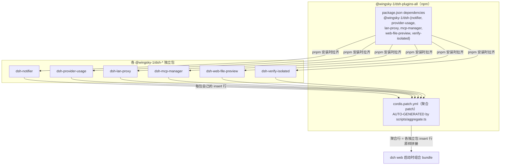

# dsh-plugins-all 架构与运行机制（图解）

> 包：`@wingsky-1/dsh-plugins-all` · 源码：`packages/dsh-plugins-all/` · 版本：0.2.0
> 功能一句话：**DSH 插件全家桶聚合包**——安装本包 = 一键装齐全部功能插件。
>
> 快速上手（安装 / 卸载 / 更新）见 [包 README](../../packages/dsh-plugins-all/README.md)；
> 本文讲**聚合机制**。

---

## 1. 聚合原理：dependencies 拉齐 + 聚合 cordis patch



- **装它 = 子包 dependencies 拉齐 + 聚合 patch 激活**：`dsh plugin add
  @wingsky-1/dsh-plugins-all` 装的是聚合包本体，其 npm dependencies 会一并安装六个
  功能子包；聚合 `cordis.patch.yml` 把六条 insert 行（`id` + `name`，**不带 config**——
  schema 默认值兜底）原样拼接，dsh web 重启时按名册组合全部插件；
- **patch 由脚本生成，禁止手改**：`node scripts/aggregate.ts`（重新生成）/
  `--check`（CI 校验漂移）；改独立包 patch 后必须重跑；
- **patch id 与独立行相同（`ui-<目录名>`）**：同一插件以独立 + 聚合两种方式同时安装时，
  loader 层按 id duplicate → TypeError 启动失败（fail-loud 明确可发现）——
  因此 README 声明**禁双装**（任选一种安装方式）；保持 id 相同而非另加前缀，避免
  「不同 id 双 entry 各自 apply 的静默双激活」。

---

## 2. 聚合包 vs 独立安装

| 维度 | 聚合包（dsh-plugins-all） | 独立安装（dsh-<name>） |
|---|---|---|
| 安装 | 一条命令装齐 | 逐个 install |
| patch id | 与独立行相同（禁双装） | `ui-<目录名>` |
| 配置 | 各插件 schema 默认值生效 | 同 |
| 适用 | 全家桶尝鲜 / 完整环境 | 按需 / 故障隔离排查 |

> **不包含**（聚合边界）：`@wingsky-1/dsh-codegraph` 为独立发包（暂不进聚合包，需先装
> mcp-manager 或聚合包后单独安装）；`dsh-memory`（项目长期记忆）未包含；
> 已退役 `dsh-gzip`（压缩合并进 lan-proxy）、`dsh-idle-archive`、
> `dsh-subagent-model-inherit` 不再分发（见 README 退役说明）。

---

## 3. 使用方式与安全提示

```sh
# 安装全家桶
dsh plugin --profile web add @wingsky-1/dsh-plugins-all
# 卸载 / 更新（均需重启一次 dsh web 生效）
dsh plugin --profile web remove @wingsky-1/dsh-plugins-all
dsh plugin --profile web update @wingsky-1/dsh-plugins-all
# 只想用某个插件时单独安装
dsh plugin --profile web add @wingsky-1/dsh-notifier
```

装全家桶前的安全提示（各组件能力横断面）：

- `lan-proxy` 会在 `0.0.0.0:<port>` 监听并默认开启 injectToken——**等效信任整个局域网**，
  使用前务必阅读其 README 安全说明（不可信网段关闭）；
- `mcp-manager` 会启动 MCP 服务器子进程（stdio）并执行其命令——仅配置可信服务器，
  子进程继承宿主权限；
- `web-file-preview` 经代理暴露时 loopback 围栏可被穿透（局域网任意设备可读白名单文件）
  ——请在可信内网部署；
- `notifier` 在 Windows 通过 PowerShell WinRT 弹系统通知（本机桌面）；
- `provider-usage` 用户适配器代码 = 宿主完整 Node 权限——仅加载可信本地 mjs。

---

## 4. 维护事项

- 聚合 patch 变更链路：改独立包 `cordis.patch.yml` → `node scripts/aggregate.ts` 重新
  生成 → CI 的 `--check` 防漂移；
- 发布纪律遵循仓库全局规范（tag 触发、全量门禁、squash merge），本文不展开。