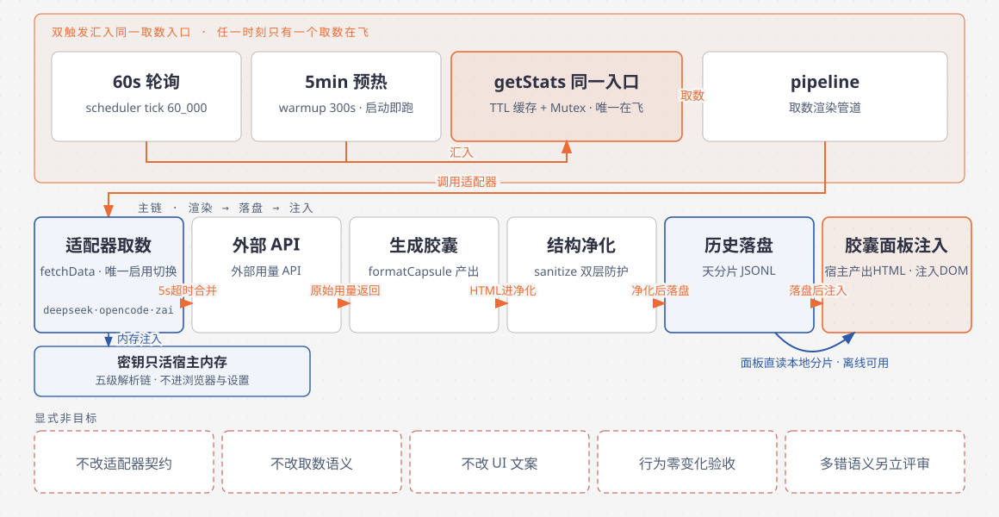
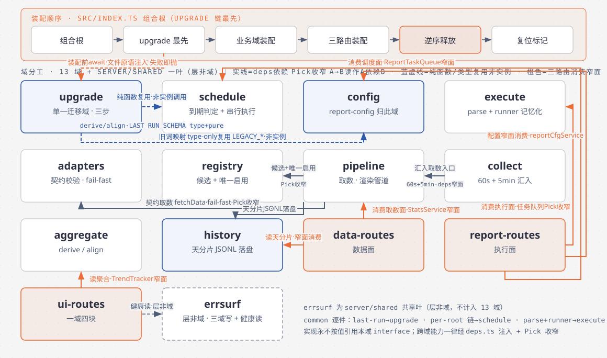
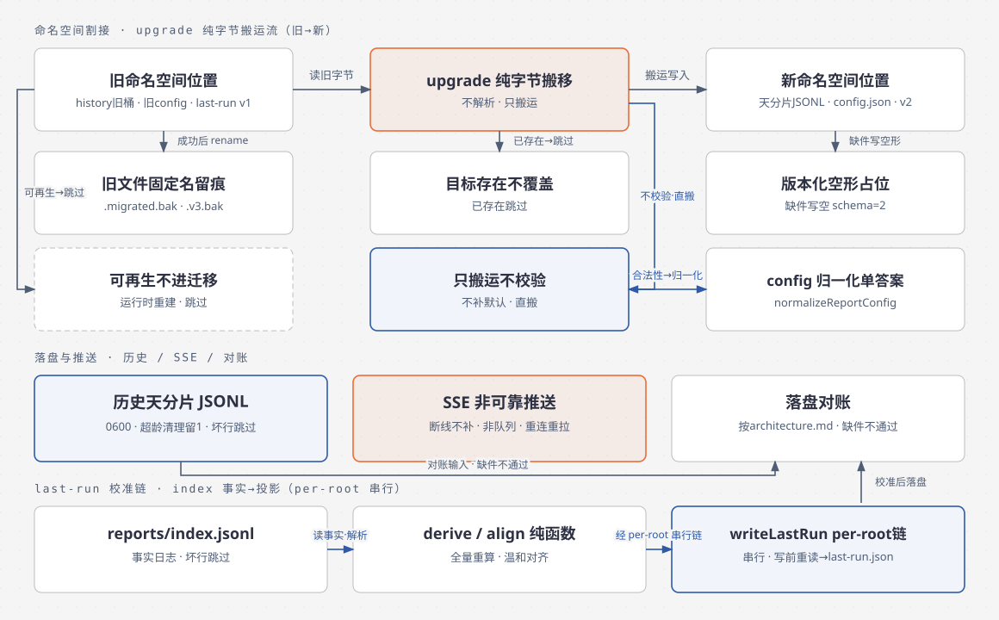
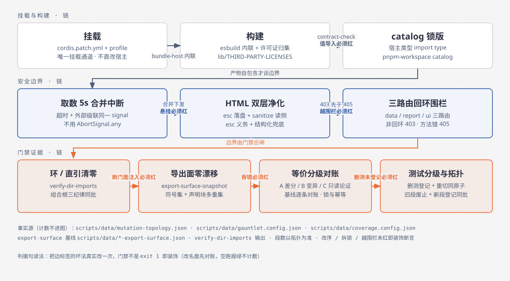

# dsh-provider-usage 架构与运行机制（TOGAF 4A 四视图）

> 包：`@wingsky-1/dsh-provider-usage` · 源码：`packages/dsh-provider-usage/` · 版本见包 `package.json`（本文不复述版本号）
> 功能一句话：**多 provider 通用量统计框架**——聊天界面右上角常驻悬浮胶囊展示当前模型 provider 用量，点击展开详情面板；任意数据源按 v2 契约写一个 mjs 文件即可接入，渲染在宿主端完成。
>
> 快速上手与适配器开发见 [包 README](../../packages/dsh-provider-usage/README.md)；细节图解见包内 [docs/architecture.md](../../packages/dsh-provider-usage/docs/architecture.md) 与 [docs/adapter-guide.md](../../packages/dsh-provider-usage/docs/adapter-guide.md)。本文按 TOGAF 四视图讲**目标架构（#768 收官重构锚定）**，现状背景见附录。
> 证据基线：`66dc2865`；证据为 `路径:行号`（取自该树，后续提交会漂移，以符号搜索兜底）。
> `src/…` 省略包目录前缀（即 `packages/dsh-provider-usage/`）。
>
> 唯一事实源（本文不复述会漂移的计数）：域清单以 `src/server/` 为准；变异段面以 `scripts/data/mutation-topology.json` 为准；阈值以 `scripts/data/gauntlet.config.json` 为准；覆盖率面以 `scripts/data/coverage.config.json` 为准。

## 四视图导航

| 视图 | 回答的问题 | 章节 | 图件 |
| --- | --- | --- | --- |
| BA | 能力、非目标与现状背景 | [§1](#ba) | `diagrams/provider-usage-ba.svg` |
| AA | 组合根装配、域分工与调用链路 | [§2](#aa) | `diagrams/provider-usage-aa.svg` |
| DA | 落盘物、命名空间割接、SSE | [§3](#da) | `diagrams/provider-usage-da.svg` |
| TA | 挂载、构建、安全边界、门禁证据 | [§4](#ta) | `diagrams/provider-usage-ta.svg` |

> 各视图节首 SVG 已生效（见 §5）；包内 architecture.md 的 mermaid 讲关系逻辑。两者不是同一张图的两种画法，改一处不必同步另一处。

## 1. 业务架构（BA）

能力：v2 适配器契约（fetchData/formatCapsule/formatPanel）承载任意 provider；60s 轮询与预热定时器汇入同一取数入口（缓存 TTL + 互斥，任一时刻只有一个取数在飞）；面板读本地天分片落盘，外部暂不可达时历史图表依然可用。

非目标：不改适配器契约、不改取数语义、不改 UI 文案；行为零变化是 #768 验收前提。唯一例外候选：store 多错聚合语义（现只抛首个错误），改则另立行为变更评审，不混进重构。

### 附录：现状背景（v0.2.5 前，行为事实，重构须保持）

宿主端渲染：适配器在 Node 侧产出 HTML，浏览器端只拉数据与注入 DOM；密钥五级解析链只活在宿主内存，不进浏览器与设置 schema；适配器代码等同用户进程内插件，仅加载可信本地文件（相对路径禁穿越，热更新默认开启）。取数 5s 强制超时；XSS 双层防护（esc 文档义务 + 结构化净化兜底）；路由 loopback 围栏；历史 JSONL 受限权限 + 超龄超量清理。区间记账法（纯消费区间对账、充值独立列示）与面板渲染缓存语义（命中条件与失效时机）保持不变。

## 2. 应用架构（AA）

组合根 `src/index.ts` 只做三件事：收窄宿主上下文、按依赖顺序装配、逆序释放；域间能力经各域 `deps.ts` 注入且 Pick 收窄；实现永不按值引用本域 `interface.ts`。

域：adapters/history/pipeline/registry（采集管理）/ aggregate/collect/execute/schedule（聚合调度）/ data-routes（stats/history/适配器管理路由）/ report-routes（报告执行面：配置服务 + 任务队列 + 执行器）/ ui-routes（health/trend/ui-config/SSE，以实现块切分）/ config（report config 形态 + 归一化单答案；有状态配置服务归此域，路由侧经窄面消费）/ upgrade（单一迁移域：存储归位 + 配置形态割接 + last-run 迁移步；运行时完全解耦（UpgradeDeps = logger + root 解析 + 旧文件显式读面，无业务实例；装配前 await，失败即抛）；源码允许纯面复用（schedule 的 LAST_RUN_SCHEMA/derive/align 经 interface type+pure 复用，非实例调用；per-root 链留 schedule 经 deps 注入，不新建 file-io 叶；LEGACY_* 旧词映射 type-only 复用，非实例））。

消除：common 兜底域消失（迁移语义归 upgrade 步；per-root 链与读写原语及格式归属归 schedule；索引解析与执行记忆归 execute；进程期错误面归 server/shared 新共享叶）；跨域直引改经门面；弃用调用清零后收缩抑制基线。

## 3. 数据架构（DA）

落盘物按包内 architecture.md 对账，缺件验收不通过。命名空间割接六规则：纯字节搬移不解析；目标已存在不覆盖；旧文件固定名留痕；版本化空初始形态；可再生落点不进迁移；迁移只搬运不校验不补默认（合法性单答案仍在 config 归一化）。SSE 不是可靠消息队列。

## 4. 技术架构（TA）

挂载只走 cordis.patch.yml + profile；宿主类型只用 catalog 锁版 import type；第三方依赖构建期内联并归集许可证。门禁证据：引用链环与直引清零、包导出面零漂移、等价性分级标级（纯函数差分/分支定向变异/改名消除新建只读论证 + 整模块重写面基线逐条对账）、测试分级（单元/新建组合根集成/客户端直连/产物契约/端到端）与删测试登记制。

## 5. 图源与维护

- 图源：本目录 `diagrams/provider-usage-{ba,da,aa,ta,architecture}.html`（archify 出图），SVG 由 `scripts/lib/export-diagram-svg.py` 导出；mermaid 只讲关系，不与 SVG 同图两画。
- 维护：目录树与域清单变更同批更新 AA 图；计数类事实只活在门禁事实源，正文不复述。
