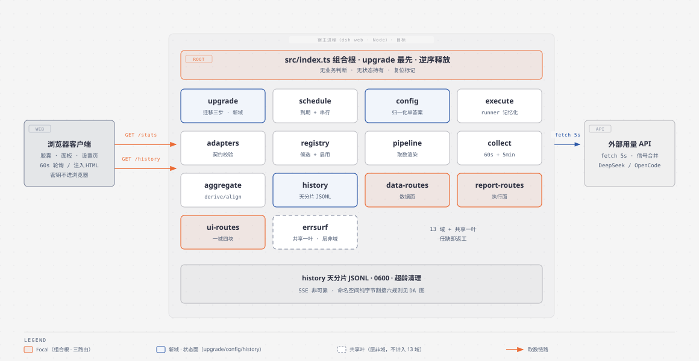
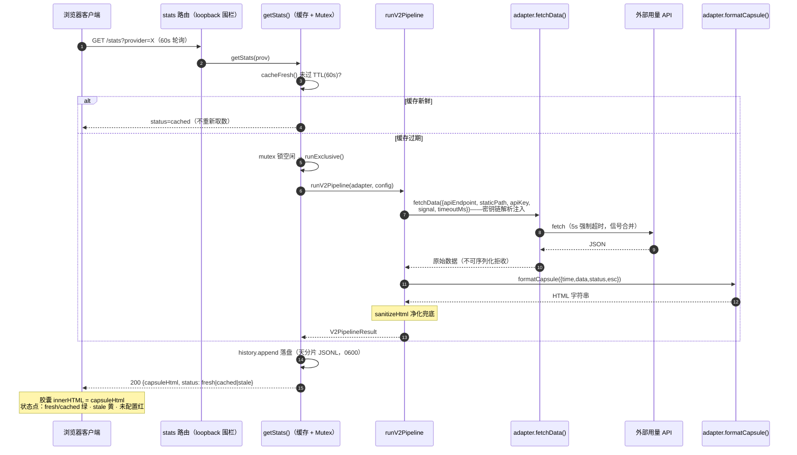
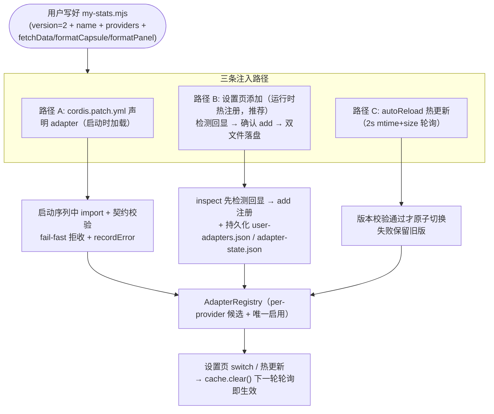

# dsh-provider-usage 架构与运行机制（图解）

> 包：`@wingsky-1/dsh-provider-usage` · 源码：`packages/dsh-provider-usage/` · 版本：0.2.0
> 功能一句话：**多 provider 通用用量统计框架**——聊天界面右上角常驻悬浮胶囊展示当前
> 模型 provider 的用量，点击展开详情面板；内置 DeepSeek 官方 / OpenCode Go / 智谱
> Coding Plan 适配器，任意数据源按 v2 契约写一个 mjs 文件即可接入，**渲染在宿主端**。
>
> 快速上手见 [包 README](../../packages/dsh-provider-usage/README.md)；**完整图解文档
> （启动装配 / /stats 取数全链路 / /history 面板 / 适配器注入三路径 / 热更新 / 客户端
> 交互 / 密钥解析链）见包内
> [docs/architecture.md](../../packages/dsh-provider-usage/docs/architecture.md)**；
> 适配器开发引导见 [docs/adapter-guide.md](../../packages/dsh-provider-usage/docs/adapter-guide.md)。
> 本文是该包的**总览级架构图 + 要点**，细节以包内文档为准。

---

## 1. 总体架构：宿主端渲染，一次取数两份 HTML

v2 核心设计是**宿主端渲染**：用户适配器在 Node 侧产出 HTML，浏览器端只做「拉数据 +
注入 DOM」，不再维护任何渲染器注册表（v1 的 `window.__DSH_USAGE__` 桥接已废弃）。

> 图源：`docs/architecture/diagrams/provider-usage-architecture.html`（diagram-design）。

要点：

- **同一链路两个触发方**：客户端 60s 轮询与宿主端 5min 预热定时器汇入同一个
  `getStats()`（缓存 TTL + Mutex 互斥锁，任一时刻只有一个取数在飞）；
- **适配器代码只活在宿主进程**：密钥不进浏览器；HTML 下发前经双层净化
  （`esc()` 转义义务 + `sanitizeHtml` 结构化净化兜底）；
- **面板不依赖实时取数**：`/history` 从本地按天分片 JSONL 读，外部 API 暂不可达时
  历史图表依然可用。

---

## 2. 核心链路：取数 → 落盘 → 渲染

降级语义速查：正常新取 `fresh`（绿）→ 缓存命中 `cached`（绿）→ 锁忙/取数失败
`stale`（黄）→ 无候选适配器 `no-adapter` / 有候选全禁用 `no-enabled-adapter`（红点
错误态胶囊，点开面板见接入引导 + 复制引导指令）。

---

## 3. 适配器注入（v2 契约）

- **设置页承载**：设置 → 插件 →「用量统计」→ 目标 provider 下「+ 添加适配器」输入
  mjs 路径（`~` 展开 / 绝对路径）→ 检测文件回显 → 确认添加（自动持久化 + 热注册）；
- **安全**：适配器代码 = 宿主完整 Node 权限（等同用户自己写的进程内插件），仅加载
  可信本地文件；路径安全：相对路径只允许落在 `DSH_HOME` 或插件 home 内，`../` 穿越
  一律 400；`autoReload` 默认开启，可关闭；
- **密钥五级解析链**：插件 `apiKey` → 环境变量 `{PROVIDER}_API_KEY` → 旧变量
  `OPENCODE_GO_API_KEY` → `<DSH_HOME>/.credentials.yaml` → opencode auth.json；
  DeepSeek 官方适配器另含三级密钥链（配置 → 凭据链 → 适配器内自查 `DEEPSEEK_API_KEY`
  兜底）。密钥仅存宿主内存，不进浏览器、不进设置面板 schema。

---

## 4. 内置适配器与数据口径

| 适配器 | 认领 provider | 数据源 | 特色 |
|---|---|---|---|
| `opencode-go-builtin` | `opencode-go` | OpenCode Go `/v1/usage` 三窗口用量 | 默认启用 |
| `deepseek-official-builtin` | `deepseek-official` | DeepSeek 官方 `/user/balance` 余额接口 | 区间记账法推算每日消耗（纯消费区间 = 余额降幅，可对账；充值独立列示不漏计）；峰谷倒计时徽标；15 日用量柱形图；近 24h 波动折线（充值断轴平移） |
| `zai-coding-cn-builtin` | 智谱 Coding Plan (CN) | — | 国内场景 |

DeepSeek 区间记账法：`topped_up_balance` 是充值账户当前剩余（恒等式
`total = toppedUp + granted`），相邻采样区间按性质分类——纯消费区间（余额降幅，可与
平台账单对账）/ 扰动混合区间（提取「充值 +¥X」独立列示，不混算）/ 跨度 >27h 或不可用
（跳过）；区间归属计入结束端所在日，跨午夜隔夜消费不丢失。

---

## 5. 路由与 /history 渲染缓存

| 路由 | 说明 |
|---|---|
| `GET /stats?provider=X` | 用量统计 + `capsuleHtml`（胶囊内容）+ `status`/`adapterVersion` |
| `GET /history?provider=X&days=N` | 历史查询 + `panelHtml`（面板内容）+ 查询 `range` |
| `GET /health` | 健康检查 + 适配器快照 + 错误登记 |
| `GET /adapters.json` | 适配器候选元数据（含 `modelProviders`） |
| `POST /adapters/select` | 切换/清空启用适配器 |
| `POST /adapters/inspect` · `/adapters/add` | 预览 / 登记适配器文件 |

`/history` 的 `panelHtml` 在宿主进程内缓存：命中条件 = `(provider, 启用适配器, 归一化
查询窗口)` 均未变（自然日粒度归一化）；失效时机四处——历史采样落盘成功、select、add、
热更新；兜底 TTL 90s；错误响应与无适配器结构不入缓存。客户端维持 `no-store`，缓存为
纯服务端行为。

---

## 6. 安全模型速览

- **适配器代码 = 宿主完整 Node 权限**（网络/文件/环境变量）——仅加载你信任的本地文件，
  插件绝不从网络拉取执行代码；
- **密钥不进浏览器端**：apiKey 仅宿主进程内存，经 fetchData 入参注入；响应体与 HTML
  均无密钥子串；
- **XSS 双层防护**：外部 API 数据入 HTML 前必须经 `esc()`（文档义务）+ 宿主端结构化
  净化兜底（script/iframe/on*/javascript: 移除，含编码变体，封闭实体解码）；
- **超时纪律（两层）**：服务端取数固定 5s（合并信号主动 abort 真实 fetch）；客户端到
  dsh web 跳 10s `AbortSignal.timeout` 兜底（移动端半开连接不悬挂）；
- 所有路由 loopback 围栏；历史 JSONL 0600 + 超龄超量自动清理；适配器 fail-fast 加载
  拒收并登记可排障错误。

---

## 7. 关键模块索引

| 模块 | 职责 |
|---|---|
| `src/index.ts` | 宿主端入口：配置归一化、7 条路由、预热定时器、持久化读写 |
| `src/contracts.ts` | v2 契约（UsageStatsAdapter / FetchContext / esc）+ 校验器 |
| `src/registry.ts` | per-provider 候选列表 + 唯一启用 + 错误登记 |
| `src/pipeline/v2.ts` | 取数/面板管道：入参组装 → safe 执行 → 净化 → 归一化 |
| `src/core/guards.ts` | 用户代码安全执行包装（超时/序列化校验/错误隔离） |
| `src/core/history.ts` | 按天分片 JSONL + 旧 v3 桶迁移 |
| `src/hotreload.ts` | mtime+size 轮询热更新 + 原子切换 |
| `src/provider-config.ts` | 密钥五级解析链 |
| `src/sanitize.ts` | HTML 结构化净化 |
| `src/client/*` | 胶囊/面板/设置页 tab |