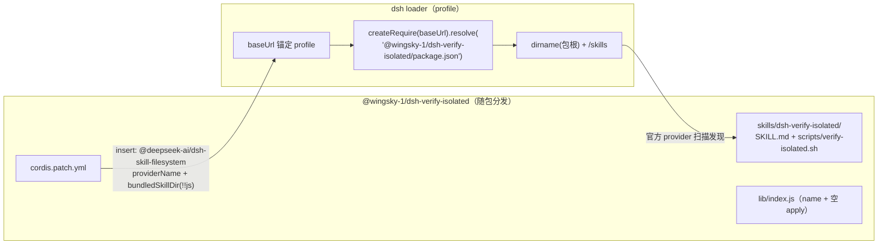
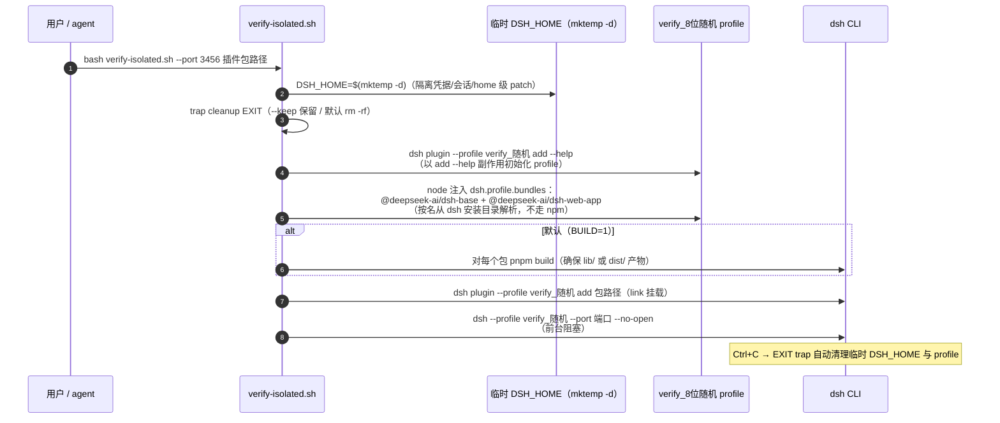

# dsh-verify-isolated 架构与运行机制（图解）

> 包：`@wingsky-1/dsh-verify-isolated` · 源码：`packages/dsh-verify-isolated/` · 版本：0.2.0
> 功能一句话：**DSH 插件开发的隔离环境浏览器验证 skill**——临时 `DSH_HOME` + 独立
> `verify_<随机>` profile 双重隔离，一键拉起隔离 `dsh web`，退出自动清理，
> 不污染正在使用的 `web` profile。
>
> 快速上手（安装 / 使用）见 [包 README](../../packages/dsh-verify-isolated/README.md)；
> 本文讲**原理与运行机制**。

---

## 1. 总体设计：宿主空壳 + skill 载体

本插件**没有宿主逻辑**——`src/index.ts` 只导出 `name` 与**空 `apply()`**（满足门禁），
skill 注册完全由 `cordis.patch.yml` 配置的官方 provider 承担：



- **skill 注册机制**：`cordis.patch.yml` 复用官方 `@deepseek-ai/dsh-skill-filesystem`，
  配置 `bundledSkillDir` 为 `!!js` 表达式——从**安装后的 npm 身份**解析包根再 `join
  ('skills')`（npm 副本 / `link:` 开发态 / 仓库 checkout 三种形态均正确，不以路径拼接
  猜测安装位置）；官方 provider 扫描 `skills/dsh-verify-isolated/SKILL.md`
  （frontmatter `name: dsh-verify-isolated`）并注册，无需自写注册代码；
- **`!!js` 求值环境**：`baseUrl` 是 loader 为 profile 提供的模块解析锚点（patch 注释
  为唯一实证来源）；`createRequire(baseUrl)` 得到以该锚点为根的 require；
- `package.json` `dsh.bundle.patch → ./cordis.patch.yml`；`files` 含 `skills`——
  skill 目录随 npm 包发布。

---

## 2. 一键脚本：双重隔离的六步

`skills/dsh-verify-isolated/scripts/verify-isolated.sh`（102 行，`set -euo pipefail`）：



双重隔离的层次（为什么两层都必要）：

| 隔离层 | 做法 | 隔离内容 |
|---|---|---|
| 第一层：临时 `DSH_HOME` | `DSH_HOME=$(mktemp -d)` | 凭据、会话、全部用户数据、home 级 `cordis.patch.yml` |
| 第二层：独立 profile | `verify_<8位随机>`（非 `web`） | 插件组合栈（bundles）、profile 级 patch、插件依赖 |

> **只建独立 profile 不够**——profile 共享 home 级凭据与会话；必须同时把 `DSH_HOME`
> 指向临时目录才与真实环境完全隔绝。验证结束删除临时 DSH_HOME 与 `verify_*` profile。

---

## 3. 使用方式

```bash
# 1. 安装（注册为内置 skill）
dsh plugin --profile web add @wingsky-1/dsh-verify-isolated

# 2. skill 加载后，取「Base directory for this skill:」绝对路径为 SKILL_BASE
bash "$SKILL_BASE/scripts/verify-isolated.sh" --port 3456 <插件包路径>
# 多包：--port 3456 <包A> <包B>
# --port 0 随机端口 · --keep 保留临时环境 · --no-build 跳过构建
```

- **SKILL_BASE 自适应**：跟随 `cordis.patch.yml` 的 bundledSkillDir 解析——npm 副本 /
  `link:` 开发态 / 仓库 checkout 均返回真实 skill 目录（脚本相对它定位）；
- 脚本自包含、从任意 cwd 以绝对路径调用；不确定时先 `ls "$SKILL_BASE/scripts/
  verify-isolated.sh"` 自证；
- **浏览器验证**（SKILL.md §5）：Playwright 或 chrome-devtools MCP 访问
  `http://localhost:<port>`；核验 UI 呈现 / Console（挂载失败只应 warn 不应 throw）/
  双主题 / 窄屏（768×1024 pad、375×667 phone）；**防 flake**：轮询
  （`waitForSelector`/`wait_for`）禁固定 sleep；截图只截插件 UI 本身（element
  screenshot，不带整窗防泄露本机信息），dsh-plugin-hub 归档至
  `packages/dsh-<name>/docs/archive/`；
- **完成检查**：隔离实例已启动且端口不冲突 → UI 渲染正常 → Console 无未处理错误 →
  截图已归档 → 实例已停止、临时 DSH_HOME 与 `verify_*` profile 已清理。

---

## 4. 安全模型

- 隔离环境不携带真实凭据（临时 `DSH_HOME` 无 `~/.dsh` 数据）；
- 不关闭/重启运行中的主 `dsh web` 进程（独立端口）；
- 脚本只用 `mktemp -d` 临时目录，退出即清理，不留残留；
- 硬约束：独立端口（不冲突）、不复制真实凭据（用测试凭据/mock）、`--port 0` 系统随机。