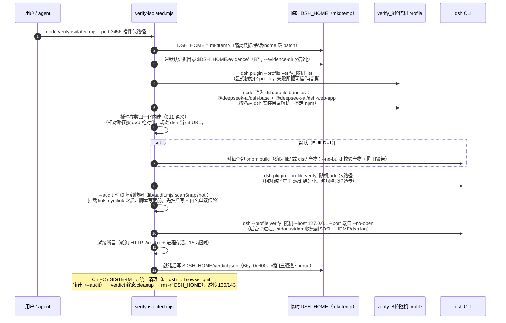

# dsh-verify-isolated 架构与运行机制（图解）

> 包：`@wingsky-1/dsh-verify-isolated` · 源码：`packages/dsh-verify-isolated/` · 版本：0.2.0
> 功能一句话：**DSH 插件开发的隔离环境浏览器验证 skill**——临时 `DSH_HOME` + 独立
> `verify_<随机>` profile 双重隔离，一键拉起隔离 `dsh web`，退出自动清理，
> 不污染正在使用的 `web` profile。
>
> 快速上手（安装 / 使用）见 [包 README](../../packages/dsh-verify-isolated/README.md)；
> 本文讲**原理与运行机制**。

---

## 1. 总体设计：宿主空壳 + skill 载体

本插件**没有宿主逻辑**——`src/index.ts` 只导出 `name` 与**空 `apply()`**（满足门禁），
skill 注册完全由 `cordis.patch.yml` 配置的官方 provider 承担：


- **skill 注册机制**：`cordis.patch.yml` 复用官方 `@deepseek-ai/dsh-skill-filesystem`，
  配置 `bundledSkillDir` 为 `!!js` 表达式——从**安装后的 npm 身份**解析包根再 `join
  ('skills')`（npm 副本 / `link:` 开发态 / 仓库 checkout 三种形态均正确，不以路径拼接
  猜测安装位置）；官方 provider 扫描 `skills/dsh-verify-isolated/SKILL.md`
  （frontmatter `name: dsh-verify-isolated`）并注册，无需自写注册代码；
- **`!!js` 求值环境**：`baseUrl` 是 loader 为 profile 提供的模块解析锚点（patch 注释
  为唯一实证来源）；`createRequire(baseUrl)` 得到以该锚点为根的 require；
- `package.json` `dsh.bundle.patch → ./cordis.patch.yml`；`files` 含 `skills`——
  skill 目录随 npm 包发布。

---

## 2. 一键脚本：四重隔离的流程

`skills/dsh-verify-isolated/scripts/verify-isolated.mjs`（node ≥22 实现，原 bash 版
`verify-isolated.sh` 已随 #517 C8 重写删除，不留 shim；退出码契约
0/1/2/130/143；可选隔离审计 `--audit` 见 §2.1）：



双重隔离的层次（为什么两层都必要）：

| 隔离层 | 做法 | 隔离内容 |
|---|---|---|
| 第一层：临时 `DSH_HOME` | `DSH_HOME=$(mktemp -d)` | 凭据、会话、全部用户数据、home 级 `cordis.patch.yml` |
| 第二层：独立 profile | `verify_<8位随机>`（非 `web`） | 插件组合栈（bundles）、profile 级 patch、插件依赖 |
| 第三层：独立端口 | `--port` 自选/探测空闲端口 | 与主 `dsh web` 及其它验证实例互不冲突 |
| 第四层：独立浏览器实例 | `--browser`（自带 browser-driver.mjs，raw CDP） | 页面/tab/console 完全独立，多会话并行互不可见 |

> **只建独立 profile 不够**——profile 共享 home 级凭据与会话；必须同时把 `DSH_HOME`
> 指向临时目录才与真实环境完全隔绝。验证结束删除临时 DSH_HOME 与 `verify_*` profile。

### 2.1 隔离审计（B4，可选 `--audit`）

判定面 = **预置白名单**（版本化 `WHITELIST_V`，`scripts/lib/audit.mjs` 纯函数：
`scanSnapshot` / `diffAgainstWhitelist` / `checkSymlinkEscape` / `runAudit`）外的
新增/删除/修改（纯 stat 路径级，不读内容；白名单内变化忽略——dsh 重写 settings
是常态；未知顶层路径 → 可疑）：

```text
profiles/**、*.json/*.jsonl/*.log（仅顶层）、browser.state、browser-profile/**（整树白名单 + 跳过深扫）、
evidence/**、audit/**、dsh.log、verdict.json
```

- **symlink 防逃逸**：快照 lstat 不跟随（不读链接目标内容）；`t1` 时**新增的**或
  **目标变化**且 resolve 后在 `$ISOLATED_HOME` 外的 symlink 报「越界 symlink」（防
  插件经 symlink 写回主 checkout）；`t0` 已存在且目标未变的外部 symlink（`link:`
  挂载点，profile node_modules 全 link: 是挂载机制本身）合法不报。防逃逸优先于
  白名单——`profiles/**` 内新增越界 symlink 同样报。
- **时序**：`t0` 基线在挂载（link: symlink 进基线）之后、脚本自身写面
  （browser.state / verdict / evidence 内容 / audit 落盘）之前；审计 diff 插在
  settle「kill dsh → browser quit → **审计** → verdict 终态 → rm」；
  `--keep` 落 `$ISOLATED_HOME/audit/audit.json`，否则并入 verdict JSON（`audit`
  字段，`--json` 的 stdout 终态同样并入）。
- **局限**：只扫 `$ISOLATED_HOME` 子树 + `--audit-extra-dirs <dir>`（可重复，相对
  路径基于 cwd 绝对化，与 DSH_HOME 重叠报参数错误）指定目录，**不扫真实 home**。
- **不阻断退出**：审计是补充非门禁——可疑项只输出「审计: N 项可疑」结论，退出码
  契约 0/1/2/130/143 不变；审计异常仅警告（verdict audit 字段带 error）。

---

## 3. 使用方式

```bash
# 1. 安装（注册为内置 skill）
dsh plugin --profile web add @wingsky-1/dsh-verify-isolated

# 2. skill 加载后，取「Base directory for this skill:」绝对路径为 SKILL_BASE
node "$SKILL_BASE/scripts/verify-isolated.mjs" --port 3456 <插件包路径>
# 多包：--port 3456 <包A> <包B>
# --port 0 随机端口 · --keep 保留临时环境 · --no-build 跳过构建 ·
# --evidence-dir <dir> 证据目录外部化 · --audit 隔离审计（B4，白名单外变化报可疑不阻断）·
# --audit-extra-dirs <dir> 额外审计目录 · --json stdout 只出最终 verdict
```

- **SKILL_BASE 自适应**：跟随 `cordis.patch.yml` 的 bundledSkillDir 解析——npm 副本 /
  `link:` 开发态 / 仓库 checkout 均返回真实 skill 目录（脚本相对它定位）；
- 脚本自包含、从任意 cwd 以绝对路径调用；不确定时先 `ls "$SKILL_BASE/scripts/
  verify-isolated.mjs"` 自证；
- **浏览器验证**（SKILL.md §5/§6）：`--browser` 拉起 skill 自带独立浏览器实例
  （browser-driver.mjs，独立 user-data-dir + 调试端口，多会话并行硬隔离）；核验 UI
  呈现 / Console（挂载失败只应 warn 不应 throw）/ 双主题 / 窄屏（768×1024 pad、
  375×667 phone）；**防 flake**：轮询（`wait --selector`）禁固定 sleep；截图只截
  插件 UI 本身（element screenshot，不带整窗防泄露本机信息），dsh-plugin-hub
  归档至 `packages/dsh-<name>/docs/archive/`；
- **完成检查**：隔离实例已启动且端口不冲突 → UI 渲染正常 → Console 无未处理错误 →
  截图已归档 → 实例已停止、临时 DSH_HOME 与 `verify_*` profile 已清理。

---

## 4. 安全模型

- 隔离环境不携带真实凭据（临时 `DSH_HOME` 无 `~/.dsh` 数据）；
- 不关闭/重启运行中的主 `dsh web` 进程（独立端口）；
- 脚本只用 `mktemp -d` 临时目录，退出即清理，不留残留；
- 硬约束：独立端口（不冲突）、不复制真实凭据（用测试凭据/mock）、`--port 0` 系统随机；
- 可选隔离审计（`--audit`）只扫 `$ISOLATED_HOME` 子树 + `--audit-extra-dirs` 指定
  目录，**不扫真实 home**；快照 lstat 不读文件内容、不跟随 symlink（防逃逸）；审计
  是补充非门禁，可疑项不阻断退出。