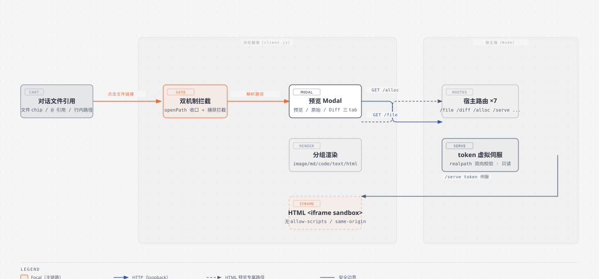
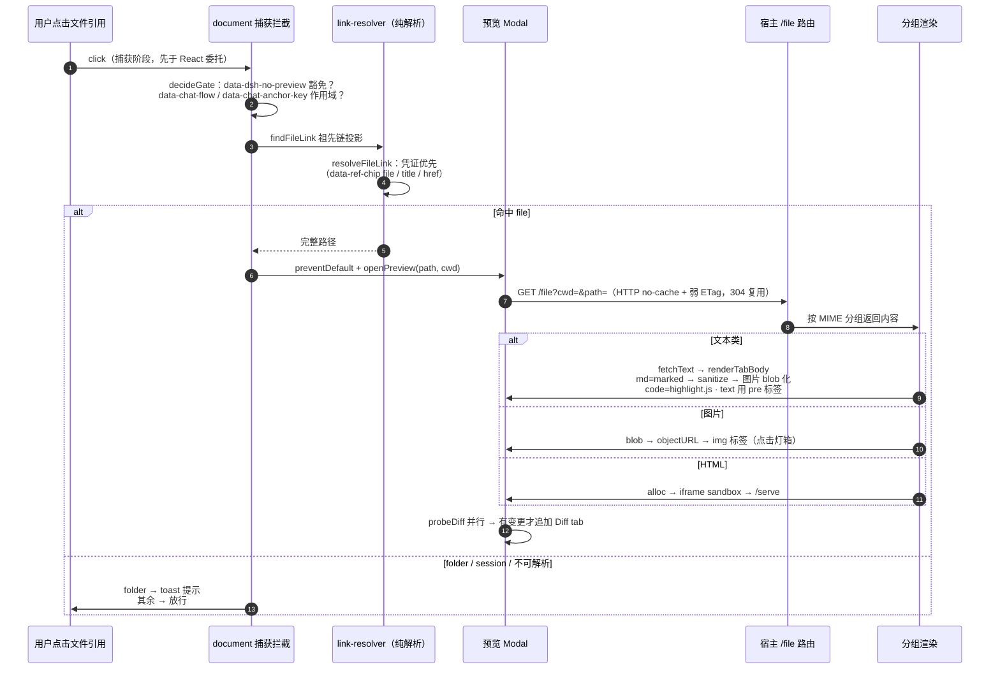

# dsh-web-file-preview 架构与运行机制（图解）

> 包：`@wingsky-1/dsh-web-file-preview` · 源码：`packages/dsh-web-file-preview/` · 版本：0.2.0
> 功能一句话：**点击对话中的文件链接，在 web 端直接预览**——图片 / 文本 /
> Markdown / 代码 / git Diff / HTML（iframe sandbox），纯 Web 部署（局域网浏览器 /
> iPad / iPhone，或 `nativeOpen:false`）也能预览，不再依赖桌面原生打开器。
>
> 快速上手（安装 / 配置 / 验证）见 [包 README](../../packages/dsh-web-file-preview/README.md)；
> 本文讲**原理与运行机制**。

---

## 1. 总体架构：双端分工

> 图源：`docs/architecture/diagrams/web-file-preview-architecture.html`（diagram-design）。

设计要点：

- **宿主端按 MIME 服务文件**：`/file` 按后缀分组（image / md / code / text / html /
  other）直出内容，loopback 围栏 + 弱 ETag 协商缓存；`/diff` 异步 execFile 计算
  `git diff HEAD -- <file>`；
- **客户端负责拦截与渲染**：双机制拦截（`openPath` 调用点收口 + document 捕获阶段
  静态拦截）把点击转到预览 Modal；渲染分组与宿主同源（`src/grouping.ts` 单一事实源，
  双端共用，杜绝漂移）；
- **HTML 预览走 token 虚拟伺服**（issue #73）：`/alloc` 把 HTML 所在目录登记为只读
  root 并返回 128-bit token，`/serve/<token>/<rest>` 按 realpath 双向校验伺服，
  `<iframe sandbox>`（无 allow-scripts / allow-same-origin）渲染——**与 `/file` 的宽松
  语义刻意相反**（serve 严格防护，见 §5）。

---

## 2. 点击链路：拦截 → 解析 → 拉取 → 渲染

- **解析优先级**：元素显式凭证（`data-ref-chip` / `title` / `<a href>`，basename 与文本
  命中一致才采信）永远优先于「文本像路径」的启发式嗅探；凭证命中即返回，绝不只靠猜；
- **作用域圈定**：捕获拦截仅在 `[data-chat-flow]` / `[data-chat-anchor-key]` 对话流子树
  内生效（`SCOPE_SELECTORS`，追加式数组），对话流外放行；任何元素子树标
  `data-dsh-no-preview` 即豁免（跨区域优先，第三方插件逃生门）；
- **@ 引用适配（rc8）**：`data-ref-chip="file"` → `cleanRefChipPath`（去前导 @ 与引号）
  直接打开预览；文件夹引用只 toast（无目录浏览能力）；会话引用显式忽略。

---

## 3. 宿主端路由（全部 loopback 围栏 + GET-only）

| 路由 | 说明 |
|---|---|
| `GET /file?cwd=&path=` | 主预览：**三级定位**（#486：① 绝对 resolve → ② 相对 resolve(cwd) → ③ resolve 失败+带 cwd → basename 在 cwd 内 fdir 唯一搜索）→ 按 **resolved** 真实文件扩展名分组直出；成功响应带 `X-File-Path`（encodeURIComponent(resolved)，200/304 同值、超 8000 字符省略）；404（未命中）/ 400（非文件 / 缺 cwd）/ 413（超 `maxTextBytes`，先于 ETag）/ 415（不可预览后缀）；弱 ETag（`size-mtimeMs`）304 协商 |
| `GET /diff?cwd=&path=` | git diff：`rev-parse` → `status --porcelain`（untracked 判定）→ `git diff --no-ext-diff --no-textconv HEAD`（**--no-textconv 封死 textconv 命令执行面**）；每步 8s 超时、32MB 上限（宿主零改动——客户端 probeDiff 发 resolved 绝对路径，git.ts 天然接受） |
| `GET /health` | 健康检查 |
| `GET /alloc?cwd=&path=` | 仅 html 组：**同三级定位**（#486）→ realpath 目标文件 → root=realpath(dirname) → `store.alloc(root)`（128-bit token；满且无 LRU 可淘汰 → 429）；返回 `{token, rest, path}`（path=真实 resolved 绝对，#486；**不含 root**） |
| `GET /serve/<token>/<rest>` | token 虚拟伺服（prefix 路由）：decodeURIComponent → 拒 NUL/`..`/`.` 段 → join(root) → realpath 双向包含校验 → isFile → ≤`maxAssetBytes` → ETag 304 → 流式直出（html→text/html 其余 mime）；未知/过期 token 统一 404 |
| `GET /release?token=` | 显式释放（幂等 200，无探测面）；未释放由 TTL 30min / LRU 64 兜底 |
| `GET /mermaid` | Mermaid 懒加载 chunk（`lib/client-mermaid.js`，仅首次出现 mermaid 块时动态 import） |

**分组单一事实源**（`src/grouping.ts`）：`image | md | code | text | html | other` 六组，
后缀表双端共用；宿主 `previewKindOf(path)` 映射 Content-Type（image 用 `mime` 库全表、
html→`text/plain` 防顶层脚本通道），客户端 `renderGroupFor` 直接 re-export——任何一端
改表都会因 smoke 契约断言暴露漂移。

---

## 4. 渲染与 Diff

- **三 tab**：md / code / html 组 =「预览」+「原始」；text 组仅「内容」；**Diff tab 动态
  追加**——`probeDiff` 成功有变更才加，探测失败/HTTP 失败加禁用 tab「Diff 不可用」
  （与「确实无 diff」区分）；
- **md 管线**：`marked`（GFM）→ `sanitizePreview`（DOMPurify + 相对引用重写）→
  `applyHeadingIds`（返回栈内锚点跳转）→ 相对图片 blob 化（并发 6）→
  `hydrateMermaid`（懒加载 chunk，失败回退代码块）；
- **code 管线**：highlight.js 25+ 语言子集 → DOMPurify；
- **超大文本降级**（issue #344）：>1MB 码元 → 纯 `<pre>` 截断渲染 + 提示（防主线程
  阻塞），原始 tab / 新标签可看全文；
- **Diff**：`diff2html` line-by-line → DOMPurify；未跟踪新文件给提示；超大 diff 截断；
- **缓存**：无跨会话 JS 内存缓存——HTTP 层 `no-cache` + 弱 ETag + If-None-Match 自动
  协商（未变 304 秒回、已变拿最新）；`rawText` 仅当前预览会话与返回栈快照（≤1MB）内保留；
- **返回栈**：Modal 内 `@` 引用跳转压栈（`MAX_BACK=32` 环形），返回重建（大文本快照
  退化为仅 path，返回时重拉）。**#486**：快照在 openPreview 同步段捕获（closeModal 覆
  盖 state 前），本文件首响应 resolved 落地后才真正入栈——条目 path 恒为宿主回传的
  权威绝对路径，返回直中不再二次搜索；resolved 落地前关闭/切走不压栈。

---

## 5. 安全模型

- **⚠️ 局域网部署高危**：经 `dsh-lan-proxy`（或任何重写 Host/Origin 的代理）对外暴露时，
  loopback 围栏被穿透——局域网内任意设备可直接访问 `/file?path=…` 预览本机白名单内
  文件（含 `~/.dsh/.credentials.yaml` 等）。请在**可信局域网**部署或网络层加会话鉴权；
  本插件语义是「能打开 dsh web 即持有高权限」，不做重复兜底；
- **`/file` 宽松、`/serve` 严格（刻意相反）**：`/file` 不做"逃出 cwd"拦截（访问控制由
  平台/用户负责）；`/serve` 因把目录映射成 web root 而做全套防护——realpath 双向根
  越界校验（闭合符号链接逃逸）、编码攻击面拒绝（percent 解码/NUL/`..`/`\`）、目录 404
  无列表、未知 token 404、只读不落盘、TTL/LRU 三重回收；
- **兜底搜索（#486）**：③ 级 fdir 通用遍历（非 git，任意工作区可用）——**不遵循
  `.gitignore`**（物理存在+唯一即暴露，与 `/file` 任意读模型一致，不新增访问面）；dot
  目录跳过但 dot 文件可命中；不跟符号链接；唯一命中+stat 通过才采信，0/≥2 歧义/触顶
  （20000）/超时（1500ms）→ 404 不猜；「确认不存在」1s 负缓存 + in-flight 合并防
  并发叠堆（同一批失效内嵌图 20 并发实测 325ms→23.6ms）；
- **渲染安全**：文件响应一律 `X-Content-Type-Options: nosniff`；SVG 额外
  `Content-Security-Policy: sandbox`；HTML iframe `sandbox` 空 token 集（无
  allow-scripts / allow-same-origin）、`referrerpolicy="no-referrer"`（防 token 经
  Referer 外泄）；`/file` 对 `.html/.htm` 保持 `text/plain`（顶层导航成同源脚本通道的
  风险面）；
- **Mermaid**：`securityLevel: strict` + `htmlLabels: false` + `startOnLoad: false` +
  `suppressErrorRendering: true`（防失败时向 body 追加错误横幅）；渲染产物 SVG 再经
  DOMPurify svg profile 二次消毒，不开放 securityLevel/主题等配置；
- **外链防护**：Modal/查看器内绝对 http(s) 链接捕获阶段拦下改 `window.open("_blank",
  "noopener")`；git diff 用 `--no-textconv` 封死命令执行面。

---

## 6. 构建契约

- 第三方依赖（marked / highlight.js / diff2html / dompurify / mermaid / mime /
  untildify）全部在 devDependencies，**构建期内联**进 `lib/`——运行时零 npm 依赖；
  license 自动归集 `lib/THIRD-PARTY-LICENSES`（pack-check 断言）；
- `client.js` ≈ 550KB（gzip ~120KB）；**Mermaid 整库独立 chunk**
  `client-mermaid.js` ≈ 3.29MB（gzip ~940KB），仅首次渲染 mermaid 块时下载一次
  （浏览器模块缓存 + 304 后续零成本）；minified 产物的依赖清单存于
  `client-mermaid.deps.json` sidecar（license 归集与 pack 断言唯一证据源）；
- **客户端注入**：`@deepseek-ai/dsh-client-connection`（session 打开走 Remote 网关）。

---

## 7. 已知限制

- 文本类超 `maxTextBytes`（默认 20MB）返回 413 + 截断标记；客户端 >1MB 降级纯 `<pre>`
  （流式/虚拟滚动未实现）；
- HTML 预览：iframe 内 fetch/XHR 被 CORS 阻断（属预期，静态子资源不受影响）；根绝对
  路径引用（`<script src="/assets/app.js">`）不支持；预览长期不交互可能失效（serve
  token idle TTL 30min 兜底）；root 目录被移动/删除后预览失效（只读不落盘语义）；
- 可点击范围较宽（凡路径 title / 本地 href / 内联路径文本都可能进预览）——
  `data-ref-chip` 权威分支优先于通用嗅探，避免 `@` 引用误触发；
- 文件夹 `@` 引用不开预览（仅提示），目录浏览不在本插件范畴；
- 多会话切换以当前活跃会话 cwd 为准。