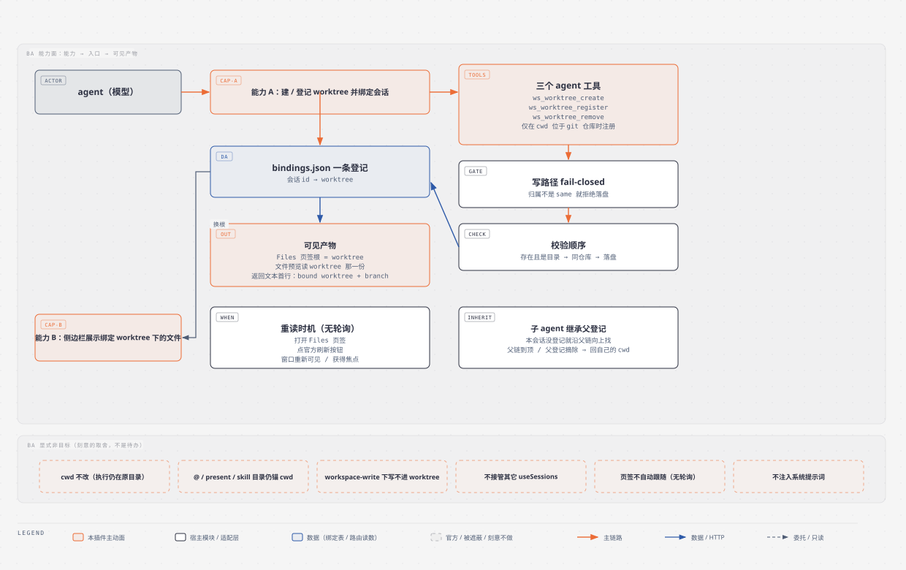
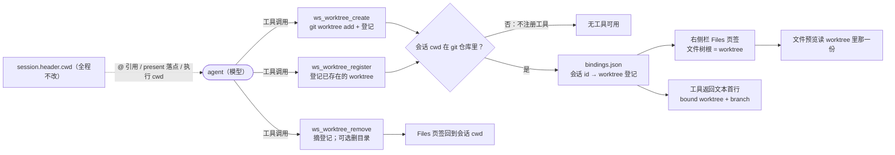
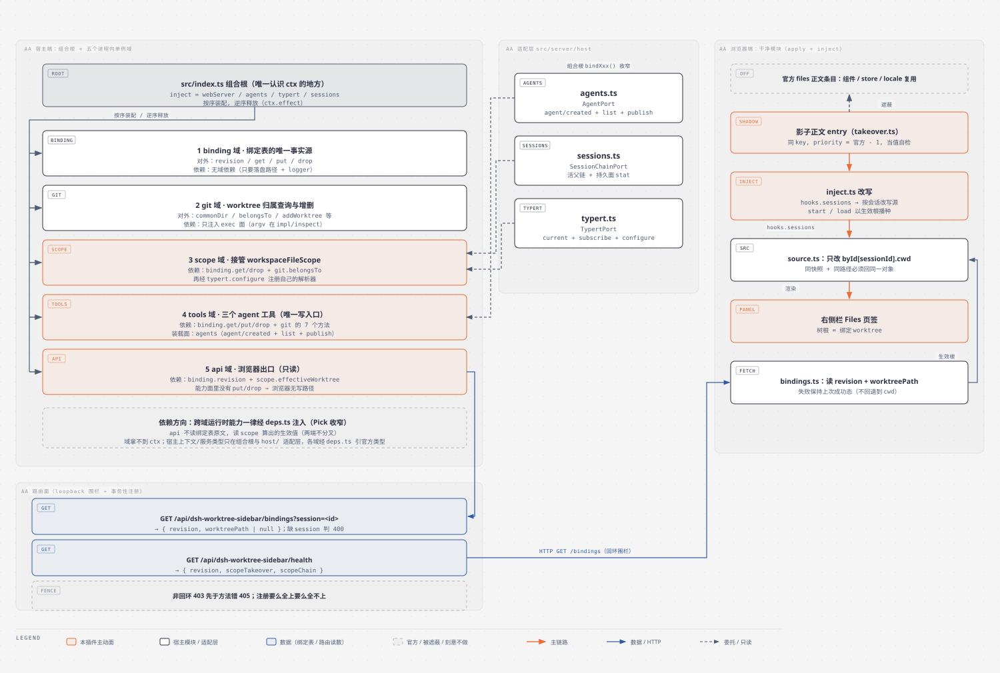
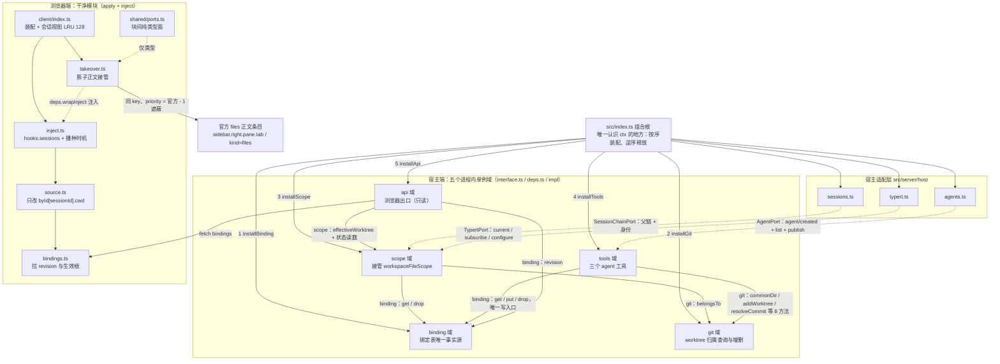
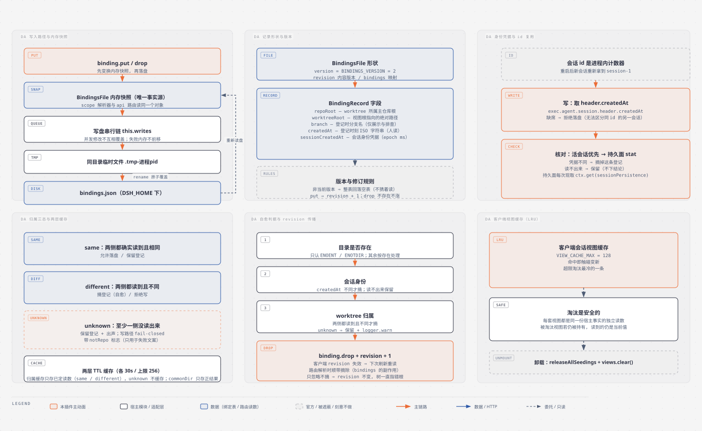
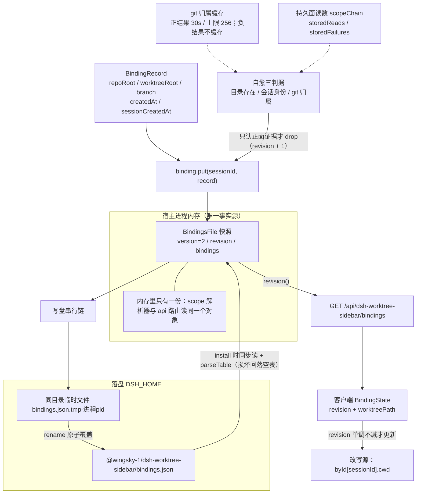
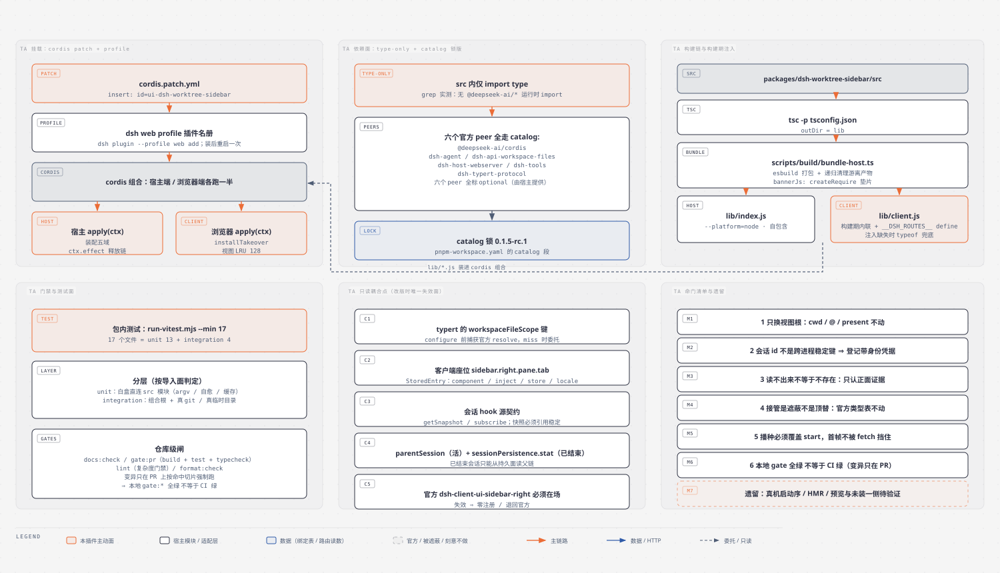
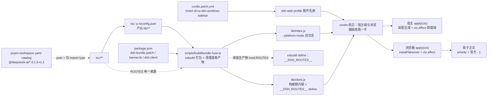

# dsh-worktree-sidebar 架构与运行机制（TOGAF 4A 四视图）

> 包：`@wingsky-1/dsh-worktree-sidebar` · 源码：`packages/dsh-worktree-sidebar/` · 版本：0.1.0（未发布）
> 功能一句话：**把某个 git worktree 登记给当前会话，让该会话官方右侧栏的文件树根指向它，而会话 cwd 不变**。
>
> 快速上手（安装 / 验证 / 兼容性 / 安全模型 / 已知限制）见 [包 README](../../packages/dsh-worktree-sidebar/README.md)；
> 本文按 TOGAF 四视图（业务 BA / 应用 AA / 数据 DA / 技术 TA）讲**原理与运行机制**。
>
> 证据口径：路径省略前缀 `packages/dsh-worktree-sidebar/`，行号取自本分支当前树。
> 凡本文写「未验证」的，都是无法从本仓代码或实跑命令确认的事实；官方包内部的断言以仓库内可读副本为证据。

## 四视图导航

| 视图 | 回答的问题 | 章节 | 本章图（独立 SVG） | 主要证据面 |
|---|---|---|---|---|
| BA 业务架构 | 用户 / agent 能感知到什么能力，刻意不做什么 | [§1](#user-content-1-业务架构ba) | [BA 业务架构图](diagrams/worktree-sidebar-ba.svg) | 三个工具定义、包 README 的显式非目标 |
| AA 应用架构 | 宿主五域与浏览器端怎么分工、依赖谁、在哪接管 | [§2](#user-content-2-应用架构aa) | [AA 应用架构图](diagrams/worktree-sidebar-aa.svg) | 五域 `interface.ts` / `deps.ts`、客户端接管块 |
| DA 数据架构 | 绑定存在哪、长什么样、怎么失效与自愈 | [§3](#user-content-3-数据架构da) | [DA 数据架构图](diagrams/worktree-sidebar-da.svg) | `binding/impl/model`、`store`、自愈判据 |
| TA 技术架构 | 怎么挂载、依赖什么、怎么构建、测试与命门 | [§4](#user-content-4-技术架构ta) | [TA 技术架构图](diagrams/worktree-sidebar-ta.svg) | `cordis.patch.yml`、`package.json`、测试与门禁面 |

> 每节两张图分工固定：**SVG 讲完整载体与证据标注**（源文件 `diagrams/worktree-sidebar-<视图>.html`，
> 自包含内联 SVG，可打开调整后重新导出），**节末 mermaid 讲关系逻辑**（链路、依赖方向、判定分支）。
> 两者不是同一张图的两种画法，改一处不必同步另一处。

---

## 1. 业务架构（BA）



> 图源 `diagrams/worktree-sidebar-ba.html`。上图给完整能力面（含非目标分区与每条论断的证据标注）；
> 本节末的 mermaid 只给「能力 → 入口 → 产物」的关系逻辑。

### 1.1 能力面（两条）

**能力 A：agent 建 / 登记 worktree 时会话绑定。**

- 触发者是 agent（模型）在会话内发起工具调用；工具**只在「该会话 cwd 位于 git 仓库内」时注册**，
  否则一个工具都不给（`src/server/tools/impl/service/index.ts:81` 经 `repoOf`；
  `src/server/tools/impl/bind/index.ts:156-160` 判定）。
- 三个工具的同一次装配：`src/server/tools/impl/service/index.ts:84-88`；名称分别见
  `register/index.ts:19`、`create/index.ts:11`、`remove/index.ts:40`。
- 写入路径的校验顺序是刻意的（先本地事实、后要起 git 的归属判定）：
  路径存在且是目录 → 属于同一仓库 → 落盘（`bind/index.ts:1-9`、`:96-153`；
  路径判定在 `register/index.ts:73-76`、`create/index.ts:76-83`）。
- 失败一律 fail-closed：归属不是 `same` 就拒绝写（`bind/index.ts:114-131`）。

**能力 B：右侧栏展示绑定 worktree 下的文件。**

- 载体是官方 `sidebar.right.pane.tab` 座位上的 `files` 正文，被本插件以**同 key、更低 priority 遮蔽**
  （`src/client/takeover.ts:29-32`、`:41-43`）。
- 重读只发生在三个用户可感知的时机：打开页签 / 点官方刷新 / 窗口重新可见或获得焦点；
  **没有定时轮询**（`src/client/inject.ts:133-156`、`:163-173`、`src/client/index.ts:6-8`）。
- 子 agent 会话**与用户 fork 的会话**都继承父会话的登记：本会话没有登记时沿父链向上找，
  命中的第一条登记连同**持有它的那个会话 id** 一起返回（fork 与子 agent 的判据同为 header
  `parentSession`，本域刻意不区分；`src/server/scope/impl/inherit/index.ts:24-38`）。

### 1.2 能力 → 入口 → 可见产物

| 能力 | 入口（工具） | 宿主侧产物 | 用户 / 模型可见产物 |
|---|---|---|---|
| 建 worktree 并绑定 | `ws_worktree_create`（`create/index.ts:11`） | `git worktree add` + `bindings.json` 一条登记 | Files 页签根 = 新 worktree；返回文本带状态行 |
| 登记已有 worktree | `ws_worktree_register`（`register/index.ts:19`） | 只写 `bindings.json` 一条登记 | 同上 |
| 解除绑定 | `ws_worktree_remove`（`remove/index.ts:40`） | 摘登记；仅 `removeDirectory: true` 才 `git worktree remove` | Files 页签回到会话 cwd（`remove/index.ts:99-117`） |

状态行由统一信封渲染，**永远出现在返回文本首行**，失败路径也说清当前指向哪里
（`src/server/tools/impl/protocol/index.ts:54-62`、`RESULT_SCHEMA` 在 `:27-52`）。
`ws_worktree_create` 的「目录建出来了但绑定失败」是**部分成功**，不会被报成失败
（`create/index.ts:119-131`）。

### 1.3 显式非目标

| 非目标 | 代码 / 文档依据 |
|---|---|
| 不改执行 cwd | 插件从不写 `session.header.cwd`；工具描述明写 cwd 不变（`register/index.ts:21-29`） |
| `@` 引用、`present` 落点、skill 目录仍锚 cwd | 同上；改写只覆盖单个 entry 的 inject 面（`src/client/source.ts:62-75`） |
| `workspace-write` 策略下写不进 worktree | 工具描述 `register/index.ts:27` |
| 不接管其它 `useSessions` 消费方 | 只改这一条 entry 的注入面（`source.ts:62-75`；[包 README](../../packages/dsh-worktree-sidebar/README.md) 的「显式非目标」） |
| 页签不自动跟随 | 无轮询（`src/client/index.ts:6-8`） |
| 不注入系统提示词 | 包 README「已知限制」（文档事实，代码无对应实现） |



---

## 2. 应用架构（AA）



> 图源 `diagrams/worktree-sidebar-aa.html`。上图给完整载体：组合根装配序、五域依赖窄面、
> 三个宿主适配层、浏览器端影子接管与两条路由；本节末的 mermaid 只给依赖方向与接管关系。

### 2.1 宿主端：组合根 + 五域 + 三个适配层

`src/index.ts` 是全包**唯一认识 `ctx` 的地方**（`src/index.ts:1-7`），它把 `ctx` 收窄成 `HostPort` 后
按依赖顺序装配五域（`src/index.ts:58-72`、`:93-148`），并声明宿主服务依赖
`inject = ["webServer", "agents", "typert", "sessions"]`（`src/index.ts:39`）。

| 序 | 域 | 装配调用 | 依赖谁的能力（经 `deps.ts` 声明） | 证据 |
|---|---|---|---|---|
| 1 | binding | `installBinding({ logger, file })` | 无域依赖（只有落盘路径与日志） | `src/index.ts:102`；`src/server/binding/deps.ts:5-9` |
| 2 | git | `installGit({ exec })` | 无域依赖（exec 面由组合根注入） | `src/index.ts:107`；`src/server/git/deps.ts:23-25` |
| 3 | scope | `installScope({ logger, binding, git, typert, sessions })` | `binding: get / drop`、`git: belongsTo` | `src/index.ts:112-118`；`src/server/scope/deps.ts:19`、`:22` |
| 4 | tools | `installTools({ logger, binding, git, scope, agents, now })` | `binding: get / put / drop`、`git: commonDir / addWorktree / resolveCommit 等 8 方法` | `src/index.ts:123-130`；`src/server/tools/deps.ts:12`、`:15-25` |
| 5 | api | `installApi({ register, logger, binding, scope })` | `binding: revision`、`scope: effectiveWorktree + 状态读数` | `src/index.ts:135-140`；`src/server/api/deps.ts:11`、`:20`、`:28` |

三条硬纪律（都由代码与单测守）：

1. **域拿不到 `ctx`**：官方**宿主上下文 / 服务**类型只在组合根与 `src/server/host/` 三个适配层出现
   （`src/index.ts:1-7`；`src/server/host/typert.ts:1-10`）；各域只经自己的 `deps.ts` 引官方**类型**
   （全 type-only，例如 `src/server/tools/deps.ts:2` 引 `@deepseek-ai/dsh-tools`、
   `src/server/api/deps.ts:2` 引 `@deepseek-ai/dsh-host-webserver`），这正是 `verify-dir-imports` 认可的依赖面。
2. **单例 + `install` / `release` 成对，二次装配显式抛错**：五域的守卫分别在
   `binding/impl/service/index.ts:52`、`git/impl/service/index.ts:105`、`scope/impl/service/index.ts:102-103`、
   `tools/impl/service/index.ts:37`、`api/impl/service/index.ts:31`。
3. **装配中途失败要回滚**：已装域按逆序释放后原样抛出（`src/index.ts:142-145`、`:151-160`）；
   api 域的端点注册是事务性的（`src/server/api/impl/route/index.ts:28-68`，`api/impl/service/index.ts:35-42`）。

依赖方向的口径是「谁 `Pick` 了谁的 `interface.ts`」：`scope` 只拿 binding 的 `get/drop`
（`scope/deps.ts:19`）、tools 只拿 `commonDir` 等 8 个 git 方法（`tools/deps.ts:15-25`）、
api **刻意不读绑定表原文**而读 scope 算出的生效值（`api/deps.ts:13-20`），
且 api 的能力面里没有 `put/drop`，因此**浏览器侧不存在写绑定的授权路径**（`tools/deps.ts:12`）。

### 2.2 工具面与写路径不变量

- 三个工具由 tools 域装进**每个 agent 自己的作用域**，并随该 agent 的 effect 一起释放
  （`src/server/host/agents.ts:50-82`）；两条入口缺一不可：`agent/created` 覆盖之后发布的 agent，
  `list()` 覆盖装配前已在跑的 agent（`tools/impl/service/index.ts:1-9`、`:42-43`）。
- 写绑定只有一条路：`bindWorktree`（`tools/impl/bind/index.ts:96-153`），归属校验在其中做**唯一一次**，
  所以「只允许绑定同一仓库的 worktree」不会因某条路径漏写而破。
- 删除是显式的：默认只摘登记，`force` 必须与 `removeDirectory: true` 同时给出
  （`remove/index.ts:91-97`）。

### 2.3 浏览器端：干净模块与官方座位的影子接管

客户端入口只 `export function apply(ctx)` + `export const inject`（`src/client/index.ts:77`、`:133`），
`inject` 面是 `["slots", "sidebarRightTabs", "sessions", "locale"]`（`src/client/index.ts:127-133`）；
块内分工见本页 §2 的图，跨块形状只由纯类型面承载（`src/client/shared/ports.ts:121-128`），
`takeover.ts` 与 `inject.ts` **零互引**（`src/client/takeover.ts:24`）。

影子接管的三条设计事实：

1. **priority = 官方那条 − 1**：`shadowPriorityOf` 取 `(official.options.priority ?? 0) - 1`
   （`takeover.ts:41-43`）。官方座位注册表按 priority 升序排序、**最低者渲染**
   （`node_modules/.pnpm/@deepseek-ai+dsh-client-ui-slots@0.1.5-rc.1_.../lib/index.js:76-77`、`:130`，
   由 `pnpm-workspace.yaml:19` 的 catalog 锁版）。
2. **复用官方一切，只包 `inject`**：组件 / store / locale 原样递回，`inject` 换成包装后的工厂
   （`takeover.ts:137-147`）；类型表从不改写，因此标题与 `guide` 保持官方原样
   （`src/client/shared/ports.ts:79-86`）。
3. **登记成功不等于当值**：`isWinner` 自检当值项必须是带我们 priority 的那条，否则当场退位并出声；
   优先级冲突是终态不重试，瞬时登记失败允许再来一次（`takeover.ts:48`、`:112-116`、`:148-176`、
   `:197-209`）。

改写面只有两处：`hooks.sessions` 指向按会话的改写源（`inject.ts:62-72`），
`start` / `load` 改成「以生效根播种」（`inject.ts:80-157`）。改写源只动
`byId[sessionId].cwd` 一个字段，且同快照 + 同路径必须回同一对象（`source.ts:33-45`、`:62-75`）。
每个会话一套视图，上限 128，淘汰最冷的那条（`src/client/index.ts:70-102`）。

### 2.4 HTTP 路由面

路由常量与响应形状是双端共享契约的**单点定义**（`src/shared/contract.ts:12-28`）：

| 路由 | 方法 | 成功响应 | 失败 | 证据 |
|---|---|---|---|---|
| `/api/dsh-worktree-sidebar/bindings?session=<id>` | GET | `{ revision, worktreePath \| null }` | 缺 `session` 400；非回环 403；方法错 405 | `api/impl/handlers/index.ts:24-42` |
| `/api/dsh-worktree-sidebar/health` | GET | `{ ok, revision, scopeTakeover, scopeChain }` | 同上 | `api/impl/handlers/index.ts:44-67` |

- 围栏用仓库共享层那一份（`shared/host-utils.js:26-36`），**非回环 403 先于方法错 405**
  （`api/impl/route/index.ts:41`）。
- `bindings` **不回 `repoRoot`**：客户端只需要目录根，多回一个字段就多一份暴露面
  （`handlers/index.ts:1-8`、`src/shared/contract.ts:23-28`）。
- 端点带**自愈副作用**：解析生效根时会顺带摘除已确认失效的登记（见 §3.5），这是让客户端
  `revision` 缓存失效的唯一通道（`handlers/index.ts:36`；`scope/impl/own/index.ts:1-16`）。
- 端点异常统一收口成日志 + 500，且只在响应头未发出时补写（`api/impl/route/index.ts:70-78`）。



---

## 3. 数据架构（DA）



> 图源 `diagrams/worktree-sidebar-da.html`。上图给完整载体：写入链、记录形状、身份凭据三步、
> 归属三态与两层缓存、自愈三判据与 revision、视图 LRU；本节末的 mermaid 只给生命周期逻辑。

### 3.1 落盘位置与写入协议

- 唯一落盘物是绑定表：`<DSH_HOME>/@wingsky-1/dsh-worktree-sidebar/bindings.json`
  （`src/server/shared/paths.ts:9-17`）。路径只认 `DSH_HOME` 一个变量，经
  `shared/dsh-home.js` 归一（空白视同未设置，回落 `~/.dsh`；`shared/dsh-home.js:49-52`）。
- 写是**原子写**：补齐父目录 → 写同目录临时文件 `<file>.tmp-<进程 pid>` → `rename` 覆盖
  （`src/server/shared/file-io.ts:28-40`）。失败用返回值表达，不抛异常（`:13-17`）。
- 读在装配期同步完成（`readTextFileSync`，`file-io.ts:19-26`），
  文件缺失 / 不可读 / 是目录一律归为同一类，回落空表（`file-io.ts:13-14`、`binding/impl/store/index.ts:7-12`）。
- **内存快照是唯一事实源**，落盘只是它的持久化副本：scope 的解析器与 api 的路由读同一个对象，
  两端 `revision` 因此不可能各说各话（`binding/impl/service/index.ts:1-10`、`:79-98`）。
- 写盘串行链保证两次并发修改不会互相覆盖；失败时**内存不前移**（`service/index.ts:38-42`、
  `:107-121`）。`release` 会等在飞的写盘落定，并用装配代数避免抹掉新一代刚读回的表
  （`service/index.ts:43-48`、`:60-77`）。

### 3.2 记录字段与版本

`binding/impl/model/type.ts:18-40` 定义了记录与整表形状：

| 字段 | 类型 | 语义 | 证据 |
|---|---|---|---|
| `version` | number | 表版本；当前 `BINDINGS_VERSION = 2` | `type.ts:16`、`:36-40` |
| `revision` | number | **内容版本**而非写入次数，空表从 0 起；客户端只做相等/单调比较 | `impl/model/index.ts:10-13` |
| `bindings` | Record<sessionId, BindingRecord> | 会话 id → 登记 | `type.ts:39` |
| `repoRoot` | string | worktree 所属主仓库根，用于归属校验 | `type.ts:20-21` |
| `worktreeRoot` | string | 视图根要指向的 worktree 绝对路径 | `type.ts:22-23` |
| `branch` | string | 登记时分支名，仅展示与排查 | `type.ts:24-25` |
| `createdAt` | string | 登记时刻 ISO 时间戳（人读） | `type.ts:26-27` |
| `sessionCreatedAt` | number | 会话身份凭据（epoch 毫秒），见 §3.3 | `type.ts:28-32` |

版本与修订规则：

- `version` 不等于 2 一律**整表回落空表**，不做部分恢复、不猜着读（`impl/model/index.ts:33-47`）；
  v1→v2 无迁移路径，因为本包尚未发布、磁盘上不存在合法 v1（`type.ts:9-15`）。
- 单条记录任一字段不合格就丢弃该条：半条记录比没有记录更危险（`impl/model/index.ts:15-31`）。
- `put` 让 `revision + 1`；`drop` 目标不存在时原样返回（不涨 revision），
  否则「清理一个本来就没有的会话」会让全网客户端白刷一次（`impl/model/index.ts:67-86`）。
- 序列化带缩进，让人能直接看这份文件（`impl/model/index.ts:62-65`）。

### 3.3 会话身份凭据与 id 复用风险

官方会话 id 由**实例计数器**生成（`session-${++this.counter}`），重启后新会话会重新拿到 `session-1`；
插件侧同一条事实写在 `src/server/scope/deps.ts:78-86` 与 `src/server/host/sessions.ts:16-23`。
本机官方包可读到计数器与恢复分支的源码位置（`@deepseek-ai/dsh-session/lib/index.js:1313`、`:1377`
与 `:1385` 的 `Session.fromRestore`），这是**安装树上的外部证据、不在 CI 内**，故「真机会发生碰撞」
属推断而非本文验证结论。

因此登记里存了会话 header 的 `createdAt` 作凭据，三步闭环：

1. **写**：工具从执行上下文取 `exec.agent.session.header.createdAt`；
   拿不到就**拒绝落盘**，并给出「无法与复用同 id 的另一个会话区分」的原因
   （`src/server/tools/impl/session/index.ts:8-33`；`tools/impl/bind/index.ts:104-113`）。
2. **核对**：活会话优先，不在册才回落持久面（`sessionPersistence.stat`）；
   凭据不同 ⇒ 摘掉这条登记；读不出来 ⇒ 保留（`scope/impl/own/index.ts:68-81`、`:97-112`；
   host 适配层 `src/server/host/sessions.ts:68-78`）。
3. **持久面每次现取**：`ctx.get("sessionPersistence")` 在调用当刻取，
   提前取一次会让晚挂的后端永久退化成缺席（`src/index.ts:74-81`）。

### 3.4 git 归属三态与缓存策略

`belongsTo` 回**三态而不是布尔**（`src/server/git/deps.ts:38-58`；实现 `git/impl/service/index.ts:160-183`）：

| 读数 | 条件 | 调用方处置 |
|---|---|---|
| `same` | 两侧都**确实**给出了公共 git 目录且相同 | 允许落盘 / 保留登记 |
| `different` | 两侧都给出了公共 git 目录且不同 | 摘登记（自愈）/ 拒绝写 |
| `unknown` | 至少一侧没读出来（spawn 失败 / 权限 / 超时） | 保留登记 + 出声；写路径 fail-closed |

`unknown` 还带一个 `notRepo` 标志：至少一侧**明确**回了「不是 git 工作树」，
它只用来把失败文案说准，不参与摘除判定（`git/deps.ts:49-57`）。
限定一条：权限不可读的目录在读数上与「不是工作树」同形，所以那句文案读作
「git 拒绝把它当工作树」，而不是「我们已经验过了」（`tools/impl/bind/index.ts:116-119`）。

缓存策略（`git/impl/service/index.ts`）：

| 缓存 | 键 | 缓存什么 | TTL | 上限 | 证据 |
|---|---|---|---|---|---|
| 归属判定 `belongsTo` | `dir + NUL + repoRoot` | **只缓存已定读数**（`same` / `different`）；`unknown` 不缓存 | 30s | 256，超限整表丢弃 | `:43`、`:46`、`:160-183` |
| 仓库判定 `commonDir` | `dir` | **只存「拿到了公共 git 目录」**；负结果每次真问 git | 30s | 256 | `:59`、`:62`、`:100-101`、`:126-137` |

- `unknown` 不进缓存的理由：写路径对它是 fail-closed，且文案让调用方「等目录可读后重试」；
  把那次 `unknown` 记住，就等于把这句重试建议变成 30s 内的确定性失败
  （`service/index.ts:39-41`、`:176-178`）。
- 负结果不缓存的理由（`commonDir`）：`git init` 可能就发生在下一次调用之前；「读不出来」本就该重试
  （`service/index.ts:56-57`、`:123-125`）。
- TTL 刻意与任何客户端刷新节拍无关：早先同值 5s 导致每轮轮询都踩在过期点上，
  一个绑定会话每小时白起约 1500 个 git 子进程（`service/index.ts:29-42`）。
- 归属判定间接吃 `commonDir` 的缓存，故**只有已定读数**的最坏不新鲜期是 60s（两层 TTL 同值叠加）；
  `unknown` 不受这条叠加影响，它每次都真问（`service/index.ts:36-38`）。
- 公共目录返回值是相对路径时要按入口目录 `resolve` 补全，否则「同一仓库的两个 worktree」会被判成不同仓库
  （`service/index.ts:149-151`）。

### 3.5 作用域内清理（自愈）与 revision 传播

失效判据要求**硬证据**才允许摘除（`scope/impl/own/index.ts:1-16`、`:56-94`）：

| 判据 | 摘除条件 | 读不出来时 | 证据 |
|---|---|---|---|
| 目录是否存在 | `stat` 说 ENOENT / ENOTDIR | 按存在处理（EACCES / EIO 不等于不存在） | `own/index.ts:37-48` |
| 会话身份 | 登记 `sessionCreatedAt` 与当前会话 `createdAt` 不同 | 保留登记（不下结论） | `:68-81`、`:97-112` |
| worktree 归属 | 两侧**都确实**读到公共 git 目录且不同 | 保留登记 + `logger.warn` | `:82-92` |

摘除动作是 `binding.drop` + `logger.warn`；drop 本身可能失败或抛错，两条路都出声但都不上抛
（`own/index.ts:114-127`）。摘掉而不是仅仅忽略，是因为客户端以 `revision` 判定缓存有效性：
**只忽略不摘的话 revision 不变，树会一直指着已经不成立的根**（`own/index.ts:1-16`；
`api/impl/handlers/index.ts:24-42` 的解析路径带这条副作用）。

静默降级只有一处，且给了落地读数：已结束会话的父链只能从持久面读，读不出来时按「到顶」收口，
于是继承悄悄退回 live-only（`scope/impl/inherit/index.ts:47-56`）。
`health` 的 `scopeChain` 就是它唯一能落地的痕迹（`scope/impl/service/index.ts:67-74`、`:168-178`；
`api/impl/handlers/index.ts:54-67`）。

工具面读的是**同一份解析**，但**不设 takeover 门**：`worktreeOrigin` 在 waiting / abandoned 期照旧
给出登记（那是宿主启动序与第三方占位的读数，不是绑定事实的一部分），因此这一态的「工具说已绑定、
侧边栏仍按 cwd」是**刻意**的，由 `/health` 的 `scopeTakeover` 分辨
（`scope/impl/service/index.ts:193-200`、`scope/interface.ts:31-40`）。

### 3.6 视图缓存（LRU）

客户端每个会话一套视图（改写源 + 生效根读数），同一 id 恒回同一对象；上限
`VIEW_CACHE_MAX = 128`，命中即「触碰变新」，超限淘汰最冷的那条
（`src/client/index.ts:70-102`）。淘汰是安全的：每套视图都是同一份宿主事实的独立读数，
被淘汰的视图若仍被渲染层持有，它读到的仍是宿主当前值（`index.ts:70-74`）。
卸载时 `releaseAllSeedings()` + `views.clear()` 统一收口（`index.ts:112-120`）。



---

## 4. 技术架构（TA）



> 图源 `diagrams/worktree-sidebar-ta.html`。上图给完整载体：patch + profile 挂载、type-only 依赖面、
> 构建链与注入、门禁/测试面、耦合点与命门；本节末的 mermaid 只给装配与构建链路逻辑。

### 4.1 挂载方式：cordis patch + profile

插件**不修改 DSH 源码**，经 `cordis.patch.yml` 的一行 `insert` 挂进 `dsh web` profile 名册
（`cordis.patch.yml:7-9`）；安装动作是 `dsh plugin --profile web add @wingsky-1/dsh-worktree-sidebar`
（[包 README](../../packages/dsh-worktree-sidebar/README.md) 的「安装」），bundle 层只在启动时组合，
改完需重启一次 `dsh web`。

- 宿主端入口 `exports["."]` → `lib/index.js`（`package.json:13-17`），在 Node 进程跑 `apply(ctx)`；
- 浏览器端入口 `exports["./client"]` → `lib/client.js`（`package.json:18-21`），
  在浏览器跑 `apply(ctx)`，并声明 `dsh.client.platform = "web"` 与
  `dsh.client.inject = ["@deepseek-ai/dsh-client-ui-sidebar-right"]`（`package.json:29-34`）；
- 宿主 `apply` 装配五域后用 `ctx.effect` 注册卸载链（`src/index.ts:58-72`）；
- 组合层配置只有一个总开关：`WorktreeSidebarConfig.enabled === false` 时一律不接管、不注册工具、不挂路由
  （`src/index.ts:41-45`、`:98`）。

### 4.2 依赖面：全 type-only + catalog 锁版

- `src/` 内**没有任何** `@deepseek-ai/*` 的运行时 import（实测见 §5 复现命令 exit 1 = 无匹配）；
  官方类型一律 `import type`：**宿主上下文 / 服务**类型只在组合根与三个宿主适配层
  （`src/index.ts:8-10`、`src/server/host/typert.ts:11-13`、`src/server/host/sessions.ts:13-14`、
  `src/server/host/agents.ts:7`），各域只在 `deps.ts` 与工具实现里引官方**工具 / 路由类型**
  （`src/server/tools/deps.ts:2`、`src/server/tools/impl/service/index.ts:11`、
  `src/server/tools/impl/protocol/index.ts:10`、`src/server/api/deps.ts:2`）。
- 六个官方 peer 全走 `catalog:`（`package.json:52-59`），catalog 锁
  `0.1.5-rc.1`（`pnpm-workspace.yaml:16-29`）；六个 peer 全标 `optional: true`
  （`package.json:60-79`），实际提供方是宿主。
- `@deepseek-ai/dsh-session` 只在 devDependencies（纯类型需求，`package.json:48`）。
- 客户端第三方库走构建期内联，发布物自包含、运行时零 npm 依赖
  （`docs/architecture/README.md` 的「通用机制」表「发布物自包含」行）。

### 4.3 构建链与构建期环境注入

`pnpm --filter @wingsky-1/dsh-worktree-sidebar build` 的顺序是
清理 → `tsc` → `bundle-host`（`package.json:8`）：

1. `tsc -p tsconfig.json` 产出 `lib/**`（`outDir: lib`，`packages/dsh-worktree-sidebar/tsconfig.json:4`）；
2. `scripts/build/bundle-host.ts` 用 esbuild 把宿主端打成自包含的 `lib/index.js`（`--platform=node`），
   并按 `dsh.bundle.bannerJs` 注入 `createRequire` 垫片（`package.json:25-28`；
   `scripts/build/bundle-host.ts:81-95`）；
3. 检测到 `src/client/index.ts` 时走共享预设 `buildClient` 产出 `lib/client.js`，随后递归清理游离产物
   （`scripts/build/bundle-host.ts:110-160`、`:213-216`）；
4. **`ROUTES` 构建期注入**：bundle-host 从宿主产物读 `mod.ROUTES`，经 esbuild `define` 注入
   `__DSH_ROUTES__`，两端路由因此构建期强一致（`scripts/build/bundle-host.ts:132-150`；
   宿主侧导出点 `src/index.ts:26-27`）；
5. 客户端对注入缺失做 `typeof` 守卫并回落 `src/shared/contract.ts` 的常量——
   `declare const` 只活在类型层，非 bundle 环境（源码直引、单测）里裸引用会当场 ReferenceError
   （`src/client/index.ts:26-35`）。

### 4.4 门禁与测试面

- 包内测试脚本 `node ../../scripts/test/run-vitest.mjs --min 17`（`package.json:9`），
  对应 `test/` 下 **17 个测试文件**（`test/unit` 13 个 + `test/integration` 4 个，实测见 §5）。
- 分层口径与 [ARCHITECTURE-METHOD.md](../ARCHITECTURE-METHOD.md#user-content-8-测试三层与导入面矩阵) 一致：
  单元测试白盒直连 `src` 模块（如 `test/unit/git-inspect.test.ts:22` 逐字断言 argv、
  `test/unit/scope.test.ts:221` 打自愈与解析），集成测试经组合根与真 git / 真临时目录
  （`test/integration/apply-lifecycle.test.ts:209`、`git-real.test.ts:31`、`tools-real.test.ts:86`、
  `binding-store.test.ts:46`）。
- 仓库级闸：本包改文档走 `pnpm docs:check`，改源码走 `pnpm gate:pr`（含全仓 build / test / typecheck、
  `lint` 复杂度门禁与 `format:check`），详见 [AGENTS.md](../../AGENTS.md) 的门禁分层表。
- **本地 `gate:*` 全绿不等于 CI 绿**：变异只在 PR 上按命中切片强制跑
  （[AGENTS.md](../../AGENTS.md):86-89）。
- 四条**界面语义**进不了任何自动门禁（`gate:*` 里没有浏览器），只能靠隔离真机验证；
  其中 2 条已实测（见下），其余见 §4.7。
- **隔离环境真机读数**（临时 `DSH_HOME` + 独立 profile + 独立端口 + 独立浏览器，走官方 verify-isolated 一键脚本）：
  1. 隔离实例装上并加载本插件：构建 exit 0；`curl /api/dsh-worktree-sidebar/health` →
     `HTTP 200 {"ok":true,"revision":0,"scopeTakeover":"live"}`；`dsh.log` 无报错行。
  2. 预置绑定后 Files 页签根 = worktree 目录并列出其文件（会话 cwd 是另一个目录，前后对照成立）——
     界面语义「打开 / 刷新页签后列 worktree 内容」首次真机证据。
  3. worktree 落在主仓库之外、且也在 `/mnt/ssd/worktree` 之外时同样展示（「任意路径」的真机证据）。
  4. `sessionCreatedAt` 与会话不一致 → 端点 `revision 1→2`、`bindings.json` 落盘为
     `{"version":2,"revision":2,"bindings":{}}`、`worktreePath:null`、UI 回落 cwd（自愈首次真机闭环）。

  证据归档：[819-isolated-bound-worktree-tree.png](../../packages/dsh-worktree-sidebar/docs/archive/819-isolated-bound-worktree-tree.png)（判据 2）、
  [819-isolated-identity-mismatch-fallback.png](../../packages/dsh-worktree-sidebar/docs/archive/819-isolated-identity-mismatch-fallback.png)（判据 4）、
  [819-isolated-verify-report.md](../../packages/dsh-worktree-sidebar/docs/archive/819-isolated-verify-report.md)（完整报告：结论表 / 临时目录与端口 / 覆盖缺口）。

### 4.5 兼容性耦合点（改版时唯一会失效的地方）

| 耦合点 | 读取方式 | 证据 |
|---|---|---|
| 宿主 `typert` 的 `workspaceFileScope` 键 | `lookups.get/configure/subscribe`；`configure` 前捕获官方 `resolve`，miss 时委托它 | `src/server/host/typert.ts:25-53`；`scope/impl/service/index.ts:202-240` |
| 客户端键控座位 `sidebar.right.pane.tab` 与 `StoredEntry` 形状 | `slots.entries / entriesOfSlot / register / subscribe / onEntryError`，复用 `component/inject/store/locale` | `src/client/shared/ports.ts:19-77`；`takeover.ts:133-178` |
| 会话 hook 源契约 `{ getSnapshot(), subscribe(fn) }` 且引用稳定 | `hooks.sessions` 改写源；`getSnapshot` 同快照 + 同路径回同对象 | `ports.ts:88-92`；`source.ts:33-45` |
| 会话 header 的 `parentSession`（活）与 `sessionPersistence.stat`（已结束） | 两个来源都要；持久面可选，缺席时退 live-only | `src/server/host/sessions.ts:20-33`、`:47-78` |
| 官方客户端包 `@deepseek-ai/dsh-client-ui-sidebar-right` 必须在场 | 不在时整体不激活（抓不到官方 `files` 类型 id 就零注册） | `package.json:29-34`；`src/client/index.ts:127-133`；`takeover.ts:186-195` |

任一点失效时的行为统一是**零注册 / 退回官方**：可感知地什么都不做，好过静默显示错的地方
（`src/client/index.ts:121-124`；`takeover.ts:152-171`）。

### 4.6 命门清单（本页最该记住的七条）

1. 只换**视图根**：cwd 与 `@` / `present` 语义一律不动（`source.ts:62-75`；`register/index.ts:21-29`）。
2. 会话 id **不是**跨进程稳定键（进程内计数器），所以登记必须带身份凭据（`scope/deps.ts:78-86`；
   `binding/impl/model/type.ts:28-32`）。
3. 「读不出来」永远不等于「不存在」：三条摘除判据都只认正面证据（`own/index.ts:37-48`、`:82-92`、`:97-112`）。
4. 接管是**遮蔽**而不是顶替：类型表不动，官方条目留在原始账上（`takeover.ts:16-22`、`:101-110`）。
5. 播种时机必须覆盖 `start`，且首帧不能被一次无超时的 fetch 挡住（`inject.ts:133-147`）。
6. 本地 `gate:*` 全绿不等于 CI 绿：变异只在 PR 上按切片强制跑（[AGENTS.md](../../AGENTS.md):86-89）。
7. **`<path>` 之后的位置参数仍会被 git 重新解析成选项**：`--` 与 `--end-of-options` 都只保护紧邻的位置参数，
   实测起点传 `-f` / `--force` 会 rc=0 却把起点**静默忽略成 HEAD**（报成功、建错基线）。所以起点必须先做
   形态 guard（`-` 开头直接拒），再用 `git rev-parse --verify --quiet "<base>^{commit}"` 归一化成 SHA 才进 argv
   （`git/impl/inspect/index.ts` 的 `addWorktreeArgs` 注释；`tools/impl/create/index.ts` 的 guard 与归一化）。

### 4.7 遗留风险与未验证项

- **真机启动序**：本次隔离实测观测到 `scopeTakeover: "live"`（provider 已注册、接管成功，见 §4.4）；
  仍缺**等待态与让位态**（`waiting` / `abandoned`）的真机观察（`scope/impl/service/index.ts:202-240`）。
- **重启后 id 复用**：判据已补到「真文件 + 真组合根」（`apply-lifecycle.test.ts`），
  本次真机又补上了「凭据不一致 ⇒ 摘登记 + 落盘 revision + UI 回落 cwd」的完整闭环（§4.4 判据 4）；
  仍缺的是**跨进程重启**（新进程的 `session-1` 读到上一进程留下的登记）那一次观察。
- **dev HMR 重注册**只有单元级判据（官方组件换对象后重捕 + 当值复检），dev server 真机那一次**未验证**
  （`takeover.ts:180-219`）。
- **界面语义部分已实测**：判据「打开 / 刷新页签后列 worktree 内容」与「未登记一侧行为一致」已实测；
  **仍缺**：文件预览内容、继承（fork / 子 agent）的真机观察、未安装本插件一侧、双主题 / 窄屏几何
  （覆盖缺口清单见 [819-isolated-verify-report.md](../../packages/dsh-worktree-sidebar/docs/archive/819-isolated-verify-report.md)）。
- **两条实测操作约束**（都会让验证静默失败）：
  1. `patchReload: live` **不会重装本插件**（改 `cordis.patch.yml` 后 `revision` 仍为 0）
     ⇒ 绑定必须在 `dsh web` 启动前落盘。可行路径：先起一次实例取会话 id + `createdAt`
     （会话身份跨重启稳定）→ 写 `$DSH_HOME/@wingsky-1/dsh-worktree-sidebar/bindings.json` →
     用同一个 `DSH_HOME` 重启。
  2. 一键脚本 `--keep` 场景下 SIGTERM **不带走 dsh 子进程**，会占住端口使下次启动静默失败；
     隔离验证必须显式确认端口已释放。
- 插件 `logger.warn` 在无 exporter 的组合里**不落盘**，现场痕迹只有 `/health` 的
  `scopeTakeover` / `scopeChain` 两个读数（`api/impl/handlers/index.ts:44-53`）。
- 归属 `unknown` 时保留登记是**故意的取舍**：代价是「目录还在但已不是工作树」时文件树报错，
  可感知而非静默（`own/index.ts:82-92`）。
- 官方 `dsh-client-ui-slots` 的「最低者渲染」已被真机间接验证（判据 2 的树换根只有在影子条目当值时才会发生）；
  其源码行号证据仍以仓库内 catalog 锁版副本为准（§2.3）。



---

## 5. 图源与延伸阅读

- 图源归档（每视图一张，源 HTML 自包含内联 SVG；导出件由
  `python3 scripts/lib/export-diagram-svg.py <源.html>` 生成，四张共用一套配色 / 字体 / 图例）：
  - BA：`docs/architecture/diagrams/worktree-sidebar-ba.html` → `worktree-sidebar-ba.svg`
  - AA：`docs/architecture/diagrams/worktree-sidebar-aa.html` → `worktree-sidebar-aa.svg`
  - DA：`docs/architecture/diagrams/worktree-sidebar-da.html` → `worktree-sidebar-da.svg`
  - TA：`docs/architecture/diagrams/worktree-sidebar-ta.html` → `worktree-sidebar-ta.svg`
- 包 README（安装 / 验证 / 安全模型 / 已知限制）：`packages/dsh-worktree-sidebar/README.md`。
- 结构方法论（六载体、暴露面与耦合收敛、依赖事实图 × 意图图、测试三层）：
  [ARCHITECTURE-METHOD.md](../ARCHITECTURE-METHOD.md)。
- 提案长文（各轮读数与遗留判据）：`docs/proposals/worktree-sidebar.md`。
- 本文用到的复现命令（均实跑，exit code 见交付说明）：

```sh
# 1. 确认 src 内没有 @deepseek-ai/* 的运行时 import（无输出 = 仅 type-only）
grep -rn 'from "@deepseek-ai' packages/dsh-worktree-sidebar/src | grep -v "import type"

# 2. 确认官方座位注册表的 priority 语义（最低者渲染、默认 0）
grep -n "lowest renders" \
  node_modules/.pnpm/@deepseek-ai+dsh-client-ui-slots@0.1.5-rc.1_*/node_modules/@deepseek-ai/dsh-client-ui-slots/lib/index.js

# 3. 确认测试文件数（应等于 package.json 的 --min 17）
ls packages/dsh-worktree-sidebar/test/unit/*.ts packages/dsh-worktree-sidebar/test/integration/*.ts | wc -l

# 4. 文档与格式门禁
pnpm docs:check
pnpm exec prettier --check docs/architecture/ packages/dsh-worktree-sidebar/README.md README.md
```
