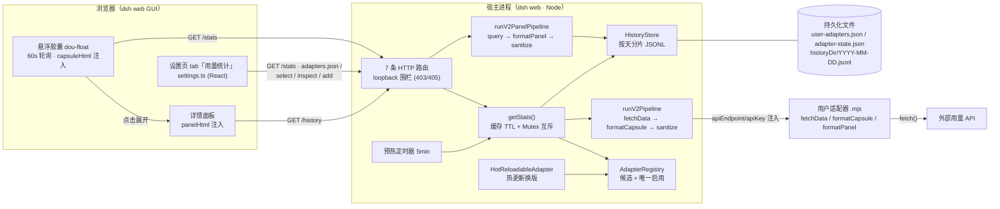
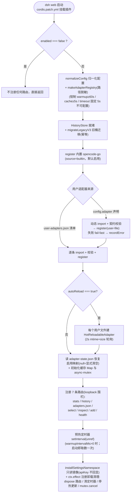
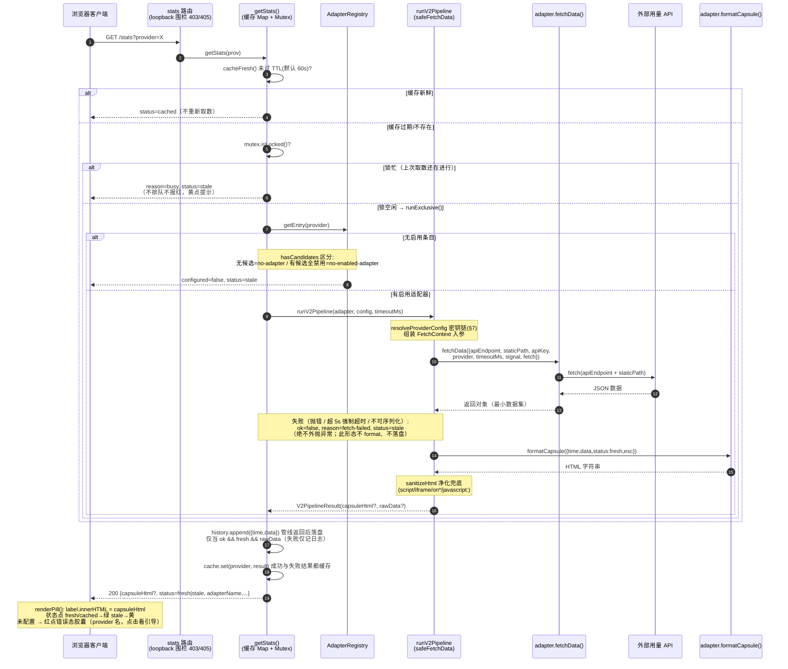
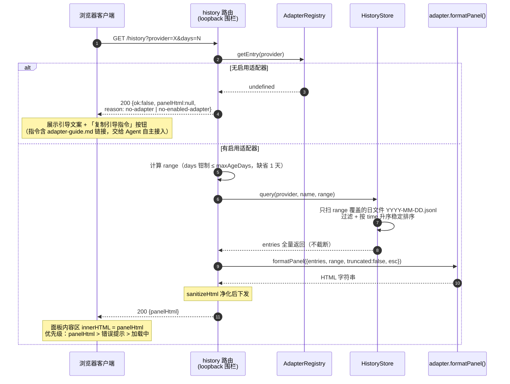
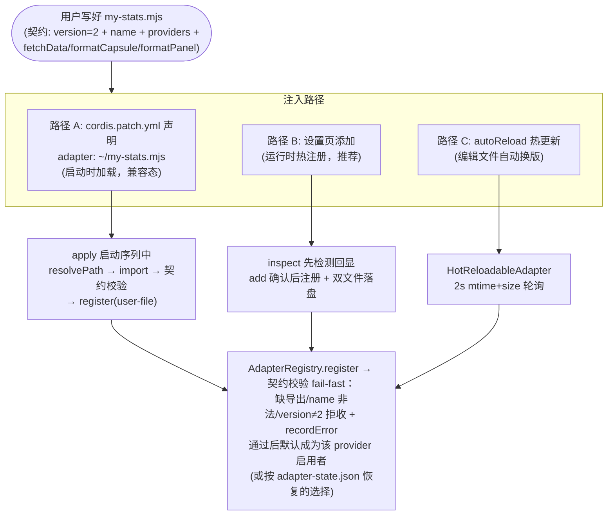
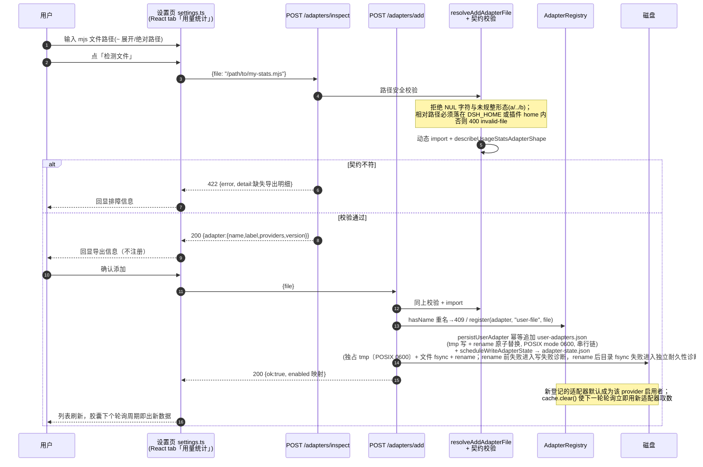
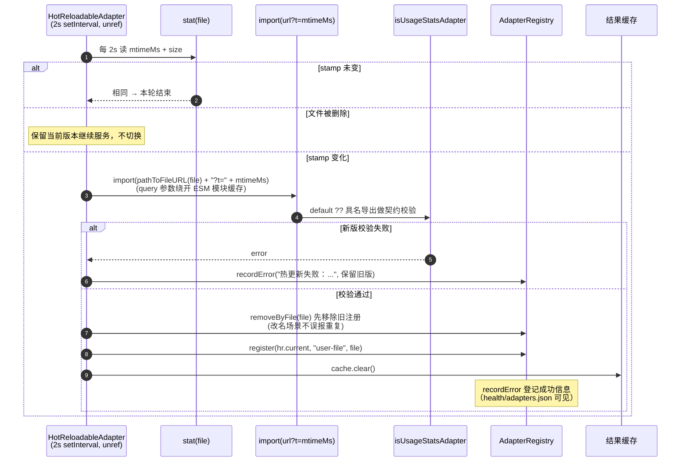
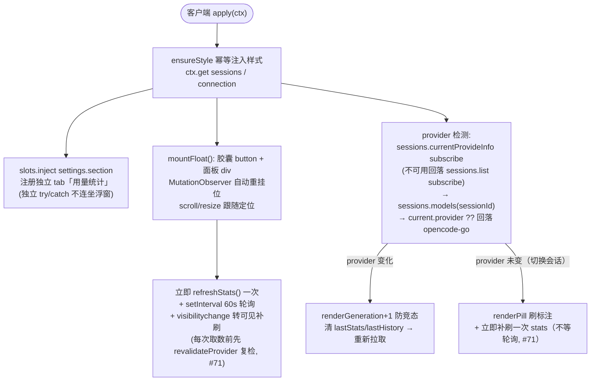
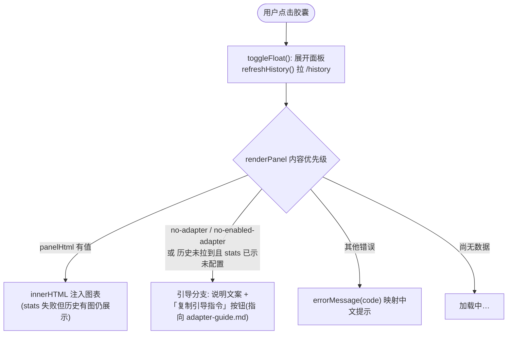
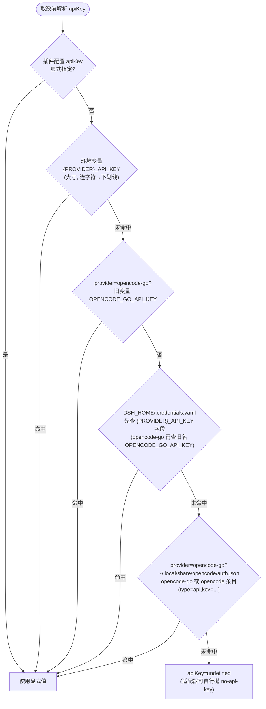

# dsh-provider-usage 架构与运行机制（图解）

> 基于 v2 契约重构版源码（`src/index.ts` 及 `src/` 各模块）整理。
> 本文用流程图 / 时序图讲清三件事：**整个插件怎么跑起来、自定义适配器怎么注入、客户端与服务端怎么交互**。
> 配套文档：适配器开发引导见 [adapter-guide.md](adapter-guide.md)；快速上手见 [../README.md](../README.md)。

---

## 1. 总体架构：一次渲染，两端分工

v2 的核心设计是**宿主端渲染**：用户适配器在 Node 侧产出 HTML，浏览器端只做「拉数据 + 注入 DOM」，不再维护任何渲染器注册表（v1 的 `window.__DSH_USAGE__` 桥接已废弃）。

要点：

- **同一条链路，两个触发方**：客户端 60s 轮询和宿主端 5min 预热定时器都汇入同一个 `getStats()`；互斥锁保证任一时刻只有一个取数在飞。
- **适配器代码只活在宿主进程内**：密钥不进浏览器；HTML 在下发前经净化兜底。

---

## 2. 插件启动流程（`apply(ctx, config)`）

插件本身不改 DSH 源码——经 `cordis.patch.yml` + profile 机制挂载到 `dsh web`，`apply(ctx, config)` 在宿主启动时被调用。宿主端入口按固定顺序装配。任何一步失败都不阻断启动——适配器加载失败走 fail-fast 拒收并登记错误，其余功能照常。

启动后落盘的两份状态文件（均在历史根目录下）：

| 文件 | 写入方 | 内容 |
| --- | --- | --- |
| `user-adapters.json` | 设置页 add | 用户适配器清单 `{version:1, adapters:[{id,label,providers,file}]}`，tmp+rename 原子写；POSIX mode 0600（Windows 依赖用户 ACL） |
| `adapter-state.json` | select / add | provider → 启用适配器 name 映射（`null` 表示显式清空）；串行链经独占临时文件（POSIX 0600；Windows 依赖用户 ACL）、文件 fsync、原子 rename（支持目录 fsync 的平台再同步目录）写入。rename 前失败按写入失败处理；rename 后目录 fsync 失败只报「已提交但耐久性未完全确认」。坏 JSON 或非法顶层形态以 no-clobber 方式隔离为 `.bak-<ts>[-n]`，仅留证、不自动恢复，最多轮转保留 5 份；隔离成功后按默认关系继续并允许后续状态重写，只有旧状态读取/隔离失败路径 fail-closed |

关于末步的 `installSettingsNamespace`：它把插件 Config schema 以**只读镜像**形式暴露到设置面板 UI（`setSource`/`onChange` 均为空实现，纯展示；rc.7 的 keyed 渲染约束下不提供运行时写回）——真正的运行时管理由设置页 tab 经 `adapters.json / select / inspect / add` 路由承载，apiKey 不进 schema 故不回显。

---

## 3. 核心时序：`GET /stats` 取数全链路

这是整个插件最热的一条路径。客户端每 60 秒打一次，后台预热每 5 分钟打一次。

降级语义速查（客户端状态点颜色由这些字段决定）：

| 场景 | 返回形态 | 客户端表现 |
| --- | --- | --- |
| 正常新取 | `status=fresh` | 绿点，实时数据 |
| 60s 缓存命中 | `status=cached` | 绿点，tooltip 标「缓存」 |
| 锁忙（取数进行中） | `ok=true, reason=busy, status=stale` | 黄点，「取数进行中，稍候自动刷新」 |
| 取数失败/超时 | `ok=false, error=...` | 黄点 + tooltip 错误详情 |
| 无候选适配器 | `configured=false, reason=no-adapter` | 红点错误态胶囊（显示 provider 名）；点开面板见接入引导 + 复制引导指令 |
| 有候选但全禁用 | `configured=false, reason=no-enabled-adapter` | 同上 |

注意：失败与 no-\* 结果同样会写入缓存，TTL 内重复请求直接复用缓存条目（status 改标 `cached`），不会反复打外部 API。

---

## 4. 面板时序：`GET /history` 历史查询

面板内容不走实时取数，而是**从本地历史读**——所以即使外部 API 暂时不可达，已落盘的历史图表依然可用。

---

## 5. 自定义适配器注入：三条路径

### 5.1 总览

设置页主列表的数据源 `GET /adapters.json` 除返回注册表快照（host/enabled/errors）外，还经 `ctx.llm.listProviders()`（插件 `inject` 含 `llm`）带上模型配置页的提供商列表 `modelProviders`，用于把「模型配置中的 provider」与「已注册适配器认领的 provider」对齐展示。

> 注意：运行时注册表**只收 v2 契约（`version === 2`）**；`contracts.ts` 保留的 v1 deprecated 类型仅为编译期引用兼容，不再有加载路径。

### 5.2 时序：设置页「检测 → 添加」（运行时注入的主路径）

切换/停用走 `POST /adapters/select`（body 为 `{provider, adapterName}` 或 `{provider, adapterName:null}` 显式清空）：`registry.select()` → `cache.clear()` → 启用映射串行落盘，全程无需重启。

### 5.3 时序：autoReload 热更新

---

## 6. 客户端交互流程

客户端是一个干净模块（`export function apply(ctx)` + `export const inject=[]`），构建期由 `__DSH_ROUTES__` 注入真实路由表。按职责拆两张图：挂载与刷新循环、点击后的面板分支。

### 6.1 挂载与刷新循环

### 6.2 点击胶囊：面板渲染分支

防竞态与一致性细节：

- **renderGeneration 代 token**：provider 切换/卸载时自增，迟到的旧请求响应直接丢弃；
- **adapterVersion 重置机制（预留）**：客户端在响应 `adapterVersion` 变化时会丢弃旧 `lastHistory`，防止「新数据 × 旧模板」混搭；当前服务端 `/stats` 恒返回 `adapterVersion: 0`，该路径暂不触发（为换版语义预留）；
- **所有异常只 warn**：任何请求失败都不会让 GUI 启动失败或挂起（客户端请求不设硬超时，取数超时由宿主端统一执行——固定 5s）。

---

## 7. 密钥解析链（`resolveProviderConfig`）

`apiKey` 从不要求写在适配器源码里，每次取数前按以下优先级解析（首个命中即返回）：

`apiEndpoint` 只有两级：插件显式配置 > 无（由适配器用 `staticPath` 与自身逻辑组合）。密钥仅存在于宿主进程内存，经 `fetchData` 入参注入，不进浏览器端、不进设置面板 schema。

---

## 8. 安全机制一览

| 机制 | 实现 | 位置 |
| --- | --- | --- |
| 路由围栏 | 所有路由 loopback 才放行（非回环 403）、方法白名单（405） | 每个 route handler 入口 |
| 取数超时 | `safeFetchData`: Promise.race + AbortController，强制 timeoutMs（固定 5000ms，不可配置）；结果必须过 JSON 序列化校验 | `core/guards.ts` |
| 渲染超时 | `safeFormat`: 异步 format 超时（与取数同一 timeoutMs 注入，当前固定 5s） + 返回类型校验（同步死循环为文档化风险） | `core/guards.ts` |
| XSS 兜底 | `sanitizeHtml` 白名单式正则净化：script/iframe/frame/object/embed/meta/link/base 标签、on* 事件、`javascript:`/`data:text/html` 协议、CSS `expression(` | `sanitize.ts` |
| 密钥隔离 | apiKey 仅宿主内存，不入设置面板 schema、不下发浏览器 | `provider-config.ts` / `index.ts` |
| 路径安全 | add/inspect 拒绝 `\0`、未规整相对路径；相对路径限 DSH_HOME / 插件 home 内；历史目录名 `safeSegment` 防穿越 | `index.ts` / `contracts.ts` |
| 信息最小披露 | health/errors 中用户文件路径脱敏为 basename 或 `~` 形态 | `index.ts` / `registry.ts` |
| 历史文件 | 按天分片 JSONL，mode 0600；清理在每次 append 后惰性触发——先删过期日文件，再在总大小超限时从最旧删起且恒保留最后 1 个文件防清零；清单文件 tmp+rename 原子写 | `core/history.ts` / `index.ts` |
| fail-fast 加载 | 缺导出 / 类型错 / name 不合白名单 → 拒收并登记可排障错误，不影响插件其余功能 | `contracts.ts` / `registry.ts` |

---

## 9. 关键模块索引

构建链：`src/*.ts` 经 tsc 编译后由 bundle-host 把全部子模块**内联进单一 `lib/index.js`**（发布物自包含、无运行时 npm 依赖），因此契约与核心模块一律在 `src/index.ts` re-export——smoke/lint 只能从 `lib/index.js` 导入。各模块职责：

| 模块 | 职责 |
| --- | --- |
| `src/index.ts` | 宿主端入口：配置归一化、装配顺序、7 条路由、预热定时器、持久化读写 |
| `src/contracts.ts` | v2 契约（UsageStatsAdapter/FetchContext/CapsuleInput/PanelInput）、esc、校验器、v1 deprecated 类型 |
| `src/registry.ts` | 适配器注册表：per-provider 候选列表 + 唯一启用 + 错误登记 + 快照 |
| `src/pipeline/v2.ts` | 取数管道与面板管道：组装入参 → safe 执行 → 净化 → 归一化结果 |
| `src/core/guards.ts` | 用户代码安全执行包装（超时/序列化校验/错误隔离） |
| `src/core/history.ts` | 按天分片 JSONL 存储 + 旧 v3 桶迁移 |
| `src/hotreload.ts` | mtime+size 轮询热更新 + 原子切换 |
| `src/provider-config.ts` | 密钥五级解析链 |
| `src/sanitize.ts` | HTML 结构化净化 |
| `src/adapters/opencode-go.mjs`（+ `.d.mts`） | 内置适配器 opencode-go-builtin：OpenCode Go `/v1/usage` 三窗口用量（#215 mjs 化；另见 deepseek-official.mjs / zai-coding-cn.mjs） |
| `src/client/index.ts` | 客户端入口：胶囊/面板挂载、轮询、provider 检测 |
| `src/client/settings.ts` | 设置页 tab：适配器管理（检测/添加/切换/停用） |
| `src/client/core.ts` | 客户端数据层：fetch 封装、响应类型、会话 provider 解析 |
| `src/client-logic.ts` | 设置页纯函数：provider 列表拆分与徽标文案 |
| `src/path-resolve.ts` | 路径解析：`~` 展开、DSH_HOME 相对路径解析（pluginHome） |
